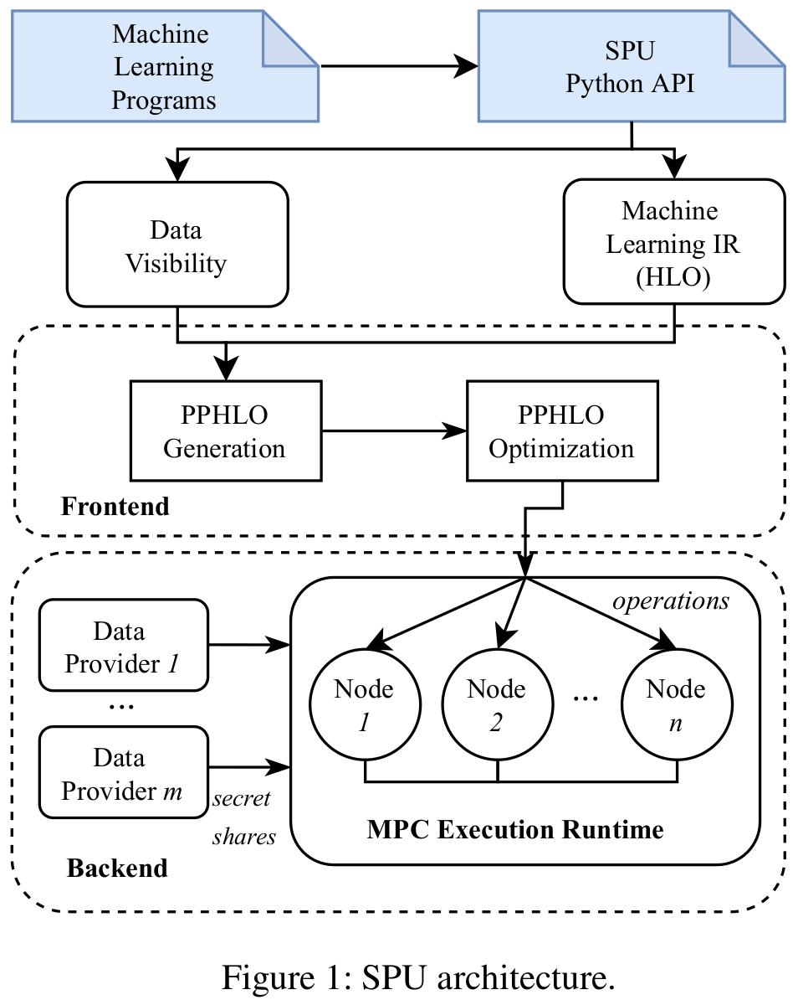
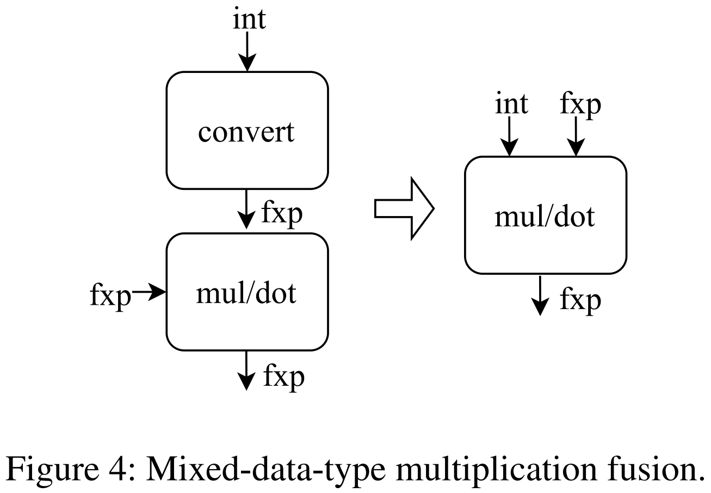
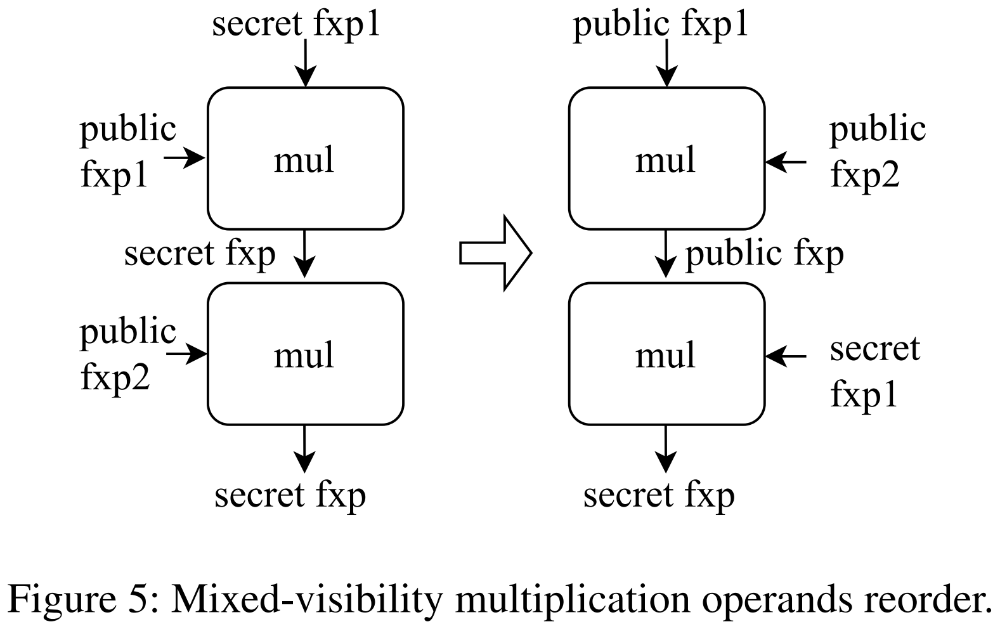
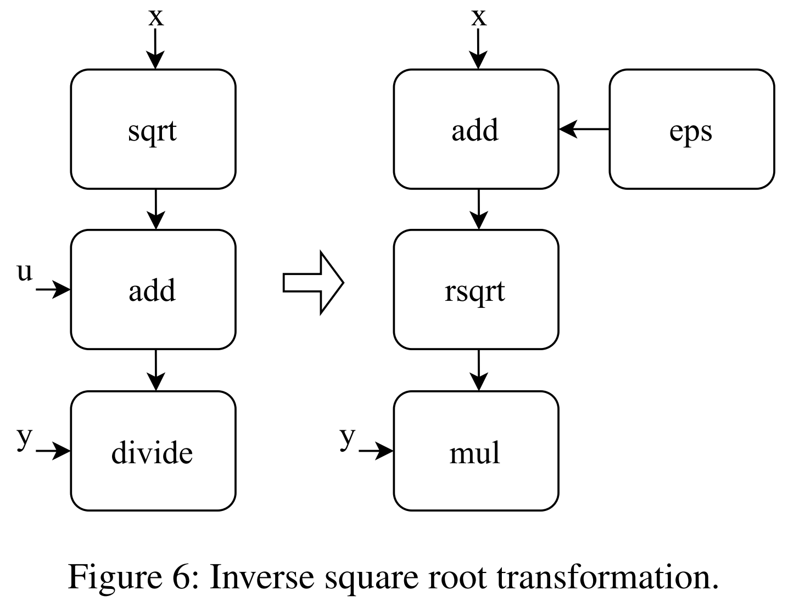
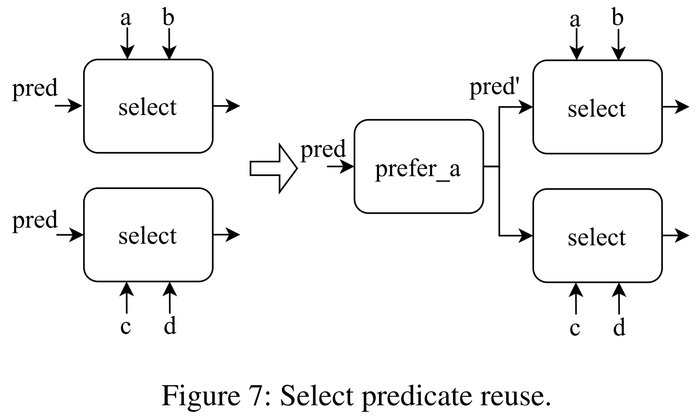
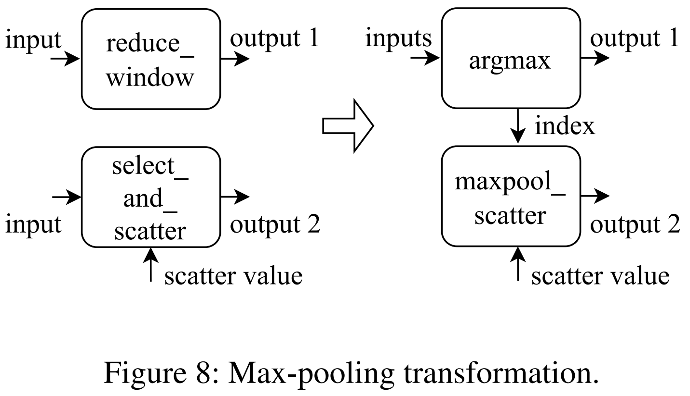
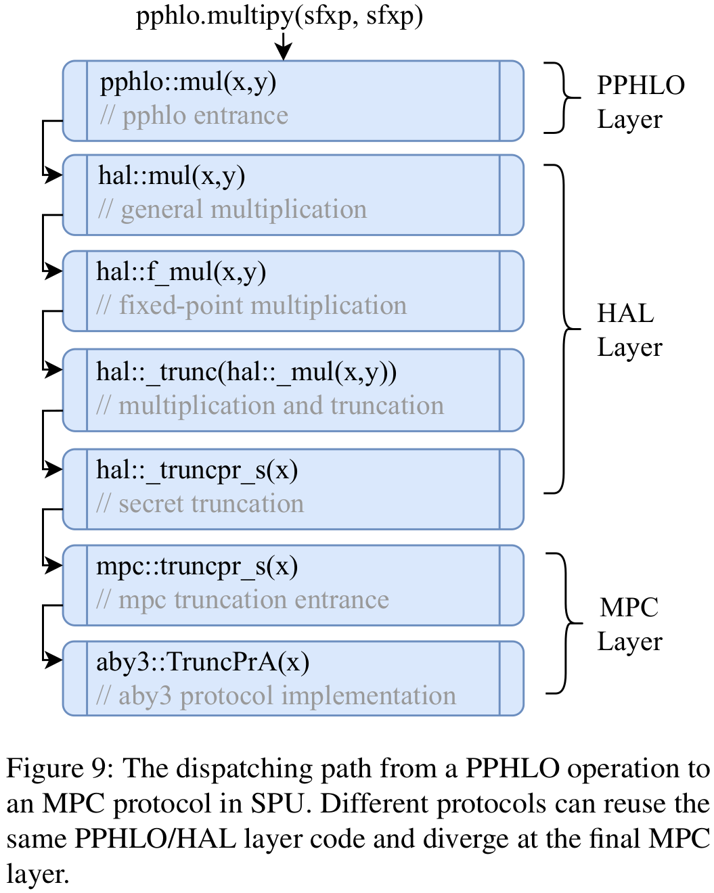
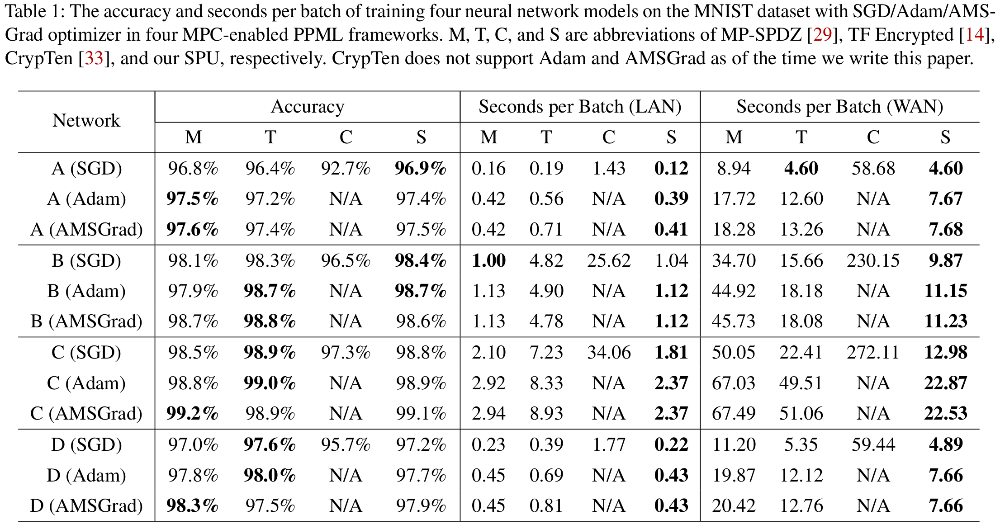

# SecretFlow-SPU: A Performant and User-Friendly Framework for Privacy-Preserving Machine Learning
Junming Ma; Yancheng Zheng; Jun Feng; Derun Zhao; Haoqi Wu; Wenjing Fang; Jin Tan; Chaofan Yu; Benyu Zhang; and Lei Wang
*2023 USENIX Annual Technical Conference*
> **Security and Privacy**
> [https://www.usenix.org/conference/atc23/presentation/ma](https://www.usenix.org/conference/atc23/presentation/ma)
> [https://github.com/secretflow/spu](https://github.com/secretflow/spu)

## Abstract
With the increasing public attention to data security and privacy protection, privacy-preserving machine learning (PPML) has become a research hotspot in recent years. Secure multi-party computation (MPC) that allows multiple parties to jointly compute a function without leaking sensitive data provides a feasible solution to PPML. However, developing efficient PPML programs with MPC techniques is a great challenge for users without cryptography backgrounds.
Existing solutions require users to make efforts to port machine learning (ML) programs by mechanically replacing APIs with PPML versions or rewriting the entire program. Different from the existing works, we propose SecretFlow-SPU, a performant and user-friendly PPML framework compatible with existing ML programs. SecretFlow-SPU consists of a frontend compiler and a backend runtime. The frontend compiler accepts an ML program as input and converts it into an MPC-specific intermediate representation. After a series of delicate code optimizations, programs will be executed by a performant backend runtime as MPC protocols. Based on SecretFlow-SPU, we can run ML programs of different frameworks with minor modifications in a privacy-preserving manner.
We evaluate SecretFlow-SPU with state-of-the-art MPC-enabled PPML frameworks on a series of ML training tasks. SecretFlow-SPU outperforms these works for almost all experimental settings (23 out of 24). Especially under the wide area network, SecretFlow-SPU is up to 4.1× faster than MP-SPDZ and up to 2.3× faster than TF Encrypted.

## Problem Statement and Research Objectives
* Privacy-preserving machine learning (PPML) has been gaining popularity due to the pervasive usage of machine learning (ML) and attendant privacy problems. Secure multi-party computation (MPC), a cryptographic technique that enables multiple parties to jointly compute a function without leaking each party’s private inputs, brings a provable and practical solution to ML users with strong privacy concerns.
* However, incorporating MPC techniques in ML applications introduces great challenges due to the natural differences between these two fields.
  * MPC experts mainly focus on designing performant cryptographic protocols for low-level computation primitives.
  * In contrast, ML practitioners are more accustomed to constructing high-level ML models using user-friendly frameworks that encapsulates commonly-used ML building blocks.

## Proposed Method
* _Can we efficiently run ML programs of mainstream frameworks in a privacy-preserving manner?_
* The core components of SPU include a frontend compiler and a backend MPC runtime.
* Diverse frameworks and libraries can be supported in SPU if there is a path from ML source code to PPHLO (Privacy-Preserving High-Level Operations).
* PPHLO enables us to propose and implement MPC-specific optimizations at both frontend and backend to achieve high performance.
### 1. Architecture Overview

### 2. Privacy-Preserving High-Level Operations
  * A tensor’s type in PPHLO can be represented by a triple `<Shape, Data Type, Visibility>`
    * Visibility is a unique tensor attribute in PPHLO. It can be either secret or public.
  * For each operation in PPHLO, we use the following rules to determine the output’s type according to the input’s type
    * **Data Type Promotion**: if one of the operands is a fixed-point number, the result is also a fixed-point number
    * **Visibility Narrowing**: if one of the operands is a secret, the result is also a secret.

### 3. Frontend

&nbsp;&nbsp;&nbsp;

&nbsp;&nbsp;&nbsp;

### 4. Backend
Each MPC-primitive function will be finally dispatched to the MPC layer, corresponding to a specific implementation of fundamental MPC protocols. Adding a new MPC protocol in SPU only needs to implement the MPC-primitive function set.

## Evaluation and Results
* Three state-of-the-art MPC-enabled PPML frameworks (i.e., MP-SPDZ, TF Encrypted, and CrypTen) as the baseline.
* We train four common-evaluated neural networks on the MNIST dataset for image classification under both local area network (LAN) and wide area network (WAN) settings.

-----
## Notes
* The IR(intermediate representation) used in ML compilers is typically expressed as a computation graph (i.e., a directed acyclic graph).
* One widely-used ML compiler is Google’s XLA. TensorFlow, PyTorch, and JAX, support XLA.
* One fundamental technique used in MPC is secret sharing.