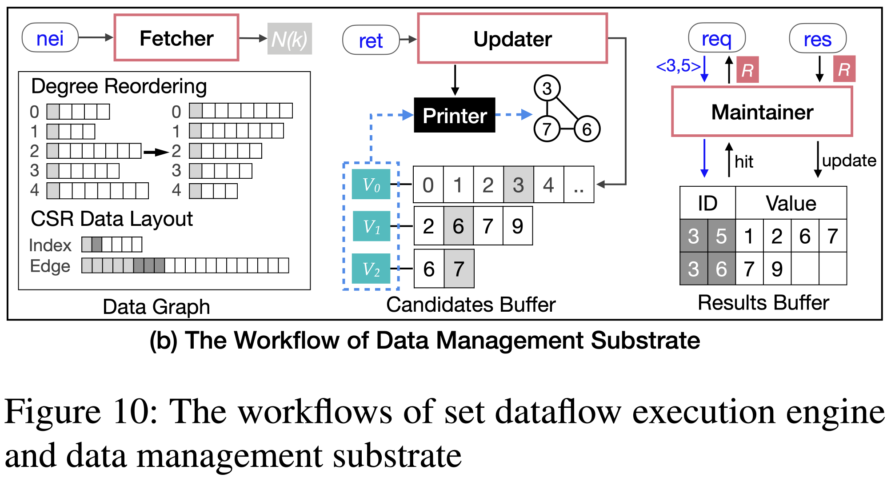

# Cyclosa: Redundancy-Free Graph Pattern Mining via Set Dataflow
Chuangyi Gui; Xiaofei Liao; Long Zheng; Hai Jin
*2023 USENIX Annual Technical Conference*
> **Searching Graphs**
> [https://www.usenix.org/conference/atc23/presentation/gui](https://www.usenix.org/conference/atc23/presentation/gui)

## Abstract
Graph pattern mining is an essential task in many fields, which explores all the instances of user-interested patterns in a data graph. Pattern-centric mining systems transform the patterns into a series of set operations to guide the exploration and substantially outperform the embedding-centric counterparts that exhaustively enumerate all subgraphs. These systems provide novel specializations to achieve optimum search space, but the inherent redundancies caused by recurrent set intersections on the same or different subgraph instances remain and are difficult to trace, significantly degrading the performance.
In this paper, we propose a dataflow-based graph pattern mining framework named Cyclosa to eliminate the above redundancies by utilizing the concept of computation similarity. Cyclosa is characterized by three features. First, it reorganizes the set operations for a pattern into a set dataflow representation which can elegantly indicate the possibility of redundancies while sustaining the optimal scheduling for high performance. Second, the dataflow-guided parallel execution engine decouples data access and computations to enable efficient results sharing. Third, the memory-friendly data management substrate can automatically manage the computation results with high reuse possibility. Evaluation of different patterns demonstrates that Cyclosa outperforms state-of-the-art pattern-centric systems GraphPi and SumPA by up to 16.28× and 5.52×, respectively.

## Problem Statement and Research Objectives
#### Topic: Graph pattern mining systems
* A common approach is to enumerate all the subgraphs, usually under a certain depth, to check **whether the subgraphs satisfy the pattern constraints**, which is called the **<mark>embedding-centric paradigm</mark>**.
  * This approach is easy to develop and parallelize.
  * However, it results in high memory consumption and wasted computing resources due to a large number of intermediate partial instances.
* Recently, advanced graph pattern mining systems have adopted a **<mark>pattern-centric paradigm</mark>** to overcome inefficiencies.
  * The main idea is to use the structure information of graph patterns to filter intermediates that will not lead to a correct final match. This is achieved by **transforming the graph patterns into a series of set operations** and **executing them in a nested loop** following a matching order of pattern vertices. 

  * **<mark>The redundant computations</mark>** usually cost more than 80% of the runtime and severely degrade the performance.  
    * **The explicit redundancies** : one set intersection can be repeatedly used for computing different pattern vertices connected to the same subgraph instances.
    * **The implicit redundancies** : the same intersection appears in computing on different subgraph instances.
  * We observe two kinds of **<mark>computation similarity</mark>** in the set operations providing the opportunity to help identify and reuse both explicit and implicit redundancies.  
    * **The static similarity** : originates from the operands level of the set operations for a pattern, exposing the reuse possibility of both inputs and outputs of different computations.
    * **The dynamic similarity** : lies in the runtime characteristics of the inputs of occurred computations, reflecting which vertices are more likely to be requested for computation. (can only be analyzed after execution.)

 → In this work, we propose a **<mark>set dataflow</mark>** to use the computation similarity for redundancy elimination, as shown in Figure 4. The set dataflow is a **directed graph** indicating the procedure of how sets are transferred and computed. 

## Proposed Method
The set dataflow decouples the set formulas into individual operands and operators, and the directed edges represent the transfer relation of the input/output data between different operators.

It removes explicit and implicit redundancies as follows:
1. The explicit redundancies can be removed by cutting and maintaining unique operators, e.g., only single N(v0) and N(v1) exist. Original two N(v0) ∩ N(v1) are thus reduced to one, and the set operands are fully shared.
2. The implicit redundancies between operators are indicated by overlapped inputs, e.g., the results of N(v0) ∩ N(v1) and N(v0) ∩ N(v2).

Based on the dynamic similarity, we can heuristically cache the computation results of high-degree vertices for reusing.

#### System Overview

* Set Dataflow Analysis Module
   The set dataflow of input patterns is constructed in this module. Each pattern is first analyzed to generate a reuse-aware matching order and constraints with data graph properties. Then, based on the matching order, a set operation analyzer generates a redundancy-reduced set dataflow by keeping unique operands.    
  * The `Generator` consumes a valid candidate set of a pattern vertex to generate the neighboring sets.
  * The `Combiner` receives two sets and outputs a single set.
  * The `Reducer` checks a result set and selects valid candidates following filtering rules to produce a new candidate set for certain pattern vertices.
* Dataflow Execution Engine: **Figure 10(a)**
   
  * Each set contains two parts for identification: the set ID and the elements value, e.g., `ID < 3, -1 >` for the neighboring set of vertex 3.
  * Generator Module
       It traverses each vertex element from the input candidate set or the initial set to generate related neighboring sets. → `nei < 3, -1, op, gid*, value >`
  * Combiner Module
    * The check unit first queries whether there are already computed results with the same ID → `req < 3, 5, op, gid >`
    * If the request hits, then the computation is omitted. Otherwise, the compute unit is called to generate a new output. → `res < 3, 5, gid, value >`
  * Reducer Module
     The output of this module is a set with valid candidates for a pattern vertex. → `ret < op, gid, value >`
  * Dataflow Monitor
* Data Management Substrate: **Figure 10(b)**
   
  * Results Maintainer
  * Candidates Updater
  * Data Graph Fetcher

## Evaluation and Results
* Performance Comparison : Single Pattern Query / Multi-Pattern Query
   
* Sensitivity on Cache
   
* Scalability
   
* Overhead : Memory Consumption / Time for Constructing Set Dataflow

-----
## Notes
* Typical graph pattern mining applications include subgraph matching, clique finding, and motifs counting. Despite the prevalence of graph pattern mining applications, they have high computational complexity and usually need hours or even days to complete.