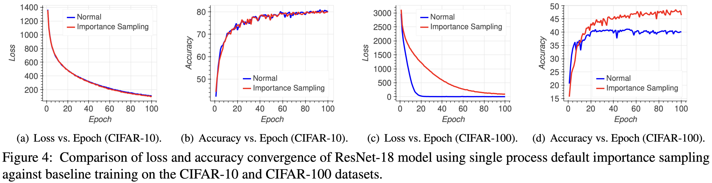
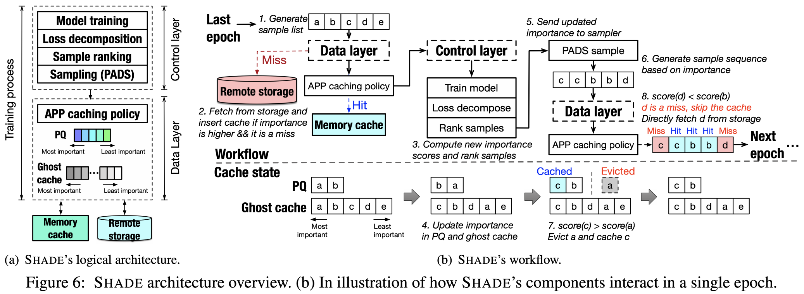
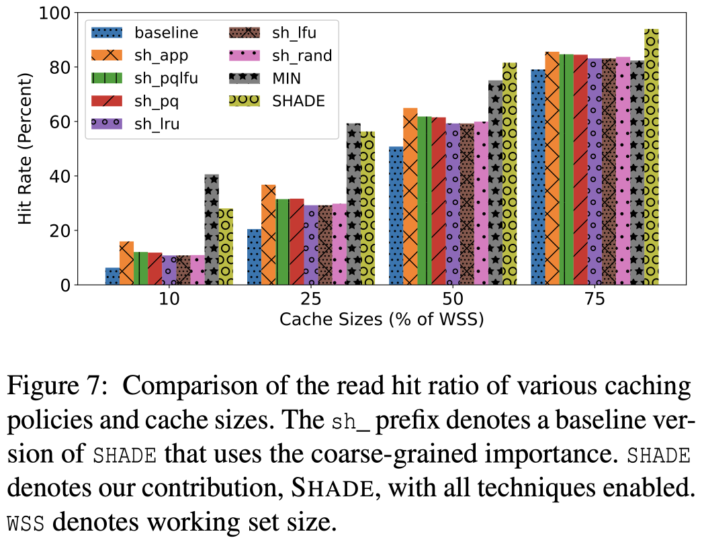
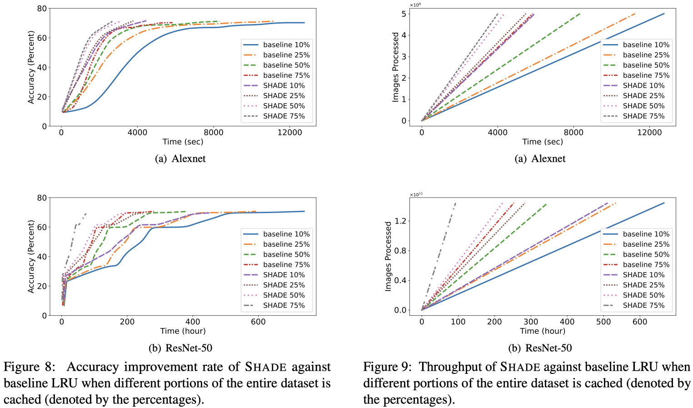
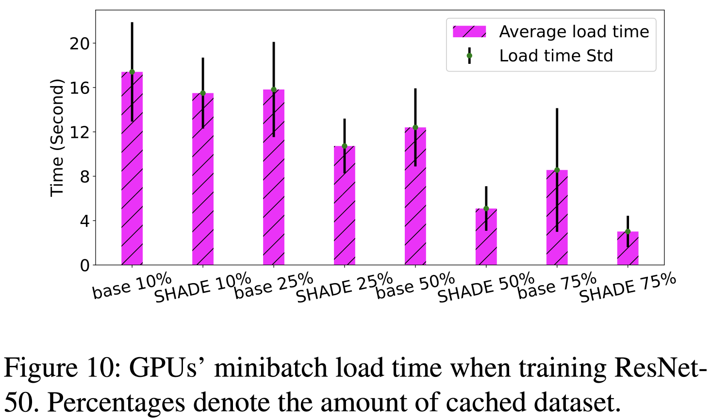
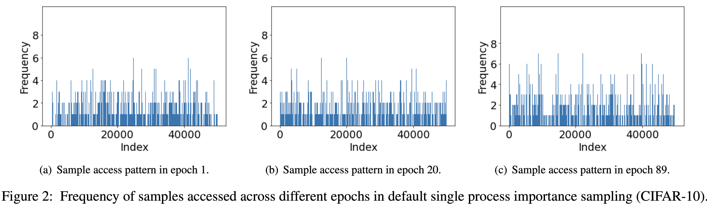
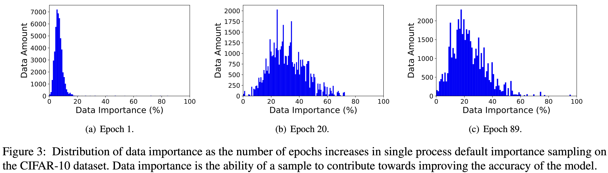

# SHADE: Enable Fundamental Cacheability for Distributed Deep Learning Training
Redwan Ibne Seraj Khan; Ahmad Hossein Yazdani; Yuqi Fu; Arnab K. Paul; Bo Ji; Xun Jian; Yue Cheng; and Ali R. Butt
*2023 USENIX Conference on File and Storage Technologies*
> **AI and Storage**
> [https://www.usenix.org/conference/fast23/presentation/khan](https://www.usenix.org/conference/fast23/presentation/khan)

## Abstract
Deep learning training (DLT) applications exhibit unique I/O workload behaviors that pose new challenges for storage system design. DLT is I/O intensive since data samples need to be fetched continuously from a remote storage. Accelerators such as GPUs have been extensively used to support these applications. As accelerators become more powerful and more data-hungry, the I/O performance lags behind. This creates a crucial performance bottleneck, especially in distributed DLT. At the same time, the exponentially growing dataset sizes make it impossible to store these datasets entirely in memory. While today's DLT frameworks typically use a random sampling policy that treat all samples uniformly equally, recent findings indicate that not all samples are equally important and different data samples contribute differently towards improving the accuracy of a model. This observation creates an opportunity for DLT I/O optimizations by exploiting the data locality enabled by importance sampling.
To this end, we design and implement SHADE, a new DLTaware caching system that detects fine-grained importance variations at per-sample level and leverages the variance to make informed caching decisions for a distributed DLT job. SHADE adopts a novel, rank-based approach, which captures the relative importance of data samples across different minibatches. SHADE then dynamically updates the importance scores of all samples during training. With these techniques, SHADE manages to significantly improve the cache hit ratio of the DLT job, and thus, improves the job's training performance. Evaluation with representative computer vision (CV) models shows that SHADE, with a small cache, improves the cache hit ratio by up to 4.5x compared to the LRU caching policy.

## Problem Statement and Research Objectives
#### DL Training with Importance Sampling
* Recently, researchers found that in SGD-based DL training, **a specific set of training samples tend to generate little-to-no impact** on the model quality and, therefore, can be ignored.
* The process of finding the set of training samples that are more important than others is known as <mark>**importance sampling**</mark>.
* Difficulty in Importance Sampling
  1. Default importance sampling (importance sampling considered in prior works) assigns per-minibatch scores, which are too coarse-grained and inaccurate.
  2. Even if important samples are identified properly, aggressively feeding the DL model with repetitive samples might make training model biased.
  3. Importance scores are constantly changing and may get stale quickly. The same sample in a later minibatch may contribute differently toward the model than it did in an earlier minibatch.

## Proposed Method
1. Control Layer
  * It calculates the importance scores associated with data samples
  * It samples the data for different training processes.
2. Data Layer
  The SHADE data layer provides mechanisms and policies for cache eviction and prefetching.

## Evaluation and Results
* Cache hit ratio
  
* Accuracy & Throughput
  
* Minibatch load time
  

-----
## Notes
* It remains challenging to improve the I/O efficiency for distributed DLT as the I/O workloads of a DLT job exhibit unique patterns.
  1. full-object, sequential, read-only accesses at per-object level
  2. dominant, small, random I/Os spread across the whole training sample dataset.
  3. highly concurrent I/Os.
* Worse, conventional wisdom holds that the I/O workload of a DL training job is not cache-friendly due to the aforementioned I/O randomness and lack of data locality.
   