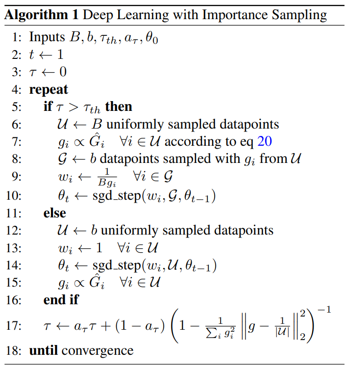
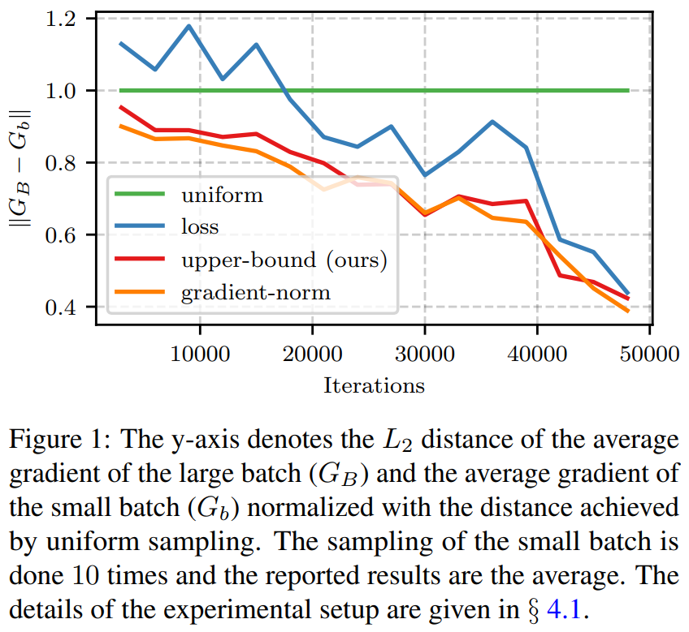
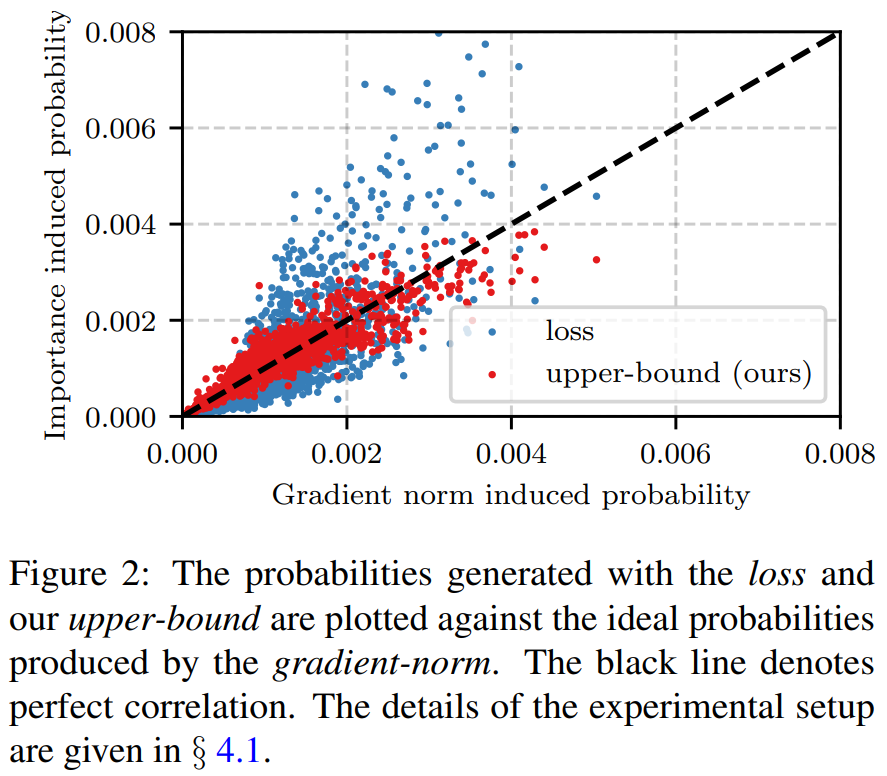
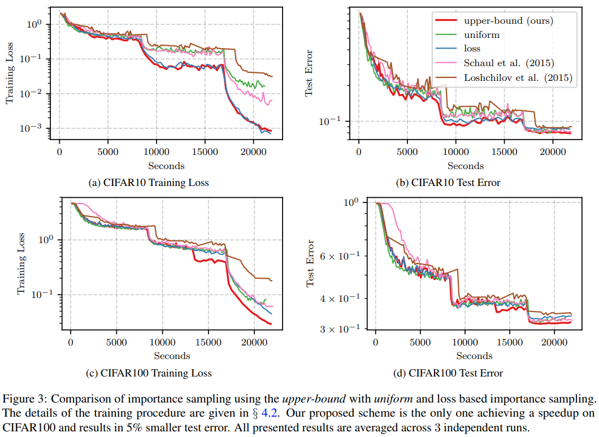

# Not All Samples Are Created Equal: Deep Learning with Importance Sampling
Angelos Katharopoulos and François Fleuret
> Machine Learning, Data Loading
> [https://doi.org/10.48550/arXiv.1803.00942](https://doi.org/10.48550/arXiv.1803.00942)
> [http://proceedings.mlr.press/v80/katharopoulos18a.html](http://proceedings.mlr.press/v80/katharopoulos18a.html)
> [https://github.com/idiap/importance-sampling](https://github.com/idiap/importance-sampling)

## Abstract
Deep Neural Network training spends most of the computation on examples that are properly handled, and could be ignored. We propose to mitigate this phenomenon with a principled importance sampling scheme that focuses computation on "informative" examples, and reduces the variance of the stochastic gradients during training. Our contribution is twofold: first, we derive a tractable upper bound to the per-sample gradient norm, and second we derive an estimator of the variance reduction achieved with importance sampling, which enables us to switch it on when it will result in an actual speedup. The resulting scheme can be used by changing a few lines of code in a standard SGD procedure, and we demonstrate experimentally on image classification, CNN fine-tuning, and RNN training, that for a fixed wall-clock time budget, it provides a reduction of the train losses of up to an order of magnitude and a relative improvement of test errors between 5% and 17%.

## Related Study
Importance sampling aims at increasing the convergence speed of SGD by focusing computation on samples that actually induce a change in the model parameters. This formally translates into a reduced variance of the gradient estimates for a fixed computational cost.

* Importance Sampling for Convex Problems<a href="#td1" name="ts1">1</a>
  * For convex optimization problems, many works have taken advantage of the **difference in importance among the samples to improve the convergence speed of stochastic optimization methods**.
* Importance Sampling for Deep Learning
  * For deep neural networks, sample selection methods were mainly employed to generate hard negative samples<a href="#td2" name="ts2">2</a> for embedding learning problems or to tackle the class imbalance problem.
  * More closely related to our work, Schaul et al. (2015) and Loshchilov & Hutter (2015) **use the loss to create the sampling distribution**.
    * Both approaches **keep a history of losses for previously seen samples**, and sample either proportionally to the loss or based on the loss ranking.
    * One of the main limitations of history based sampling, is the need for tuning a large number of hyperparameters that control the effects of “stale” importance scores;
* Importance sampling to improve and accelerate the training of neural networks
  * Those works, employ either **the gradient norm** or **the loss** to compute each sample’s importance.
  * However, the former is prohibitively expensive to compute and the latter is not a particularly good approximation of the gradient norm.
* Other Sample Selection Methods
  * Design a distribution (suitable only for the distance based losses) that maximizes the diversity of the losses in a single batch.
  * Use reinforcement learning to train a neural network that selects samples for another neural network in order to optimize the convergence speed.
  * Although their preliminary results are promising, the overhead of training two networks makes the wall-clock speedup unlikely and their proposal not as appealing.

## Proposed Method
1. Compared to the aforementioned works, we derive **_an upper bound_ to the per sample gradient norm** that can be computed in a single forward pass.
2. Furthermore, we **quantify the variance reduction** achieved with the proposed importance sampling scheme and associate it with **_the batch size increment_ required to achieve an equivalent variance reduction**.

* In order to solve the problem of computing the importance for the whole dataset, we pre-sample a large batch of data points, compute the sampling distribution for that batch and re-sample a smaller batch with replacement.
* The inputs to the algorithm are the pre-sampling size _B_, the batch size _b_, the equivalent batch size increment after which we start importance sampling $\tau_{th}$ and the exponential moving average<a href="#td3" name="ts3">3</a> parameter $a_{\tau}$ used to compute a smooth estimate<a href="#td4" name="ts4">4</a> of $\tau \cdot \theta_{0}$ denotes the initial parameters of our deep network.
* Due to the large cost of computing the importance per sample, we only perform importance sampling when we know that the variance of the gradients can be reduced.
* Our implementation is generic and can be employed by adding a single line of code in a standard Keras model training.
 
## Evaluation and Results
1. **<mark>uniform</mark>** : the usual training algorithm that samples points from a uniform distribution
2. **<mark>loss</mark>** : `Algorithm 1` but instead of sampling from a distribution proportional to our upper-bound to the gradient norm $\hat{G}_i$ (equations 8 and 20), we sample from a distribution proportional to the loss value
3. **<mark>upper-bound</mark>** : our proposed method.

* Ablation study<a href="#td5" name="ts5">5</a>
  * The variance reduction achieved with every sampling scheme
    
    * Subsequently, we sample 1,024 images uniformly at random from the dataset. Using the weights of the trained network, at intervals of 3,000 updates, we resample 128 images from the large batch of 1,024 images using **<mark>uniform</mark>** sampling or importance sampling.
  * The probabilities against the optimal ones (proportional to the _gradient-norm_)
    
    * In figure 2, we observe that our **<mark>upper bound</mark>** is almost perfectly correlated with the gradient norm, in stark contrast to the **<mark>loss</mark>** which is only correlated at the regime of very small gradients.

* Image classification
   
  * We follow the experimental setup of Zagoruyko & Komodakis (2016), specifically we train a wide resnet 28-2 with SGD with momentum. We use batch size 128, weight decay 0.0005, momentum 0.9, initial learning rate 0.1 divided by 5 after 20,000 and 40,000 parameter updates.
  * We train for a total of 50,000 iterations. In order for our history based baselines to be compatible with the data augmentation of the CIFAR images, we pre-augment both datasets to generate $1.5 \times 10^{6}$ images for each one.
  * For our method, we use a presampling size of 640. One of the goals of this experiment is to show that even a smaller reduction in variance can effectively stabilize training and provide wall-clock time speedup; thus we set $\tau_{th}=1.5$. We perform 3 independent runs and report the average.

-----
## Notes
<ol style="padding-left:20px;">
<li/><b>Convex problem</b> : non-convex with local minimum problem<a name="td1" href="#ts1">↵</a>
<li/><b>Hard negative samples</b> : 어려운 negative 문제. 실제로는 negative이지만, positive(false positive)로 예측되기 쉬운 것. 이를 위해 false positive를 학습 데이터셋 안에 포함시키는 것을 hard negative mining이라고 부른다.<a name="td2" href="#ts2">↵</a>
<li/><b>Exponential moving average</b> : 과거의 모든 기간을 계산대상으로 하며 최근의 데이터에 더 높은 가중치를 두는 일종의 가중이동평균법이다.<a name="td3" href="#ts3">↵</a>
<li/><b>The smoothing problem</b> : the problem of estimating an unknown probability density function recursively over time using incremental incoming measurements.<a name="td4" href="#ts4">↵</a>
<li/><b>Ablation study</b> : investigates the performance of an AI system by removing certain components to understand the contribution of the component to the overall system.<a name="td5" href="#ts5">↵</a>
