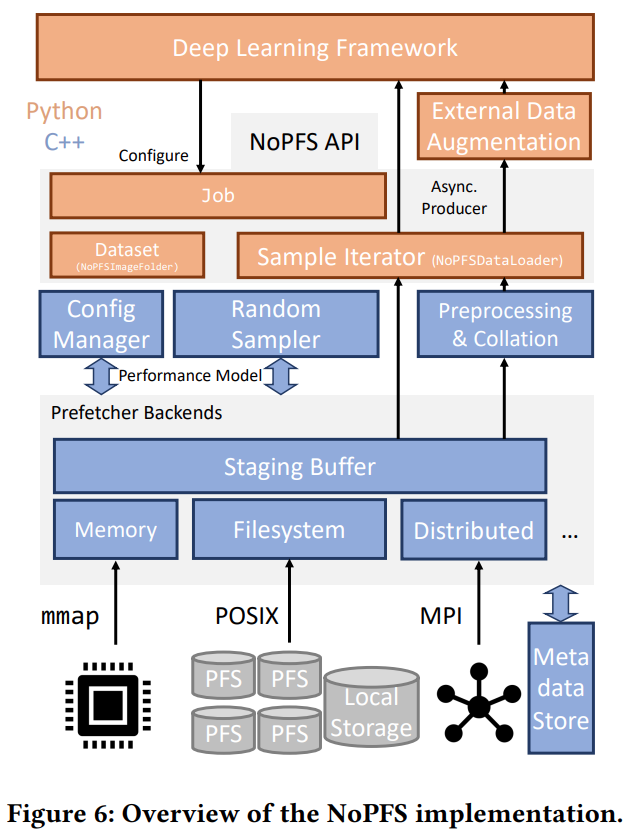

# Clairvoyant Prefetching for Distributed Machine Learning I/O
Nikoli Dryden; Roman Böhringer; Tal Ben-Nun; and Torsten Hoefler
> **Deep learning, Dataset prefetch, Distributed database**
> [https://doi.org/10.48550/arXiv.2101.08734](https://doi.org/10.48550/arXiv.2101.08734)
> [https://github.com/spcl/NoPFS](https://github.com/spcl/NoPFS)

## Abstract
I/O is emerging as a major bottleneck for machine learning training, especially in distributed environments. Indeed, at large scale, I/O takes as much as 85% of training time. Addressing this I/O bottleneck necessitates careful optimization, as optimal data ingestion pipelines differ between systems, and require a delicate balance between access to local storage, external filesystems, and remote nodes. We introduce NoPFS, a machine learning I/O middleware, which provides a scalable, flexible, and easy-to-use solution to the I/O bottleneck. NoPFS uses clairvoyance: Given the seed generating the random access pattern for training with SGD, it can exactly predict when and where a sample will be accessed. We combine this with an analysis of access patterns and a performance model to provide distributed caching policies that adapt to different datasets and storage hierarchies. NoPFS reduces I/O times and improves endto-end training by up to 5.4× on the ImageNet-1k, ImageNet-22k, and CosmoFlow datasets.

## Problem Statement and Research Objectives
* It is challenging to optimize training I/O, as stochastic gradient descent (SGD) randomly accesses (typically small) data samples.
* This problem is especially acute for distributed training, where shared filesystem contention can be detrimental to performance.
* Existing frameworks often overlap I/O with computation to reduce its overhead, but this is no longer sufficient.
  * Beyond this, ad hoc solutions such as **limited lookahead** and **double-buffering**, **data sharding**, **prestaging and in-memory caching**, or **modified access patterns** are used.
    * **Double-buffering**: fetching the next mini-batch is overlapped with computation, and using multiple threads to fetch and preprocess samples. (e.g. Pytorch) 
* These have significant limitations, including poor scalability, requiring extra hardware, neglecting parts of the storage hierarchy, or deviating from full dataset randomization.

## Proposed Method
To address the I/O bottleneck, we introduce a new I/O middle-ware framework, **the Near-optimal PreFetching System, <mark>NoPFS</mark>**.
* The key idea behind NoPFS is to use clairvoyance: **Given the seed for the pseudorandom number generator (PRNG)** that generates an access stream, **we know exactly which process will access a given sample** when, arbitrarily far in the future.
  * NoPFS analyzes the access stream to perform integrated prefetching and caching, rather than always reading from storage.
  * It combines this with a performance model-driven distributed caching policy that uses both **on-node storage hierarchies** (e.g., RAM, node-local SSDs) and **distributed memory**.
    * **Storage class**
      To account for the storage diversity present in current and upcoming systems, we will assume there are **<mark>𝐽 distinct storage classes</mark> which group similar storage media**. E.g., a storage class can represent RAM, SSDs, HDDs, shared global burst buffers, or emerging NVRAM technologies. Storage class 0 is defined to be the staging buffer, a (usually small) in-memory buffer that is shared with the machine learning framework.

* System goal

  

  * **System scalability** Whether additional resources can be productively used when scaling to many nodes.
  * **Dataset scalability** Whether arbitrarily large datasets (much larger than aggregate node storage) are supported.
  * **Full randomization** Whether sample selection is randomized over the entire dataset without replacement in each epoch.
  * **Hardware independence** Whether special hardware (e.g., node-local SSDs) is used if present, but is not required. Storage hierarchies are complex and often differ between systems (Fig. 1), making this especially important.
  * **Ease of use** Whether significant effort is needed to incorporate the framework in workflows.

* Optimal prefetching and caching strategy
  * Previous strategy for a single processor and disk
    * [Rule 1] **Optimal prefetching**: Every prefetch should fetch the next sample in 𝑅 that is not in the cache.
    * [Rule 2] **Optimal replacement**: Every prefetch should discard the sample whose next use is furthest in the future.
    * [Rule 3] **Do no harm**: Never discard sample 𝐴 to prefetch sample 𝐵 when 𝐴 will be used before 𝐵.
    * [Rule 4] **First opportunity**: Never prefetch-and-replace when the same operation could have been done previously.
  * NoPFS's caching policy
    * **Which samples** should be fetched to the staging buffer **when**?
    * **Where** should these samples **be fetched from**?
    * Which samples **should be assigned to which storage class**, and what order should they be prefetched in?
  

  * As we know the PRNG seed, we can exactly compute 𝑅 (Access sequence of a worker), and with this prefetch data in the correct access order into the staging buffer (satisfying Rule 1).
  * Immediately drop samples from the staging buffer after access, freeing up space for samples that (with high probability) will be accessed sooner. (approximate Rules 2–4)
    * Once a sample is read, a worker will access it again at the earliest in the next epoch, and every sample that follows in the current epoch is necessarily accessed earlier.
  * We need to use our performance model to decide **from where to fetch samples**. ➔ Because we know 𝑅 for each worker, every worker knows where every sample is cached, and we can select the location to fetch from that requires minimal time.

## Evaluation and Results

1. **𝑆 < 𝑑1**: The dataset fits into the first storage class (typically RAM) of each worker. This should not be a challenging situation, but is nevertheless important, as it occurs **with small datasets or workers with large amounts of RAM**.
2. **𝑑1 < 𝑆 < 𝐷**: The dataset fits in the aggregate storage of a worker. This scenario is interesting, as while **a worker can cache the entire dataset**, it must **use multiple storage classes** to do so.
3. **𝐷 < 𝑆 < 𝑁𝐷**: The dataset can be cached in the aggregate storage of all workers. This **requires workers to exploit distributed caching** and to minimize the number of PFS(parallel filesystem) accesses.
4. **𝑁𝐷 < 𝑆**: The dataset is **too large to be cached even by the aggregate storage of all workers**. While this is an uncommon scenario today when using many workers, it is interesting to examine, especially as dataset sizes grow in the future. Further, this scenario already occurs when large datasets are used on small training clusters.

-----
## Notes
* From the perspective of a DL framework, training a DNN involves three aspects: computation to execute the DNN; communication, to synchronize updates across nodes; and I/O, which provides the data and labels for training to each node.
* The vast majority of work on optimizing training has focused on computation and communication. 
  * Consequently, the performance bottleneck in training is shifting to I/O.
    
  * Indeed, we find that when training ResNet-50 on ImageNet at scale, up to 85% of runtime is I/O overhead, and we observe similar trends in other datasets.
* NoPFS utilizes a second key observation about the access pattern: Although each sample is read once per epoch, the number of times the same worker will read that sample over 𝐸 epochs of training varies depending on the random seed.
  

