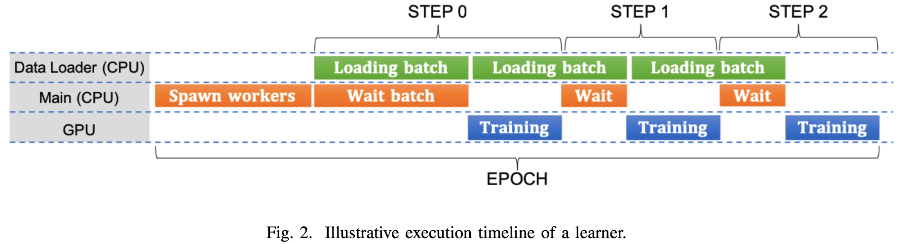
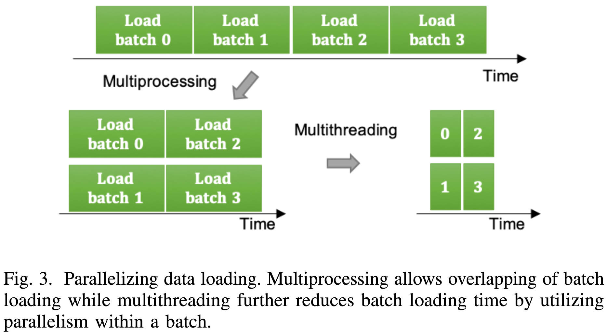
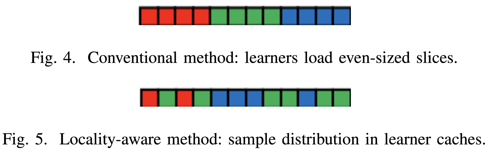
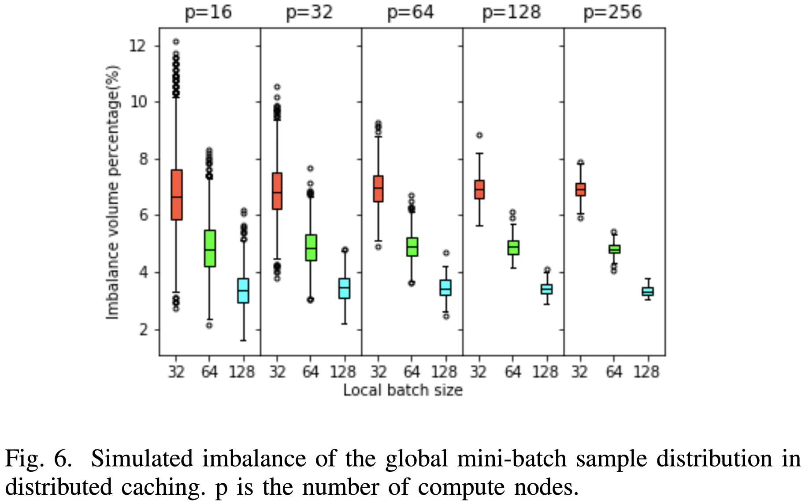
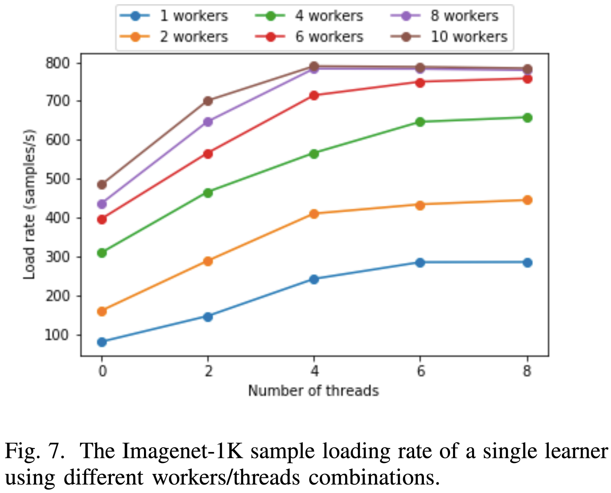
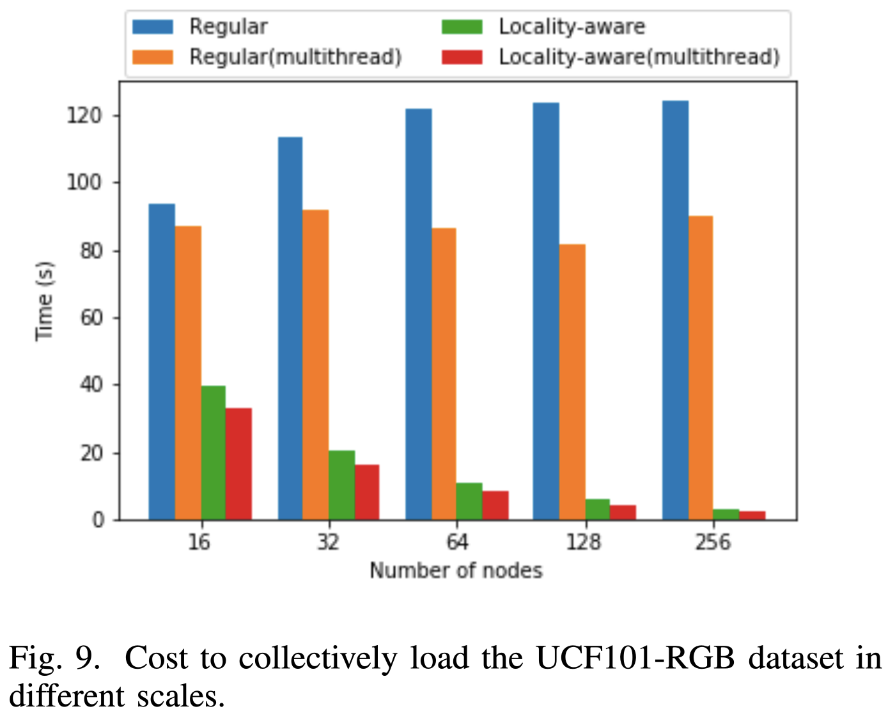
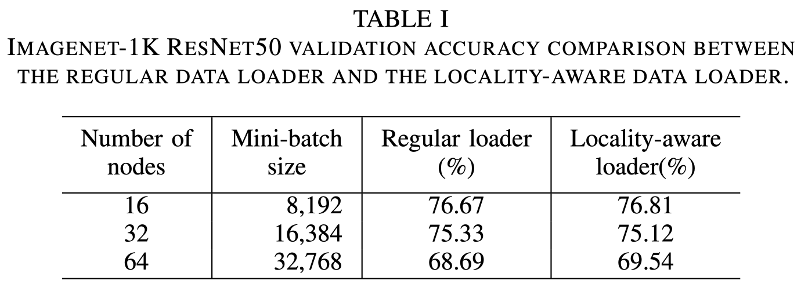
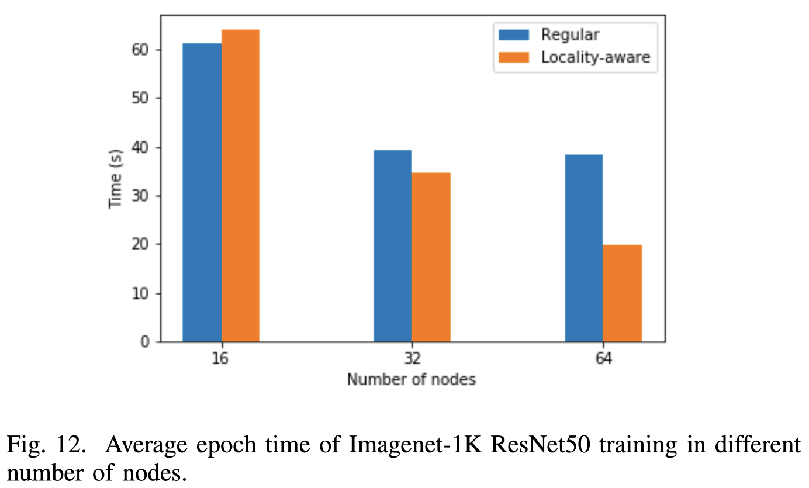
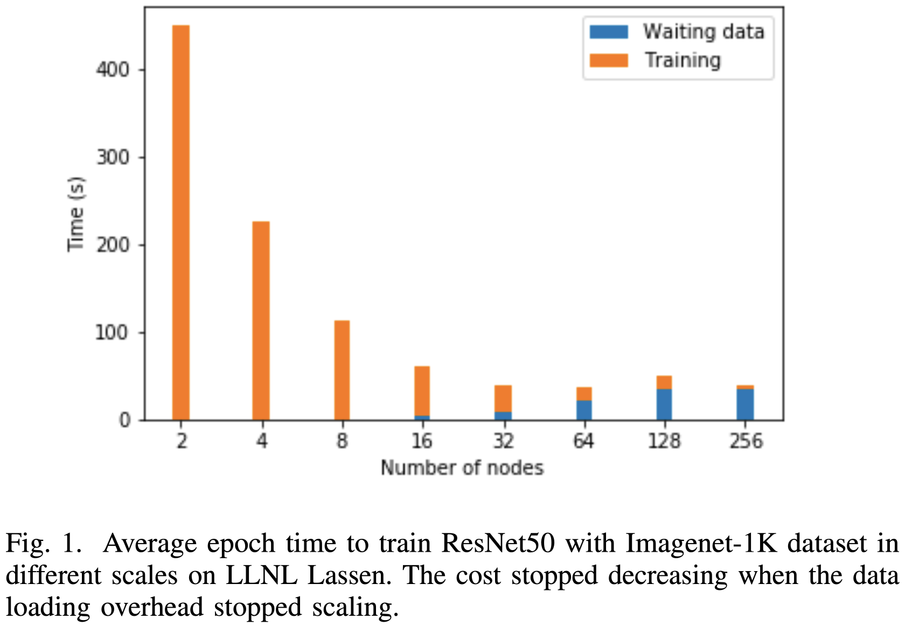

# Accelerating Data Loading in Deep Neural Network Training
Chih-Chieh Yang; and Guojing Cong
*2019 IEEE 26th International Conference on High Performance Computing, Data, and Analytics (HiPC)*
> **machine learning, distributed training, scalability, data loading, data locality**
> [https://doi.org/10.48550/arXiv.1910.01196](https://doi.org/10.48550/arXiv.1910.01196)
> [https://doi.org/10.1109/HiPC.2019.00037](https://doi.org/10.1109/HiPC.2019.00037)

## Abstract
Data loading can dominate deep neural network training time on large-scale systems. We present a comprehensive study on accelerating data loading performance in large-scale distributed training. We first identify performance and scalability issues in current data loading implementations. We then propose optimizations that utilize CPU resources to the data loader design. We use an analytical model to characterize the impact of data loading on the overall training time and establish the performance trend as we scale up distributed training. Our model suggests that I/O rate limits the scalability of distributed training, which inspires us to design a locality-aware data loading method. By utilizing software caches, our method can drastically reduce the data loading communication volume in comparison with the original data loading implementation. Finally, we evaluate the proposed optimizations with various experiments. We achieved more than 30x speedup in data loading using 256 nodes with 1,024 learners.

## Problem Statement and Research Objectives
* In large-scale distributed DNN training, we can break down the training time into three major components: **computation time**, **communication time** and **data-loading time**. While the former two draw great attentions from researchers, data-loading time is often omitted in the literature.
  * Considering common usage scenarios in HPC, it is important to design efficient methods to load data from a network-based file system or a data server, so that the data loading time does not become a bottleneck in DNN training. 

* The learners perform a step of mini-batch SGD collectively with the following procedure:
  1. **Each learner acquires the same global mini-batch sequence** (**a sequence of sample indices** instead of the actual samples) that all learners will collectively load.
  2. Each learner takes **<mark>an even-sized disjoint slice of the global mini-batch sequence</mark>**.
  3. Each learner **loads samples of its slice from the data source (e.g. a network file system)** to form a local batch.
  4. Each learner **trains with its local batch independently** to compute local gradients.
  5. All learners synchronize (i.e. all-reduce) to produce the global gradients of the current step.
  6. Each learner updates the model weights with the same global gradients.

* **<mark>Data loading</mark>** in the machine learning context refers to <u>the actions required to move data samples from a storage location to form a batch in the memory co-located with the compute units</u> for training.
  * The I/O cost (typically read-only) of moving data samples **depends on the bandwidth of the storage system**.
  * Other than the I/O cost, to make data usable in training, there is often **some pre-processing or data augmentation needed**.

## Proposed Method
### 1. Data loader optimizations
* Multiprocessing & Multithreading
  * Multiprocessing overlaps batch loading across processes, while multithreading within a worker shortens loading time per batch by preprocessing samples in parallel.
    

    

  * While multithreaded data loading exists in other deep learning frameworks, **in Pytorch, we have to modify the data loader implementation** to create a `ThreadPoolExecutor` instance along with a data loader worker.
* Caching
  * **The learners collectively load the same training dataset** with a randomized sequence every epoch.
    * Since the samples are reused, there is temporal locality that we can utilize to improve performance.
  * **All the participating compute nodes can share their local caches with each other** to form an **<mark>aggregated cache</mark>** that is many times larger than individual caches.
    * With the _aggregated cache_, compute nodes may cache disjoint partitions of a large dataset. We refer to this technique as **<mark>distributed caching</mark>**.

### 2. Locality-aware data loading
Assuming the caches have been populated with samples, the procedure of locality-aware data loading is as follows:

1. All learners get the same global mini-batch sequence.
2. Each learner independently goes through the global sequence and determines the sample distributions by looking
up the cache directory. 
3. The learners need to agree on how to load samples locally so that they collectively assemble the global mini-batch.
  * Samples not in the caches are loaded from the storage system.
  * As for load-balancing, the learners can exchange data to achieve load balance, or they can load from the storage system. If learners exchange samples for load balancing, it creates point-to-point communication traffic.

### 3. Load imbalance
* We ran simulations to show the traffic volume needed to balance the batch samples.
  

  * To characterize the amount of data samples of a global mini-batch in the cache of a certain learner, we consider the process of uniformly-at-random placing _b_ balls in _p_ bins.
  * The imbalance traffic volume percentage is calculated by summing the deficits of every learner and then divided by the mini-batch size.
  * The simulation results show that the load imbalance of the locality aware data-loading is small.
    * Still, imbalance in the amount of data present in the cache of each learner creates imbalance in computation time for forward and backward propagation in training.
    * To achieve perfect loading balancing, **learners with data surplus need to send some data samples to learners with deficit**.
* We propose an approximation algorithm.
  * We build two heaps, **one for learners with surplus Hs**, and **the other for learners with deficit Hd**.
  * Each heap element contains two items, _imbalance_ for the current imbalance in workload, and _ID_ for the learner.
  * The algorithm **greedily finds the current largest imbalanced heap elements** hs in Hs and hd in Hd, and **records sending _min(hs.imbalance, hd.imbalance)_ amount of data samples** from the learner with the surplus to the learner with the deficit in the schedule list S.
  * The algorithm then updates the heaps, and continue.

## Evaluation and Results
A compute node has two IBM POWER9 processors (44 cores in total), 256 GB system memory, 4 Nvidia V100 (Volta) GPUs, 16 GB memory per GPU, and Inifiniband EDR interconnect among compute nodes.

-----
## Notes
* _step_ : training a single mini-batch
* _epoch_ : training the whole dataset in multiple steps
* _training time_ : the overall cost of computations and communication ⇔ _data loading time_

> Since data loading is overlapped with training, the time to wait for data would appear only when data loading overhead was not completely hidden.