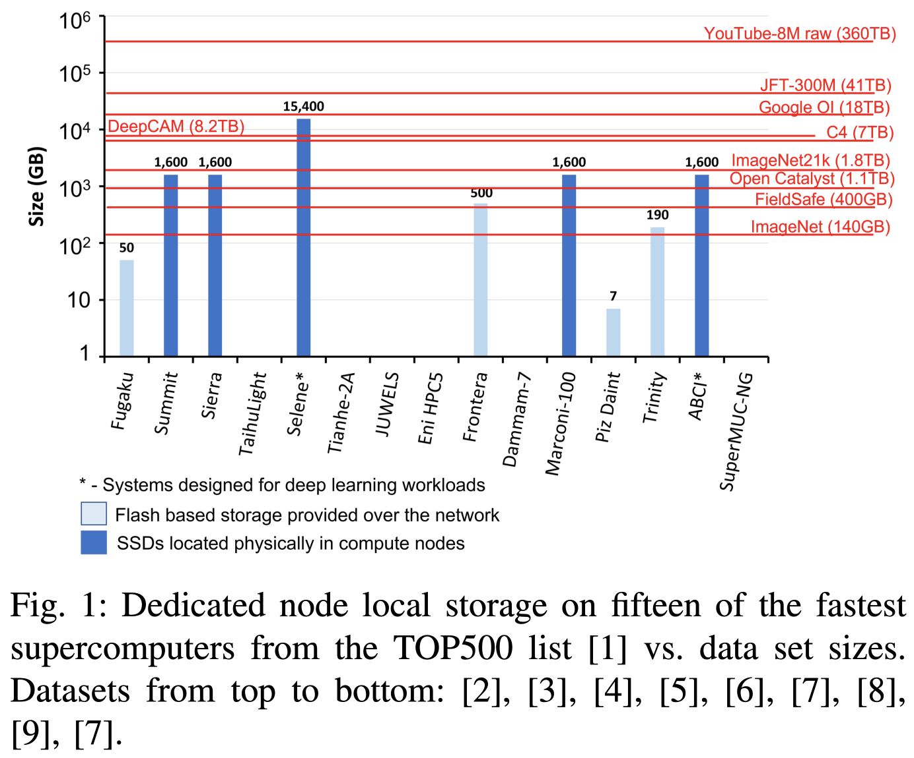
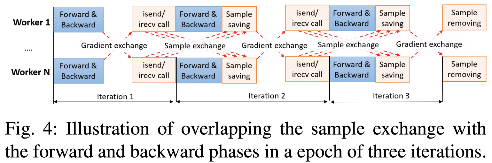
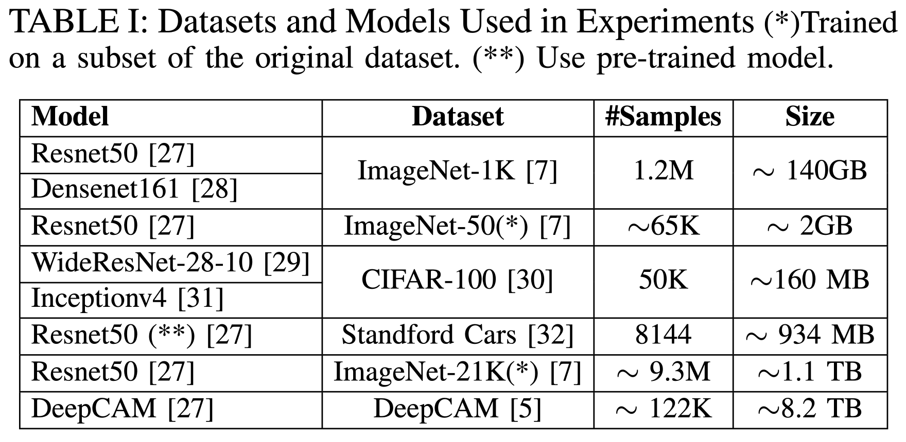
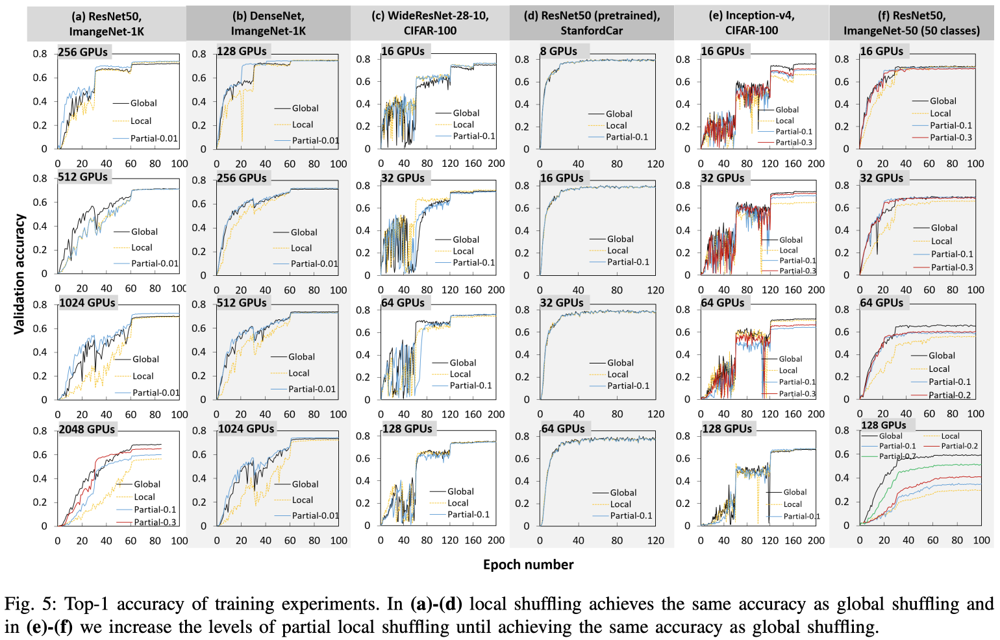
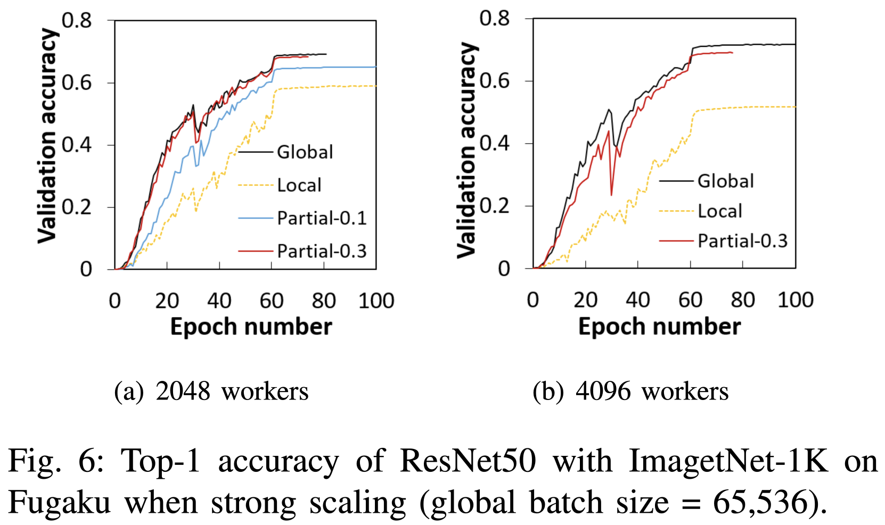
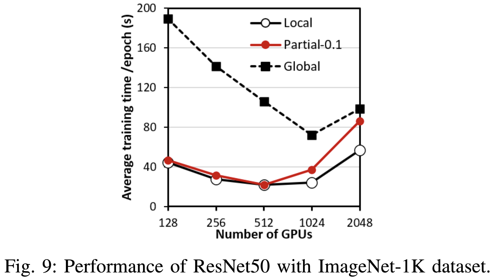
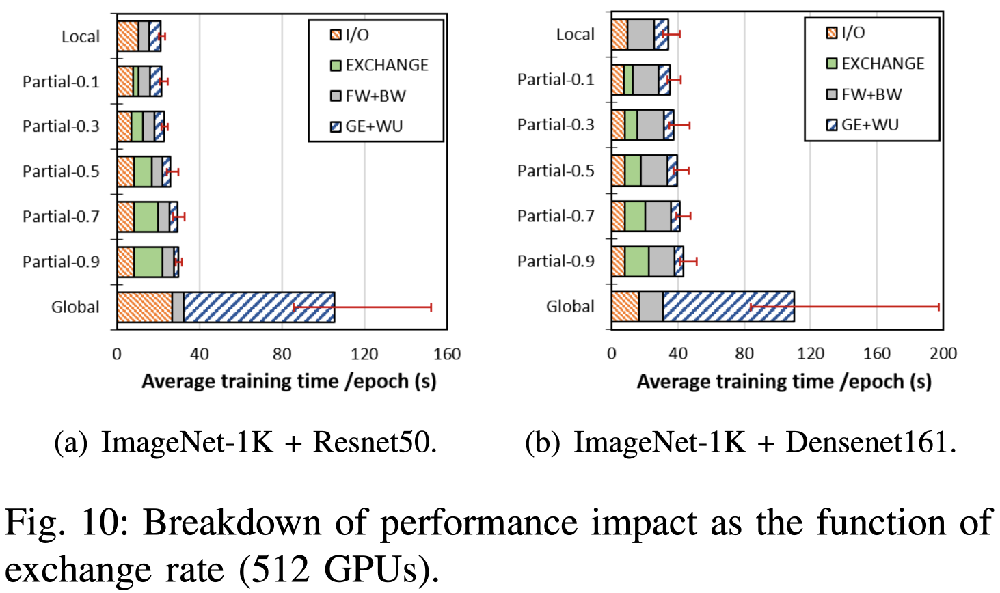

# Why Globally Re-shuffle? Revisiting Data Shuffling in Large Scale Deep Learning
Truong Thao Nguyen; François Trahay; Jens Domke; Aleksandr Drozd; Emil Vatai; Jianwei Liao; Mohamed Wahib; and Balazs Gerofi
*2022 IEEE International Parallel and Distributed Processing Symposium (IPDPS)*
> **Deep learning, Distributed database**
> [https://doi.org/10.1109/IPDPS53621.2022.00109](https://doi.org/10.1109/IPDPS53621.2022.00109)

## Abstract
Stochastic gradient descent (SGD) is the most prevalent algorithm for training Deep Neural Networks (DNN). SGD iterates the input data set in each training epoch processing data samples in a random access fashion. Because this puts enormous pressure on the I/O subsystem, the most common approach to distributed SGD in HPC environments is to replicate the entire dataset to node local SSDs. However, due to rapidly growing data set sizes this approach has become increasingly infeasible. Surprisingly, the questions of why and to what extent random access is required have not received a lot of attention in the literature from an empirical standpoint.
In this paper, we revisit data shuffling in DL workloads to investigate the viability of partitioning the dataset among workers and performing only a partial distributed exchange of samples in each training epoch. Through extensive experiments on up to 2,048 GPUs of ABCI and 4,096 compute nodes of Fugaku, we demonstrate that in practice validation accuracy of global shuffling can be maintained when carefully tuning the partial distributed exchange. We provide a solution implemented in PyTorch that enables users to control the proposed data exchange scheme.

## Problem Statement and Research Objectives
* Distributing the training of a neural network in a data parallel fashion over compute nodes of a supercomputer requires loading the input samples on compute nodes so that each node can process a subset of the samples at each training epoch.
  * This is either done by storing the entire dataset on compute node local storage, or by each node reading a subset of the samples from the parallel file system (PFS).
* Reading from the parallel files system puts an enormous pressure on the storage nodes because many compute nodes read terabytes of data simultaneously.
* It is the overarching consensus that random shuffling input elements is a strict requirement and most I/O approaches take this for granted.
* For the aforementioned reasons, the current state of practice in scale-out deep learning training is to replicate the input data set to node-local SSDs in compute nodes.
  

* Figure 1 compares the local storage capacity on fifteen of the fastest supercomputers from the TOP500 list (as of 2020 November) with the size of DL datasets.
  * Many of the data sets are already too large to be loaded on dedicated compute node storage.

## Proposed Method
### 1. Type of shuffles
* <mark>Global shuffling</mark> (i.e., all of the dataset is shuffled and distributed across workers)
* <mark>Local shuffling</mark> (i.e., each worker uses the same part of the dataset for each epoch)
  *  To much of our surprise, the experiments reveal that local shuffling often achieves a similar accuracy as global shuffling, even when scaling to 1,024 workers. In some cases, local shuffling degrades the accuracy.
* **<mark>Partial-local shuffling</mark>** strategy that exchanges only a configurable proportion of the dataset among workers in each epoch and leaves the rest local.

### 2. Data partitioning and Shuffling scheme
* We propose a shuffling scheme in which **each worker exchanges globally a `fraction Q` of its local samples** before each epoch.
  * `Q = 1` : full global shuffle
  * `Q = 0` : pure local shuffle
* Our proposed shuffling scheme ensures that **the amount of local samples is balanced across workers**, and it allows to control the ratio between the number of local and remote samples.
  * Once the `N` samples are initially distributed among the `M` workers, each worker processes `N / M` samples locally.
  * Each worker sends (and receives) `Q × N / M` samples and reads `(1 − Q) × N / M` samples locally at each epoch. 
  * For instance, with partial-0.01, workers exchange 1% of their samples at each epoch.
* Training process with partial-local shuffling
  * Before each epoch, each worker sends a selected set of data samples to other workers and consequently, receives new data samples from other workers.
    * **A full shuffle of the local portion of the data is performed before the designated ratio is exchanged** (i.e., the actual samples exchanged are also randomized).
    * To reduce the overhead of the sample exchange in each epoch, we overlap communication with the forward and backward phases of the previous epoch. 

  * **After the data transfer is finished, workers remove the data samples they transmitted** and save the received samples into their local storage area.

## Evaluation and Results

* To much of our surprise, in the overwhelming majority of our experiments **local shuffling performs almost identical to global shuffling in terms of validation accuracy attained by the training**.
  
* The results imply that **on large scale supercomputers with little local storage**, like Fugaku, **<mark>partial local shuffling</mark> can significantly reduce the storage requirement without affecting the accuracy**.
  
  > For 4,096 workers, each worker only trains on approximately 292 samples. 
* The performance results show that **the global shuffling strategy significantly degrades the training time compared to local shuffling**.
  
  > The performance of partial-0.1 significantly degrades when scale up to 1,024 and 2,048 GPUs.
  > ➔ Since the number of iterations per epoch becomes less in such cases, i.e., 40 and 20 iterations, respectively, it makes our design of overlapping the sample exchange with the computation during training becomes less effective.
* A breakdown of the training time for 512 workers as the exchange rate of the partial strategy grows.
  
  * `I/O`: the average time spent performing I/O
  * `EXCHANGE`: exchanging samples between workers for partial shuffling
  * `FW+BW`: performing the backward and forward propagation
  * `GE+WU`: exchanging gradient and updating weights

-----
## Notes
* A _worker_ in data parallel DNN training is a processing element that maintains and trains its own local copy of the model.
* This partial local shuffling is an extension of existing works [16], [17] that reduce the amount of remote samples to retrieve by keeping a part of the samples locally
  * [16] Y. Zhu, F. Chowdhury, H. Fu, A. Moody, K. Mohror, K. Sato, and W. Yu, “Entropy-aware I/O pipelining for large-scale deep learning on HPC systems,” in MASCOTS, 2018, pp. 145–156.
  * [17] C.-C. Yang and G. Cong, “Accelerating data loading in deep neural network training,” in HiPC, 2019, pp. 235–245.
