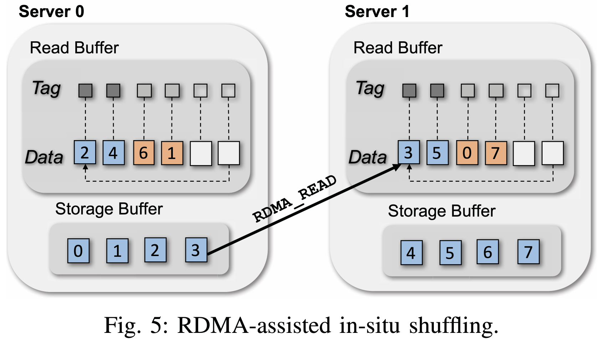

# Entropy-Aware I/O Pipelining for Large-Scale Deep Learning on HPC Systems
Yue Zhu; Fahim Chowdhury; Huansong Fu; Adam Moody; Kathryn Mohror; Kento Sato; and Weikuan Yu
*2018 IEEE 26th International Symposium on Modeling, Analysis, and Simulation of Computer and Telecommunication Systems (MASCOTS)*
> **deep learning, distributed training, data loading**
> [https://doi.org/10.1109/MASCOTS.2018.00023](https://doi.org/10.1109/MASCOTS.2018.00023)
> [http://www.mscs.mu.edu/~mascots/Papers/72.pdf](http://www.mscs.mu.edu/~mascots/Papers/72.pdf)

## Abstract
Deep neural networks have recently gained tremendous interest due to their capabilities in a wide variety of application areas such as computer vision and speech recognition. Thus it is important to exploit the unprecedented power of leadership High-Performance Computing (HPC) systems for greater potential of deep learning. While much attention has been paid to leverage the latest processors and accelerators, I/O support also needs to keep up with the growth of computing power for deep neural networks. In this research, we introduce an entropy-aware I/O framework called DeepIO for large-scale deep learning on HPC systems. Its overarching goal is to coordinate the use of memory, communication, and I/O resources for efficient training of datasets. DeepIO features an I/O pipeline that utilizes several novel optimizations: RDMA (Remote Direct Memory Access)-assisted in-situ shuffling, input pipelining, and entropy-aware opportunistic ordering. In addition, we design a portable storage interface to support efficient I/O on any underlying storage system. We have implemented DeepIO as a prototype for the popular TensorFlow framework and evaluated it on a variety of different storage systems. Our evaluation shows that DeepIO delivers significantly better performance than existing memory-based storage systems.

## Problem Statement and Research Objectives
* The read bandwidth of a parallel file system depends highly on the size of the dataset.
  * **Small datasets can easily be “cached” locally** by parallel file systems for multiple reads whereas large datasets cannot fit in the file system cache.
  * The bandwidth of reading small dataset is much greater than reading large dataset since the small dataset can benefit from the OSS’s and BeeGFS clients’ caches.
    * For small dataset: every node reads 512 MB from BeeGFS (8 GB in total) ➔ 7411.98 MB/s
    * For large dataset: the nodes read 10 GB (160 GB in total) ➔ 4662.49 MB/s

* The `tf.data` API introduces several stages: _Source_ ➔ _Map_ ➔ _Shuffle_ ➔ _Repeat_ ➔ _Batch_
   

  * **TensorFlow can perform sequential reads**, but **the randomness** of its input datasets is **highly dependent on the size of shuffling buffer** in the training framework.
  * However, **the performance of TensorFlow Dataset API** on Ext4-ssd and tmpfs are **much lower than their raw performance**, which is caused by the overheads introduced by the TensorFlow API.
    * One overhead is due to the fact that the core of `tf.data` API and TensorFlow is implemented in `C++`.
    * While TensorFlow provides wrappers to execute `C++` code in `python`, the cost of executing the wrappers to invoke the `C++` code is not trivial when the total execution time is short.
    
    

## Proposed Method
To remove the overhead of reading datasets from backend storage, we design DeepIO to be an ephemeral, in-memory storage system that is co-located with a distributed DNN training application.

### 1. RDMA-Assisted In-Situ Shuffling
In the RDMA-assisted in-situ shuffling, **datasets are buffered in each server’s local memory** and **exposed to other DeepIO servers for `RDMA_READ` operations**.
* To generate mini-batches,
  1. DeepIO servers first **create a random list of element IDs using the same seed** which is shared by broadcast at the beginning of each epoch.
  2. After that, each server will read its assigned elements from the storage buffer **using `RDMA_READ` or local memory read**, depending on the location of the element.

* The read buffer contains _data_ and an associated _tag_ for each data element.
  * The _tag_ indicates which elements have been used by the training workers and which still need to be processed.
   

  > The blue blocks mean that the reading is finished and the data is ready to be used.
  > The orange blocks imply that these blocks have been assigned to incoming elements.

### 2. Input Pipelining
The input pipelining reduces the I/O waiting time of workers by **overlapping training with mini-batch generation**.
* _The hybrid backend-memory pipeline_ is **for overlapping** the training iterations **when the size of the storage buffer of DeepIO server is insufficient** to hold the entire dataset and some elements must be retrieved from backend storage.
* _The in-memory pipeline_ **reads elements from the storage buffers of all participating DeepIO servers** and batches them for workers.
  * a part of the hybrid backend-memory pipeline

### 3. Entropy-Aware Opportunistic Ordering

According to **<mark>the Information Theory</mark>**, <u>an unlikely event is more informative than a likely event</u>. Similarly, when training with shuffled input order, a higher randomized order is more informative than a non-randomized order.
* For example, if an input order of each epoch is fixed, i.e., the probability of the appearance of the input order is 1, the training model actually learns the noise of the elements’ order instead of the elements themselves.
* **<mark>Cross-entropy</mark>** is a <u>measure of how one probability distribution diverges from a second expected probability distribution</u>. ➔ We leverage cross-entropy to help estimate the randomization level (RL) of an input sequence.
<table width="81%" align="center" style="border:1px solid grey;">
  <tbody>
    <tr>
      <td>$N_{mem}$ : the number of memory blocks on all compute nodes  
        $N_{f}$ : the number of files of a dataset  
        $N_{c}$ : the number of files that can be uploaded in $N_{mem}$ memory blocks  
        $N_{r}$ : the number of rounds needed for $N_{f}$ files to be uploaded to the $N_{mem}$ blocks  
        $r$ : the r-th file uploading round in an epoch. (the dataset file uploading round ID)  
        $N_{images}$ : the image count of a dataset.
      </td>
    </tr>
  </tbody>
</table>
 
<table width="100%" style="border:1px solid grey;">
  <tbody>
    <tr style="border:1px solid grey;">
      <td width="30%">$H(P,Q) = -\sum_{i}P(i)\log_{2}\left(Q(i)\right)$
      <td><ul><li>$P$ : The possibility of an input sequence of a hybrid backend-memory pipeline.</li>
      <li>$Q$ : The possibility of a fully shuffled input sequence</li></ul></td>
    </tr>
    <tr style="border:1px solid grey;">
      <td width="30%">$P(i, r) = \frac{N_{c}}{N_{f}-N_{c}\times r} \times \frac{1}{N_{mem}-i \mathbin{\%} N_{mem}}$
      $Q(i) = \frac{1}{N_{images}-i}$
      <td><ul><li>$\frac{N_{c}}{N_{f}-N_{c}\times r}$ : the chance of selected files on memory blocks in pipelined sequence with shuffling without replacement.</li>
      <li>$\frac{1}{N_{mem}-i \mathbin{\%} N_{mem}}$, $\frac{1}{N_{images}-i}$ : the possibility of randomly choosing elements without replacement from memory blocks.</li></ul></td>
    </tr>
    <tr style="border:1px solid grey;">
      <td width="30%">$RL = \frac{H}{H_{fully}}$
      <td><ul><li>$H_{fully}$ : the cross-entropy between two fully shuffled sequences</li>
      <li>$H$ : the cross-entropy between the input sequence and a fully shuffled sequence.</li></ul></td>
    </tr>
  </tbody>
</table>
 

> * To emulate the randomization levels, we read N images in a constant order.
>   * $RL$ (Randomization Level) : 0%(constant order) ~ 100%(fully shuffled)
>   * $RL =$ 73%, 49%, and 16% imply that 4, 16, and 256 images are concatenated in a constant sequence, which means that every 4, 16, and 256 images are treated as an independent element in shuffling, respectively.

There are two modes to select elements for mini-batches in DeepIO
* In _the ordered mode_, the order of element retrieval is **based on the requests submitted by the client** in the case that they opt out of the shuffling step.
  * However, this strict ordering results in a massive number of small random reads from backend storage to the storage buffer when the entire dataset cannot fit in the memory, which leads to relatively low read bandwidth.
  * In some training jobs, e.g., when using SGD for optimization, **<mark>the input training elements are not required to be in a meaningful order</mark>**.
    * Therefore, **the order of generated mini-batches is not important as long as it is randomized** rather than delivered in particular order.
* With _entropy-aware opportunistic ordering_, DeepIO servers **independently determine which elements will be taken in next mini-batches**.
  * The algorithm is designed to **avoid excessive inter-process communication** using a **seed broadcasting** method.
  * It **avoids a large number of small random reads** from backend storage by utilizing **only the elements that are loaded into the in-memory storage buffers**.

> * To demonstrate that our pipeline does not affect the randomization level, we have trained the AlexNet similarly
>   * $R$ indicates the ratio of the shuffling memory size to the size of the entire training dataset.
>   * $R =$ 0.25 means that the memory size used to store the dataset for one round of random read is 25% of the entire dataset.

## Evaluation and Results

-----
## Notes
* On HPC systems, the datasets can be placed on node-local devices or parallel file systems such as Lustre and BeeGFS.
* To overcome the performance challenges caused by large datasets, strategies such as distributed training with large mini-batches are typically employed. Different mini-batch sizes have been observed in practical training.