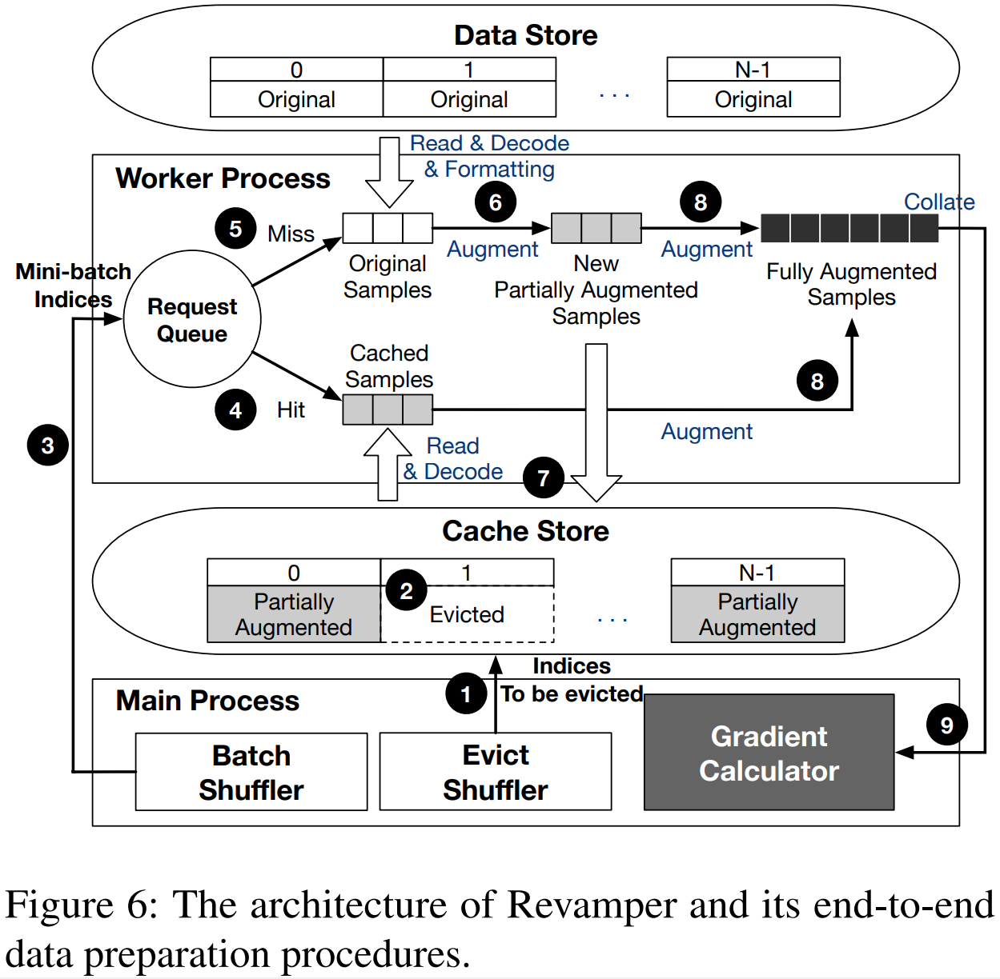
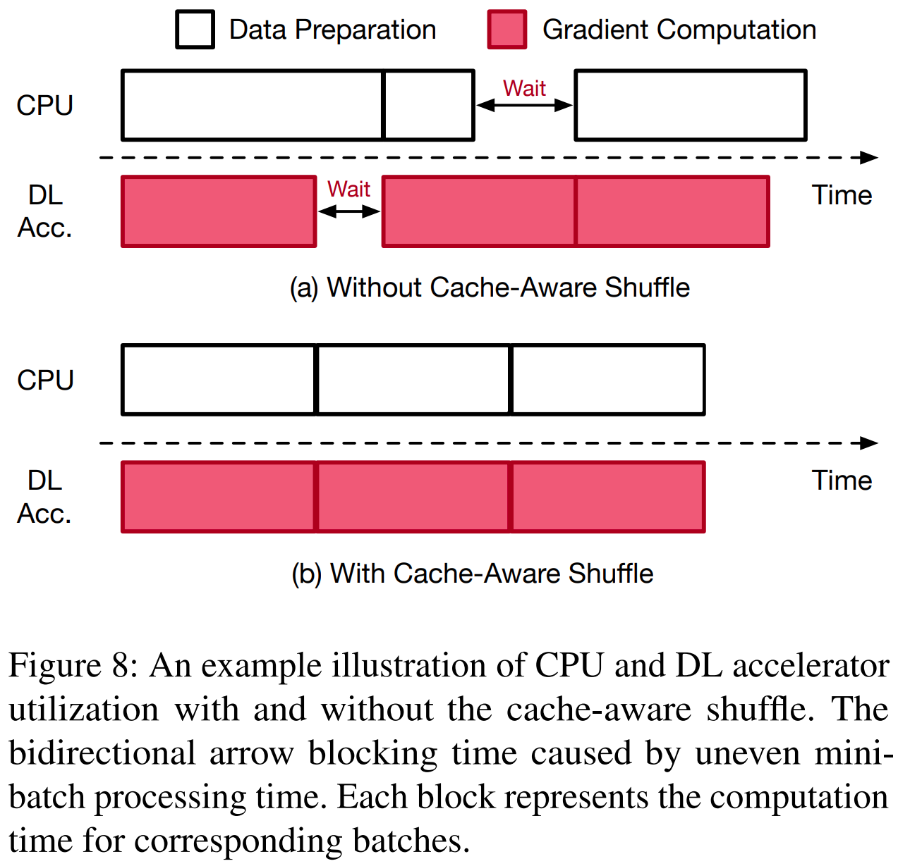

# Refurbish Your Training Data: Reusing Partially Augmented Samples for Faster Deep Neural Network Training
Gyewon Lee; Irene Lee; Hyeonmin Ha; Kyunggeun Lee; Hwarim Hyun; Ahnjae Shin; and Byung-Gon Chun
*2021 USENIX Annual Technical Conference*
> **Training Machine Learning Algorithms**
> [https://www.usenix.org/conference/atc21/presentation/lee](https://www.usenix.org/conference/atc21/presentation/lee)

## Abstract
Data augmentation is a widely adopted technique for improving the generalization of deep learning models. It provides additional diversity to the training samples by applying random transformations. Although it is useful, data augmentation often suffers from heavy CPU overhead, which can degrade the training speed. To solve this problem, we propose data refurbishing, a novel sample reuse mechanism that accelerates deep neural network training while preserving model generalization. Instead of considering data augmentation as a black-box operation, data refurbishing splits it into the partial and final augmentation. It reuses partially augmented samples to reduce CPU computation while further transforming them with the final augmentation to preserve the sample diversity obtained by data augmentation. We design and implement a new data loading system, Revamper, to realize data refurbishing. It maximizes the overlap between CPU and deep learning accelerators by keeping the CPU processing time of each training step constant. Our evaluation shows that Revamper can accelerate the training of computer vision models by 1.03×–2.04× while maintaining comparable accuracy.

## Problem Statement and Research Objectives
Because data augmentation is a stochastic process, **every augmented sample is unique**.

* The **CPU overhead** often becomes a performance bottleneck.
* Recent works such as **<mark>NVIDIA DALI</mark>** and **<mark>TrainBox</mark>** utilize hardware accelerators such as GPUs and FPGAs for optimizing data augmentation.
    ➔ It is difficult to exploit accelerators that are optimized for parallel execution of homogeneous operations.

### Previous Studies
#### a. Data echoing
  

* **<mark>Data echoing</mark>** tries to reduce the amount of computation.
  * **Split training pipelines** into the upstream and downstream pipelines
  * **Reuse previously prepared samples** from the upstream pipeline in the downstream pipeline
* This **decreases the number of unique samples** generated from data augmentation—the sample diversity—to a great degree and degrades the accuracy of trained models.
* Suppose that the upstream pipeline is `Read-Decode-Format` and the downstream pipeline is `Augment-Collate-Transfer`
  * This approach is useful when the deterministic part of the data preparation pipeline, such as I/O from a remote storage, is the bottleneck.
  * However, data echoing **becomes less effective when stochastic data augmentation is the slowest part**.

#### b. RandAugment
  

* It consists of a sequence of RandAugment layers, each of which randomly applies one of the 14 distortions (e.g., shear, rotate, and solarize) to each sample.
  * When only the `random crop` and `flip` are applied (`N = 0`), the throughput of data preparation exceed that of gradient computation on GPU, making **the data preparation step completely overlap with GPU operations**.
  * On the other hand, **when the number of <mark>RandAugment</mark> layers is set to 2**, which is known to produce the highest validation accuracy when training ResNet50 on the ImageNet dataset, **the DNN training process is bottlenecked by the data preparation**.

#### c. AutoAugment
* It searches a set of effective transformation sequences before training, and applies a sequence randomly selected from the set in every training step.

## Proposed Method
### 1. Data Refurbishing

* Data Refurbishing caches and reuses partially augmented samples generated from **<mark>the partial augmentation</mark>**, which **consists of the first few transformations in the full augmentation pipeline**.
* The rest of the augmentation pipeline—**<mark>the final augmentation</mark>**—is applied to **the partially augmented samples from the cache** in order to produce fully augmented samples.
* Data refurbishing introduces two additional configurations, the reuse factor and the split policy.
  * **The reuse factor** : how many times to reuse each cached sample (smaller than five)
  * **The split policy** : how to split the full augmentation pipeline into the partial and final augmentations. (the number of split strategies = the number of augmentation layers, does not exceed twenty)

### 2. Revamper
* Data Preparation Procedure <a href="#fn1" name="fr1">cf.</a>
  

* **The cache store** provides an interface similar to that of key-value stores. It supports `get(I)`, `put(I, S)`, and `remove(I)` methods, where `I` denotes an index and `S` denotes a partially augmented sample to be cached.
  * Partially augmented samples are either stored in memory or on disk according to the user-given `store_disk`.
  * If the `store_disk` is turned off, partially augmented samples are stored in an in-memory hash map that maps indices and the corresponding cached samples.

* Revamper **keeps the number of cache misses constant** both across epochs and within each epoch, which effectively makes the CPU processing time for each mini-batch consistent throughout the training.
  * First, **the balanced eviction strategy** evenly distributes the number of cache misses across epochs while ensuring that every cached sample is used for gradient computation for the same number of times.
  * Within an epoch, **the cache-aware shuffle** leverages the cache information to choose training samples for minibatches in order to keep the CPU computation time constant for each step.
  * Even with such modifications, the epoch boundaries are still intact, meaning that all the original training samples are used exactly once within each epoch of DNN training.
  
<table><tbody><tr><th width="50%" align="center">Balanced eviction</th><th align="center"> Cache-Aware Shuffle</th></tr>
  <tr>
  <td>
  <ul style="padding-left: 15px;"><li><b>(a)</b> Some epochs (ex. Epoch1, Epoch4) need to prepare a large number of non-cached samples while others (ex. Epoch3) do not.</li>
  <ul style="padding-left: 25px;"><li>Because <b>computation required for data augmentation is skewed</b> to a small number of epochs, DL accelerators may wait CPU in such epochs and vice versa in the other epochs.</li></ul>
  <li><b>(b)</b> At the start of each training epoch, <b>the evict shuffler samples </b>$\frac{N}{r}$<b> indices to be evicted</b>, where $N$ denotes the number of training samples and $r$ denotes the reuse factor.</li>
  <ul style="padding-left: 25px;"><li>In addition, the evict shuffler samples the indices without replacement and repeats the same sampling order until the end of training process.</li></ul>
  </ul></td>
  <td>
  <ul style="padding-left: 15px;"><li><b>(a)</b> <b>The non-cached indices are skewed</b> to the first and the third mini-batch, whereas the second batch only contains cached indices</li>
  <li><b>(b)</b> the cache-aware shuffle prepares mini-batches in a way that <b>each mini-batch has the same ratio of cached</b> to non-cached samples.</li>
  <ul style="padding-left: 25px;"><li>We ensure the randomness of the mini-batch indices by randomly sampling from both non-cached indices and cached indices. ➔ This does not adversely affect the validation accuracy of trained models</li></ul>
  </ul></td></tr>
  </tbody></table>

## Evaluation and Results
### 1. Comparison with Baselines
* **ImageNet Training with RandAugment**
  

* **CIFAR-10 Training with RandAugment**
  

* **CIFAR-10 Training with AutoAugment**
  
<table><tbody><tr><td style="padding-left:0px;">
<ul><li><b>Standard</b>: The standard setting represents the canonical DNN training with full augmentation without any reuse mechanism. The accuracy of the model trained under this setting serves as the target accuracy for the other data reusing mechanisms.</li>
<li><b>Data Echoing</b>: We evaluate data echoing with <code>echo-after-augment</code> strategy, in which each fully augmented sample is reused $r$ times, where $r$ denotes the user-given reuse factor.</li>
  <ul><li>We do not evaluate the other two strategies, <code>echo-before-augment</code> and <code>echo-after-batch</code>, since they are less relevant and/or not a good baseline.</li></ul>
<li><b>Simplified</b>: In this setting DNN models are trained with no reuse mechanism but with fewer transformation layers compared to those of the standard setting.</li></ul></td></tr></tbody></table>

### 2. Augmentation Split Policy

### 3. CPU-GPU Ratio

* The training throughput of Revamper scales well upon the increasing number of CPUs, as long as it is not bottlenecked by DL accelerators.
* Also, the performance gain from Revamper is maximized in training environments with fewer CPUs.

### 4. Robustness to Hyperparameter Change

* Revamper preserves the model accuracy of the standard setting under various hyperparameters. ➔ have varied two hyperparameters–the initial learning rate and the distortion magnitude of RandAugment.

-----
## Notes
* Data Echoing vs. Data Refurbishing
  
* Traditional data loading system (PyTorch dataloader) <a name="fn1" href="#fr1">↵</a>
  

* Revamper is applicable to both local (i.e., only one DL accelerator is used) and distributed (i.e., multiple DL accelerator or machines are used) training environments, because independent Revamper processes are created for each DL accelerator or machine.
  * However, it assumes that training data is accessible from the local disk of each machine, which requires the size of training data that are assigned to each machine to be smaller than the capacity of its local disks.
  * Hence, Revamper currently does not consider network overhead from fetching training data from a shared cloud storage.
* If the size of each sample is below threshold (16KB by default), Revamper batches multiple I/O requests to reduce system call overhead.  Revamper also batches multiple sample reads within a minibatch by packing multiple read requests into a single system call using the `AIO` library of Linux.
