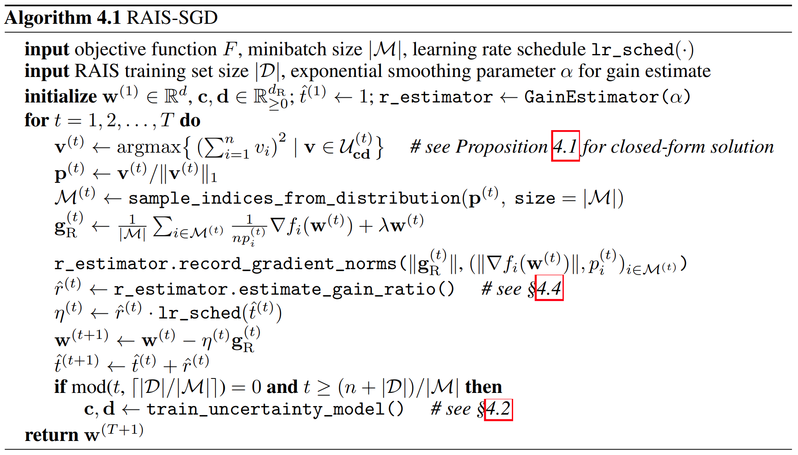
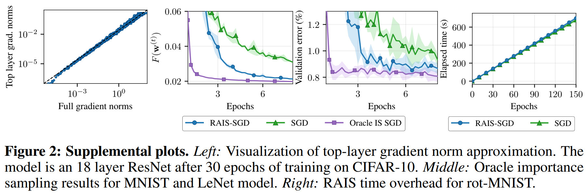

# Training Deep Models Faster with Robust, Approximate Importance Sampling
Tyler B. Johnson; and Carlos Guestrin
*Proceedings of the 32nd International Conference on Neural Information Processing Systems (NIPS'18)*
> **Deep learning, Importance sampling**
> [https://dl.acm.org/doi/10.5555/3327757.3327829](https://dl.acm.org/doi/10.5555/3327757.3327829)

## Abstract
In theory, importance sampling speeds up stochastic gradient algorithms for supervised learning by prioritizing training examples. In practice, the cost of computing importances greatly limits the impact of importance sampling. We propose a robust, approximate importance sampling procedure (RAIS) for stochastic gradient descent. By approximating the ideal sampling distribution using robust optimization, RAIS provides much of the benefit of exact importance sampling with drastically reduced overhead. Empirically, we find RAIS-SGD and standard SGD follow similar learning curves, but RAIS moves faster through these paths, achieving speed-ups of at least 20% and sometimes much more.

## Problem Statement and Research Objectives
* **Importance sampling** prioritizes training examples for SGD in a principled way. The technique suggests sampling example $i$ with probability proportional to the norm of loss term $i$’s gradient. This distribution both prioritizes challenging examples and minimizes the stochastic gradient’s variance.
  * Some previous studies analyze importance sampling for SGD and convex problems.
    * But practical versions of these algorithms sample **proportional to fixed constants**.
  * For deep models, other algorithms **attempt closer approximations of gradient norms**.
    * But these algorithms are **not inherently robust**. Without carefully chosen hyperparameters or additional forward passes, these algorithms do not converge, let alone speed up training.

## Proposed Method
We propose RAIS, an importance sampling procedure for SGD with several appealing qualities.
* First, RAIS determines each sampling distribution by solving a robust optimization problem. As a result, each sampling distribution is minimax optimal with respect to an uncertainty set. Since RAIS trains this uncertainty set in an adaptive manner, RAIS is not sensitive to hyperparameters.
* In addition, RAIS maximizes the benefit of importance sampling by adaptively increasing SGD’s learning rate. Interestingly, when plotted in terms of “epochs equivalent,” the learning curves of the algorithms align closely.
* RAIS applies to any model that is trainable with SGD. RAIS also combines nicely with standard “tricks,” including data augmentation, dropout, and batch normalization.

**<mark>O-SGD</mark>** (SGD with "*oracle*" importance sampling) vs. **<mark>U-SGD</mark>** (SGD with uniform sampling)
* samples training examples non-uniformly in a way that minimizes the variance of the stochastic gradient. (This is not new.)
  * Training examples with largest gradient norm are most important for further decreasing $F$, and these examples receive priority.
* to compensate for the first improvement, O-SGD adaptively increases the learning rate.
  * Because importance sampling reduces the stochastic gradient’s variance—possibly by a large amount— we find it important to adaptively increase O-SGD’s learning rate compared to U-SGD.
  * we propose a learning rate that depends on the “gain ratio” $r_{O}^{(t)} \in \mathbb{R}\_{{\geq 1}}$: $r_{O}^{(t)} = \mathbb{E}\left[\Vert g_{U}^{(t)}\Vert^{2}\right] \ / \ \mathbb{E}\left[\Vert g_{O}^{(t)}\Vert^{2}\right]$.
    * U-SGD with learning rate in iteration t : $\eta_{U}^{(t)} = \textsf{lr_sched}(t)$
    * O-SGD with learning rate in iteration t : $\eta_{O}^{(t)} = r_{O}^{(t)} \eta_{U}^{(t)}$

### Robust approximate importance sampling (RAIS)
<table width="50%" align="center">
  <tbody>
    <tr>
      <td>$\mathcal{M}^{(t)}$ : minibatch  
        $\mathbf{p}^{(t)}$ : discrete distribution of samples  
        $\mathbf{g}_{R}^{(t)}$ : stochastic gradient  
        $v_{i}^{*} = \Vert \nabla f_{i}(w^{(t')}) \Vert$, $\mathbf{v}^{*} = \left[ v_{1}^{*}, v_{2}^{*}, \cdots, v_{n}^{*}\right]^{T}$ 
      </td>
    </tr>
  </tbody>
</table>

#### 1. Determining a robust sampling distribution
* RAIS defines $\mathbf{p}^{(t)}$ by approximating $\mathbf{v}^{*}$
  * Naive algorithms approximate $\mathbf{v}^{\*}$ using a **point estimate** $\hat{\mathbf{v}}$
     ➔ **drawback**: extreme sensitivity to differences between $\hat{\mathbf{v}}$ and $\mathbf{v}^{\*}$.
  * Instead of point estimate, RAIS approximates $\mathbf{v}^{\*}$ with uncertainty set $\mathcal{U}^{(t)}\subset\mathbb{R}\_{\geq0}^{n}$, which we expect contains (or nearly contains) $\mathbf{v}^{*}$.
  * Given $\mathcal{U}^{(t)}$, RAIS defines $\mathbf{p}^{(t)}$ **by minimizing the worst-case value** of $\mathbb{E}\left[\Vert g_{R}^{(t)}\Vert^{2}\right]$ over **all gradient norm possibilities in $\mathcal{U}^{(t)}$**

#### 2. Modeling the uncertainty set
* For each example $i$, we define a feature vector $s_{i}^{(t)} \in \mathbb{R}\_{\geq 0}^{d_{R}}$. (A useful feature for $s_{i}^{(t)}$ is the gradient norm, $\Vert \nabla f_{i}(w^{(t')}) \Vert$)
* Given $s_{i}^{(t)}$ for all examples, RAIS defines the uncertainty set as an **axis-aligned ellipsoid**.
  * RAIS **parameterizes this uncertainty set** with two vectors, $\mathbf{c}\in\mathbb{R}\_{\geq 0}^{d_{R}}$ and $\mathbf{d}\in\mathbb{R}\_{\geq 0}^{d_{R}}$.
     ➔ **parameters of the ellipsoid**
  $$v_{i}^{(t)}=\left<\mathbf{c}, \mathbf{s}\_{i}{(t)}\right> + k\left<\mathbf{d}, \mathbf{s}\_{i}{(t)}\right>$$

#### 3. Learning the uncertainty set
In order to make $\mathbb{E}\left[\Vert g_{R}^{(t)}\Vert^{2}\right]$ small but still ensure $\mathbf{v}^{\*}$ likely lies in $\mathcal{U}\_{\mathbf{cd}}^{(t)}$, RAIS adaptively define $\mathbf{c}$ and $\mathbf{d}$. To do so, RAIS minimizes the size of $\mathcal{U}\_{\mathbf{cd}}^{(t)}$ subject to a constraint that encourages $\mathbf{v}^{\*} \in\mathcal{U}\_{\mathbf{cd}}^{(t)}$:
$$\mathbf{c}, \mathbf{d} = \arg\inf \\{\sum_{i=1}^{n}\left<\mathbf{d},\mathbf{s}\_{i}^{(t)}\right>\mid\mathbf{c},\mathbf{d}\in\mathbb{R}\_{\geq 0}^{d_{R}}, \frac{1}{|\mathcal{D}|}\sum\_{i=1}^{|\mathcal{D}|}\tilde{w}\_{i}Q_{\mathbf{cd}}(\tilde{s}\_{i}, \tilde{v}\_{i})\leq1\\} \mathbf{ \ \ \ \ \ (PT)}$$

#### 4. Approximating the gain ratio
* In addition to the sampling distribution, RAIS must approximate the gain ratio in O-SGD. Define $g_{R1}^{(t)}$ as a stochastic gradient of the form (4) using minibatch size 1 and RAIS sampling. Define $g_{U1}^{(t)}$ in the same way but with uniform sampling. From (5), we can work out that the gain ratio satisfies $$\mathbb{E} \left[ \Vert g_{U}^{(t)}\Vert^{2} \right] \ / \ \mathbb{E}\left[\Vert g_{R}^{(t)}\Vert^{2}\right] = 1 + \frac{1}{\vert \mathcal{M} \vert}\left( \mathbb{E} \left[ \Vert g_{U1}^{(t)}\Vert^{2} \right] \ / \ \mathbb{E}\left[\Vert g_{R1}^{(t)}\Vert^{2}\right] \right) / \mathbb{E}\left[\Vert g_{R}^{(t)}\Vert^{2}\right] $$
* To approximate the gain ratio, RAIS estimates the three moments on the right side of this equation. RAIS estimates $\mathbb{E}\left[\Vert g_{R}^{(t)}\Vert^{2}\right]$ using an exponential moving average of $\Vert g_{R}^{(t)}\Vert^{2}$ from recent iterations: $$\mathbb{E}\left[\Vert g_{R}^{(t)}\Vert^{2}\right]  \approx \alpha\left[\Vert g_{R}^{(t)}\Vert^{2} + (1-\alpha) \Vert g_{R}^{(t-1)}\Vert^{2} + (1-\alpha)^{2} \Vert g_{R}^{(t-2)}\Vert^{2} + \cdots \right]$$
  

#### 5. Practical considerations
* Solving $\mathbf{(PT)}$
  - RAIS should not solve $\mathbf{(PT)}$ during every iteration. Our implementation solves $\mathbf{(PT)}$ asynchronously after every $\lceil \vert \mathcal{D} \vert / \vert \mathcal{M} \vert \rceil$ minibatches, with updates to $w^{(t)}$ continuing during the process.
* Approximating per-example gradient norms
  - Unfortunately, existing software tools do not provide efficient access to per-example gradient norms. Instead, libraries are optimized for aggregating gradients over minibatches.
  - We do so by replacing $\Vert \nabla f_{i}(w^{(t)}) \Vert$ with the norm of only the loss layer’s gradient (with respect to this layer’s inputs).

## Evaluation and Results
 
 
 

-----
## Notes
* Given $w^{(t)}$, let us define the expected training progress attributable to iteration $t$ as
  $\mathbb{E} \triangle ^{(t)} = \Vert w^{(t)} - w^{*}\Vert^{2}- \mathbb{E}[\Vert w^{(t+1)} - w^{\*}\Vert^{2}]$
  $\ \qquad \ = 2\eta^{(t)} \langle\nabla F(w^{(t)}), w^{(t)} - w^{\*}\rangle - [\eta^{(t)}]^{2}\mathbb{E}[\Vert g^{(t)}\Vert^{2}]$
  (to increase $\mathbb{E} \triangle ^{(t)}$)
  * Conventionally use RMSE(Root Mean Squared Error) like L2 norm