

# Are You Killing Time? Predicting Smartphone Users' Time-killing Moments via Fusion of Smartphone Sensor Data and Screenshots
Yu-Chun Chen; Yu-Jen Lee; Kuei-Chun Kao; Jie Tsai; En-Chi Liang; Wei-Chen Chiu; Faye Shih; and Yung-Ju Chang
*CHI '23: 2023 CHI Conference on Human Factors in Computing Systems*
> **Smartphones and Notifications**
> [https://programs.sigchi.org/chi/2023/program/content/96013](https://programs.sigchi.org/chi/2023/program/content/96013)
> [https://www.youtube.com/watch?v=OvrSPuGkhc0](https://www.youtube.com/watch?v=OvrSPuGkhc0)

## Abstract
Time-killing on smartphones has become a pervasive activity, and could be opportune for delivering content to their users. This research is believed to be the first attempt at time-killing detection, which leverages the fusion of phone-sensor and screenshot data. We collected nearly one million user-annotated screenshots from 36 Android users. Using this dataset, we built a deep-learning fusion model, which achieved a precision of 0.83 and an AUROC of 0.72. We further employed a two-stage clustering approach to separate users into four groups according to the patterns of their phone-usage behaviors, and then built a fusion model for each group. The performance of the four models, though diverse, yielded better average precision of 0.87 and AUROC of 0.76, and was superior to that of the general/unified model shared among all users. We investigated and discussed the features of the four time-killing behavior clusters that explain why the models' performance differ.

## Introduction
* Given human beings' limited attentional resources, **a crucial problem for anyone delivering content to phones is how to make it stand out from the feast of other incoming information**.
  * One mainstream approach to achieving this is to predict moments at which users are receptive to such content, e.g., the content related to notifications, questionnaires, and reading material explored in prior studies.
  * Moments of **"attention surplus"** constitute another opportunity for such detection attempts.
    * Pielot et al., for example, **attempted to detect one kind of "attention surplus" state – boredom**. In such situations, some people tend to seek stimulation on their phones to alleviate boredom. Beyond boredom, however, research has shown that mobile phone usage is not always driven by a specific purpose, but is often accompanied by, or is primarily, "time-killing" behavior
* **Time-killing** is not necessarily linked to boredom, Rather, this type of usage can **simply be a result of habit**.
  * However, when the trigger of habitual phone usage is to fill free time, even if it may occasionally include productive tasks such as checking emails and messages, it is typically viewed as aimless, and if it occurs frequently without regulation, as addictive and compulsive.
  * There has been limited effort in detecting the occurrence of such prevalent phone usage intended for time-killing, making the feasibility of detecting this phone usage unclear.
* We **aim to develop a model for effectively detecting phone usage intended for time-killing**.
  * To achieve this aim, we developed an **Android research application** that automatically collected smartphone screenshot and phone-sensor data, and an interface that allowed its **users to efficiently annotate their screenshot data** with time-killing periods and their availability during those periods for viewing notifications.
  * Data collection with 36 participants over 14 days yielded a dataset of 967,466 pairings of annotated phone-sensor data with screenshots, covering 1,343.7 hours of phone usage.

## Related Work
* Interruptibility, Breakpoint, and Opportune Moment Prediction
  * Employ **machine-learning techniques** to predict mobile interruptibility or opportune moments for receiving calls and notifications.
  * **Identify opportunities** based on breakpoints
  * Detecting moments when device users want to engage with content
  * **Attention prediction** involves identifying "attention surplus" moments and timing the delivery of specific content and tasks accordingly
* Phone-usage Research
  * Utilize **self-report methods** such as interviews and diaries
    * However, because self-report methods are subject to recall biases, quantitative analysis of phone-usage logs is becoming increasingly popular.
  * Attempts to **construct models of phone usage**
  * Understanding differences in usage features across **distinct user clusters**.
  * Use **screenshots and video recordings**
    * because log data are limited to system events like screen events and app states
  * Use deep-learning models **trained on large amounts of Graphical User Interface (GUI) data** to detect screenshots.

## Implementation
### I. Data Collection

#### 1. Input-data Selection
* **<mark>Screenshot collection</mark>** has become a popular method in HCI research, because it allows researchers to collect **quantitative and qualitative data simultaneously** in high granularity and rich detail.
➔ We aimed to leverage **screenshot data, <u>along with phone-sensor interaction information</u>** (including user/phone interaction and phone status)
  * i.e., Android accessibility events, screen status, network connections, phone volume, application usage, and type of transportation

#### 2. Research Instrument
* We developed an Android research application, called **<mark>Killing Time Labeling (KTL)</mark>**
* <u>During whatever 12+-hour window</u> the user has chosen(default: 10 a.m.~10 p.m.),
  * Phone-sensor data is **collected every five seconds**.
  * Screenshots are also **captured every five seconds**, but only when the phone screen is on.
* KTL also **captures the notifications** its users receive, the times at which they receive them, and how they are dealt with.
* KTL also **sent a reminder at night** and <u>invalidated screenshots that had not received any annotations after two days</u>, which participants could no longer annotate.
* For each screenshot, participants had five annotation options:
  1. killing time and available for viewing notifications
  2. not killing time but available for viewing notifications
  3. killing time but unavailable for viewing notifications
  4. not killing time and unavailable for viewing notifications
  5. unidentifiable
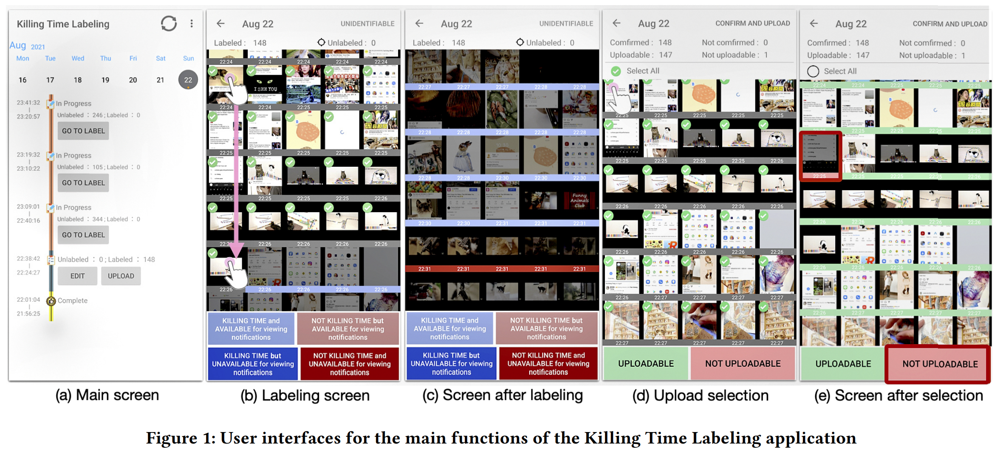

#### 3. Study Procedure
* Prior to data collection, due to the COVID-19 pandemic, we allowed our participants to **choose between remotely and physically attending** 
  * We told them that we expected them to annotate all screenshots automatically captured by KTL every day, and that 14 days of active participation were needed for their data to be useful to us.
* On their respective final days of participation, to aid future analysis, they completed **four additional questionnaires**
  * measured their boredom proneness, smart-phone addiction, inattention, and perceived acceptability of time-killing detection being deployed on their phone.
* In addition, we invited all participants to **two optional semi-structured interviews**. (after 7 days & after participation completes)
  * We asked them about their labeling processes, time-killing behaviors and preferences, and how they killed time (both typically and during the study).

#### 4. Recruitment and Participation
* We **selected participants with various occupations**, expecting they would have different time-killing patterns. 
* To ensure that sufficient data were collected, we selected participants <u>who used their mobile phones more than one hour a day</u>, according to their self-reporting in a screening questionnaire.
* As a result, data from <u>36 people</u> were used for training our time-killing detection model
  * Aged between 20 and 54 (M = 27.4, SD = 6.8),
  * 16 identifying as male and 20 as female.
  * Half were students, and the other half in employment.

#### 5. Data Collection
* In total, 1,186,345 screenshots were annotated (per-participant M = 32,954.0, SD = 15,557.9)
  * represents approximately 1,633.8 hours of phone use.
  * 1,062,780 (89.6%) screenshots were uploaded
    ➔ There were **<mark>more time-killing moments</mark>** than non-time-killing ones
    ➔ The participants reported being **available to view notifications more frequently during the time-killing moments (82.2%)** than during non-time-killing ones (63.3%).
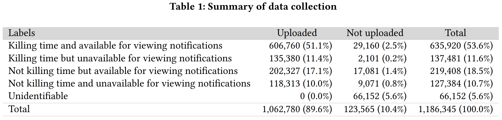

#### 6. Feature Selection and Extraction
* To predict time-killing moments, we extracted <b style="color:#45a2bc !important;">two kinds of feature sets</b> from the phone-sensor data: **phone context and user interactions**.
* For each of these feature sets, we created <b style="color:#f27367 !important;">two temporal ranges</b>,
  1. **Describing the phone at the moment** when a screenshot was taken
  2. **Describing the characteristics of the phone-use session**<a href="#fn1" name="fr1">Note</a> during which it was taken.
* As a result, the final dataset for developing the model consisted of **967,466 annotated screenshots**, from which 183 features were derived.
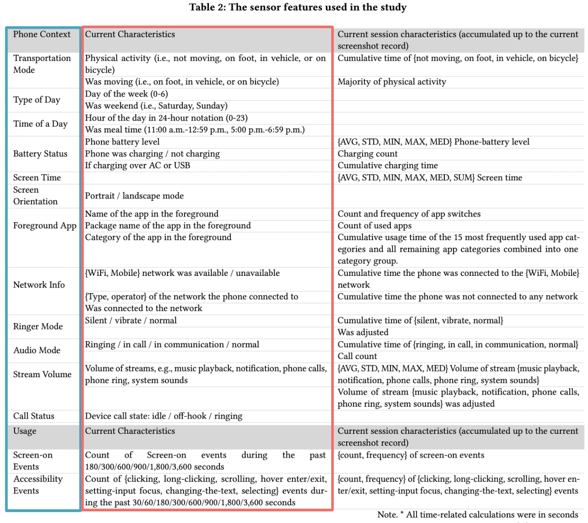
> **ⓘ Note**<a name="fn1" href="#fr1">↵</a>
> **Phone-use session**: continuous use of the phone during which any brief screen-of interval was not longer than 45 seconds.

### II. Model Design
#### 1. Training details
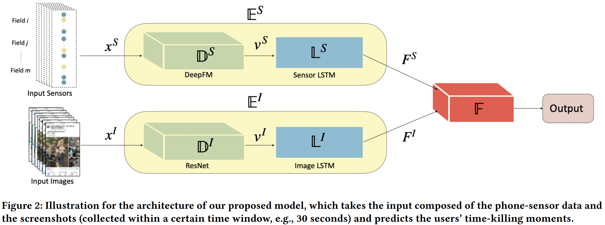

* We adopted a stage-wise training procedure, in which **we first trained the encoders, $\mathbb{E}^{S}$ and $\mathbb{E}^{I}$, independently**.
  * After pre-training both encoders till they converged, we removed the attached fully connected layers and fixed the weights of encoders. Then we trained the fusion subnetwork $\mathbb{F}$
* Instead of concatenating two features and utilizing a simple classifer to perform a multimodal fusion, we introduced an additional multi-fusion layer that takes both features as inputs to predict the reweighting coefficients $\alpha^{S}$ and $\alpha^{I}$
  * The reweighted features, denoted as $\tilde{\mathbb{F}}^{S}=\alpha^{S} \otimes \mathbb{F}^{S}$ and then concatenate with the original $\mathbb{F}^{S}$

#### 2. Experiment
* Dataset
  1. To predict whether a screenshot was labeled as time-killing or non-time-killing, we used **features derived from the screenshots and their paired sensor data <mark>30 seconds</mark> (i.e., seven screenshots) <mark>prior to</mark>** the predicted one.
  2. To prevent our model from being overly biased towards particular participants, **<mark>sampled 20,000 screenshots from each participant</mark>**.
  3. ➊ data collected on both weekends and weekdays, and ➋ exactly equal numbers of time-killing and non-time-killing instances.
* Evaluation Metrics
  1. **<mark>Testing dataset</mark>** had more time-killing instances than non-time-killing ones, **in the ratio 7:3**.
  2. ROC(Receiver Operating Characteristics)-curve & PR(Precision Recall)-curve
* Model Evaluation
  1. **3-fold cross-validation** on the dataset.
  2. Fusion model vs. SensorOnly model vs. ScreenshotOnly model

#### 3. Result

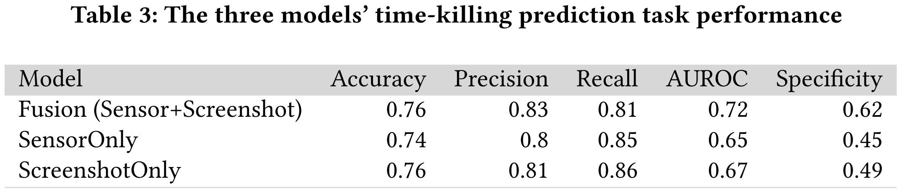

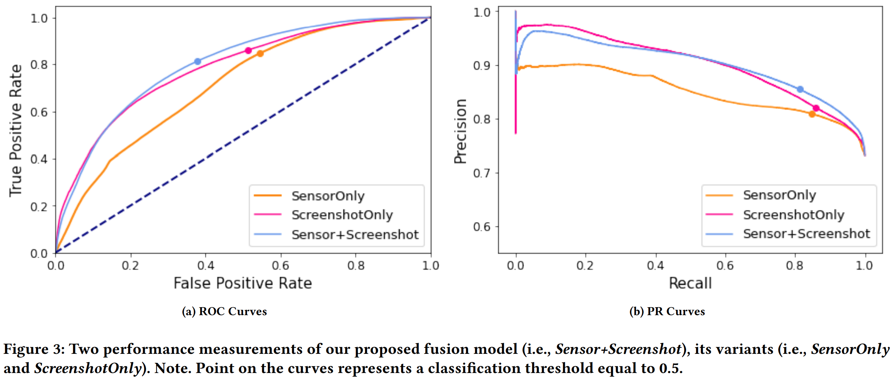

**Examples**

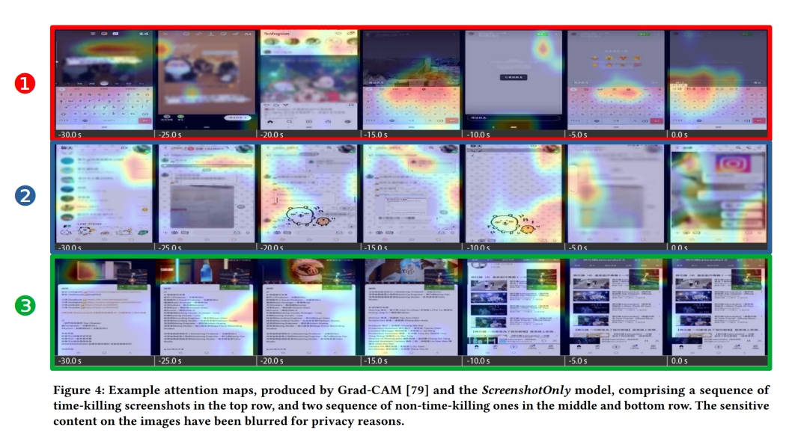

1. ✔ ScreenshotOnly ❌ SensorOnly ✔ Fusion    (time-killing case)
    * SensorOnly: because **a series of text-changed events were detected**, despite in an Instagram application, which was more likely to occur when not killing time.
    * ScreenshotOnly: it recognized the layout of the user interface of Instagram's Story feature.

2. ❌ ScreenshotOnly ✔ SensorOnly ✔ Fusion   (time-killing case)
    * ScreenshotOnly: recognized **the layout of LINE**.
    * SensorOnly: by the call status and the change of the call volume.

3. ❌ ScreenshotOnly ❌ SensorOnly ✔ Fusion
 (In this non-time-killing case, the participant was sitting in a moving vehicle and was using a navigation app while simultaneously watching a video on Youtube.)
    * SensorOnly: mistook this situation as time-killing **based on the application and physical-activity information**.
    * ScreenshotOnly: **Youtube's layout** but ignored the navigation map, possibly due to the similar color of the video screen to that of the map.
    * Fusion: correctly identified this moment, possibly because it considered **both the physical-activity information and the use of the navigation functionality**.

## Evaluation
### 1. Clustering Participants Based on their Phone-usage Behavior
* Clustering to identify **<mark>distinct phone-usage behavioral patterns</mark>**.
  * **9 features (inspired by interview)**: 1) session duration, 2) screen-switching frequency, 3) application-switching frequency, 4) scroll-event frequency, 5) text-change event frequency, 6) maximum and 7) minimum gap durations for scroll events, and 8) maximum and 9) minimum gap durations for text-change events.
  * Applied k-means, and used the Elbow method to determine the number of clusters. **(K=5)**
* **<mark>Clustered participants</mark>** according to how often their phone use belonged to each of the identified phone-usage patterns
  * We calculated the proportions of each user's five outcome behaviors, and used those proportions to cluster users.
  * Elbow methods: the resulting **k-value was 4**
    * the number of participants being 11, 11, 9, and 5 respectively.
    * time-killing:non-time-killing=13:6, 3:1, 81:19, and 3:2

### 2. Overall Performance of the Cluster-based Models
  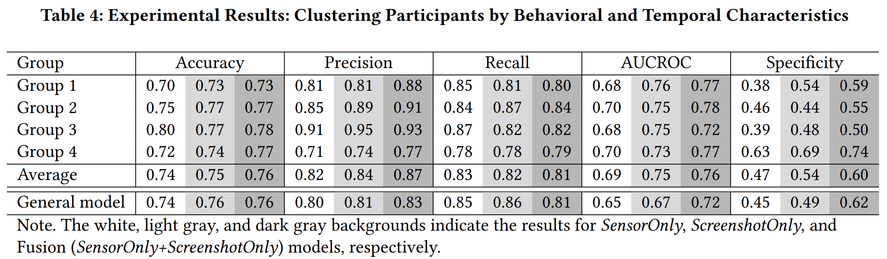
  * Build the same fusion model for each of the four user groups.
  * **<mark>It is beneficial to divide users into groups</mark>** according to their phone-usage behavior and build a time-killing prediction model for each such user group.
   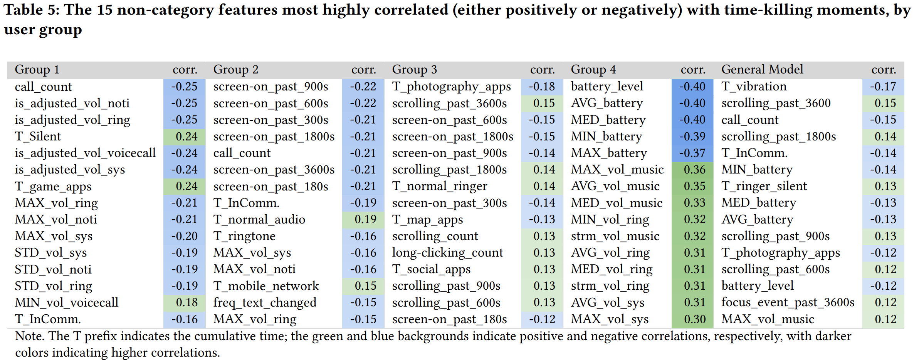
  * The correlations between time-killing moments and phone-sensor features.
  * Doing so revealed **<mark>features correlated with time-killing moments specifically for certain participants</mark>**, which would not have been revealed had they not been divided into groups.

### 3. Model Performance and Behavior by User Group
* Group2: **ScreenshotOnly model achieved better** performance than its SensorOnly model for all metrics **except specificity**
  * ScreenshotOnly was accurate in predicting time-killing moments but less so in predicting non-time-killing moments.
<table width="100%">
  <tbody>
    <tr>
      <td width="30%">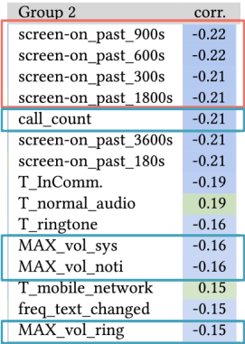
      <td><ul><li>Implies that these participants' non-time-killing moments were <b style="color:#f27367 !important;">more often associated with making calls</b>.</li>
      <li>The prior research has reported a <b style="color:#45a2bc !important;">high association between quiet ringer modes and proactive phone-checking behaviors</b></li></ul>
      ➔ the Group 2 behaviors we observed could have indicated participants checking their phones frequently to avoid missing calls and/or notifications.</td>
    </tr>
  </tbody>
</table>

* Group4: **Fusion model** performed particularly **well in specificity**
  * Fusion model was better at predicting its members' non-time-killing moments.
<table width="100%">
  <tbody>
    <tr>
      <td width="50%">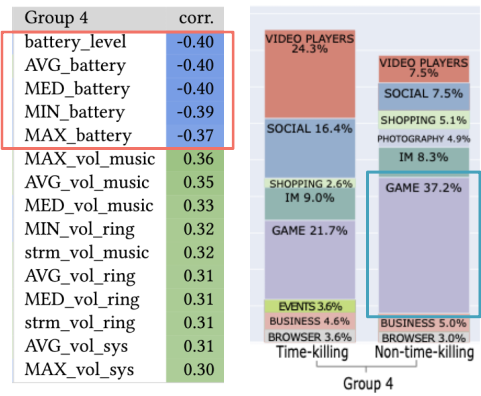
      <td><ul><li>predominantly <b style="color:#f27367 !important;">battery related</b> ones, which were <b style="color:#f27367 !important;">negatively correlated with time-killing moments</b>.</li>
      <li><b style="color:#45a2bc !important;">played games much more often during non-time-killing</b> moments than during time-killing ones (37.2% vs. 21.7%)</li></ul>
      ➔ Possibly because of the large quantity of this distinctive behavior during non-time-killing moments, the Group 4 fusion model's true negative rate was particularly high.</td>
    </tr>
  </tbody>
</table>

* Group1: Fusion model was better at predicting its members' time-killing moments
  * Fusion model achieved significantly higher precision.
<table width="100%">
  <tbody>
    <tr>
      <td width="40%">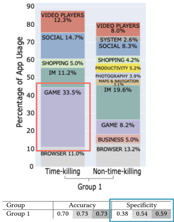
      <td><ul><li>Spent considerable time <b style="color:#f27367 !important;">playing games</b>, but in contrast to the Group 4 members, they were much more likely to do so <b style="color:#f27367 !important;">during time-killing moments</b>.</li>
        <li>SensorOnly model achieved much poorer specificity than its ScreenshotOnly model, suggesting that the fusion model <b style="color:#45a2bc !important;">relied heavily on screenshot data to recognize non-time-killing moments</b>.</li></ul></td>
    </tr>
  </tbody>
</table>

* Group3
  * Notably, correlations between features and time-killing moments were also lowest for  Group 3, suggesting that its members' time-killing behaviors tended to be diverse.
<table width="100%">
  <tbody>
    <tr>
      <td width="40%">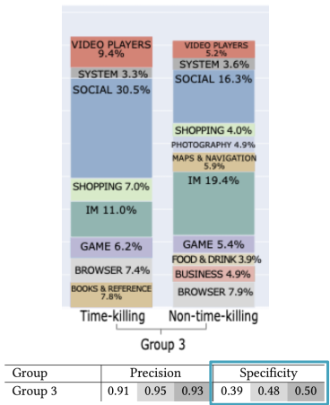
      <td><ul><li>Despite having the highest precision among the four groups, it had a particularly <b style="color:#45a2bc !important;">low true-negative rate</b>.</li>
      </ul>➔ might be attributed to it <b>having the most unbalanced dataset</b>: 80% of the instances were time-killing moments.</td>
    </tr>
  </tbody>
</table>

## Limitations
* There may be an overlap between moments when people are killing time and moments when they feel bored, but the study didn't use a method to collect data on participants' boredom, making it unable to quantify the differences between these moments.
* Because of the sensitive data collected, participants might have altered their phone usage behavior during the study, impacting the results. Additionally, participants had limited control over sensor data collection, which could also affect their behavior.
* The data collected relied on participants' annotations, which may not always be reliable due to recall errors and mislabeling.
* The study did not consider additional features that could help infer users' activity on the phone screen.
* The dataset was small and limited to a specific demographic, raising questions about generalizability.
* Privacy concerns were not addressed adequately, and future research should consider encryption and other privacy protection techniques.
* The study did not analyze demographic characteristics, occupations, or notification-attendance behavior, which should be considered in future studies.
