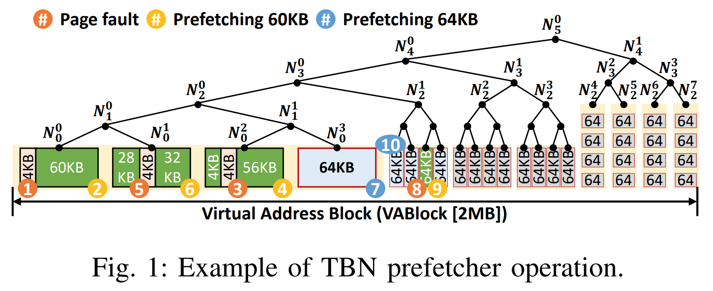
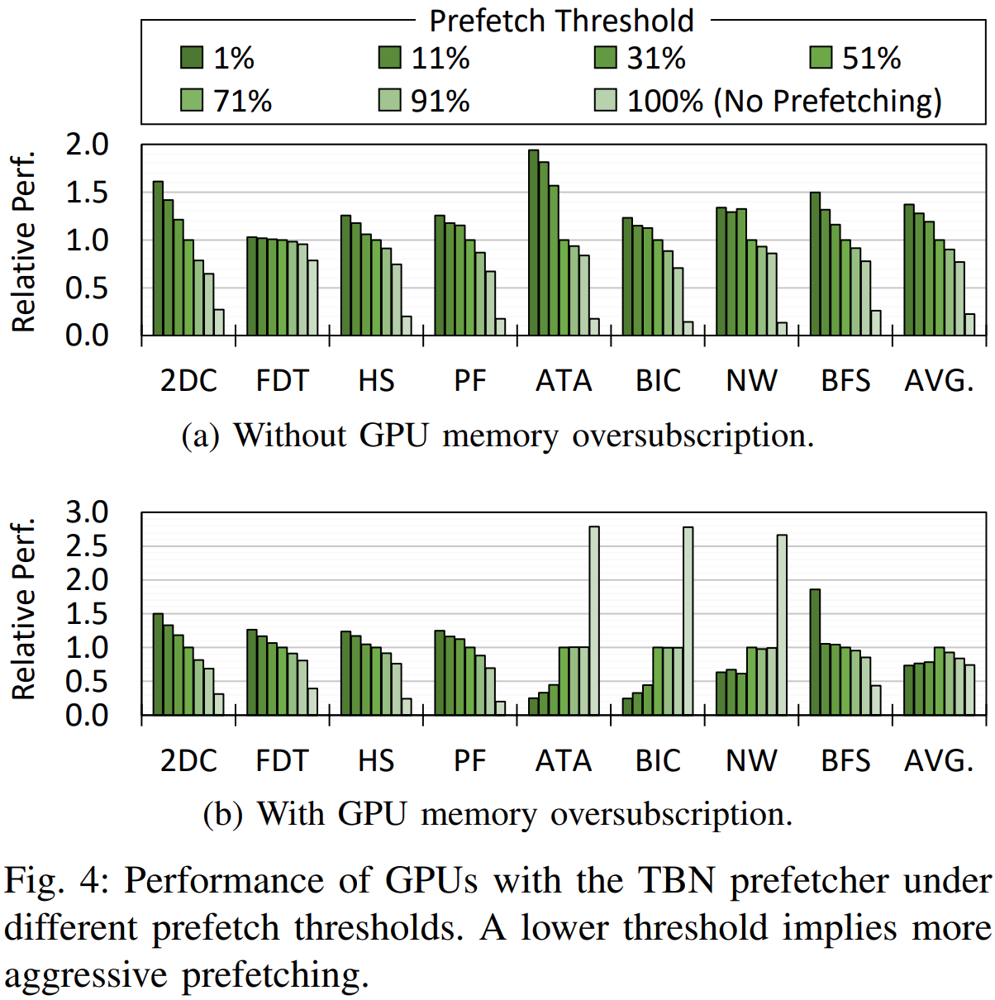
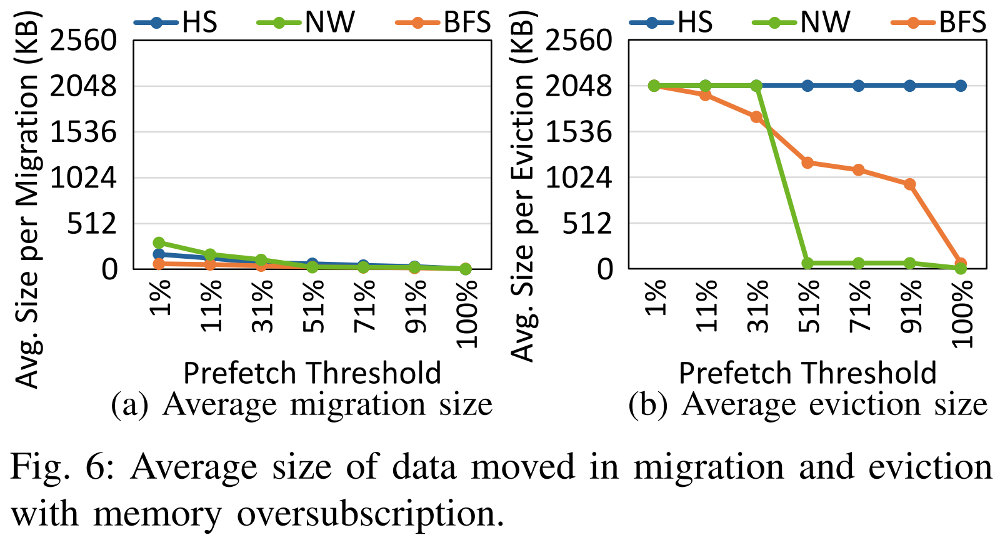
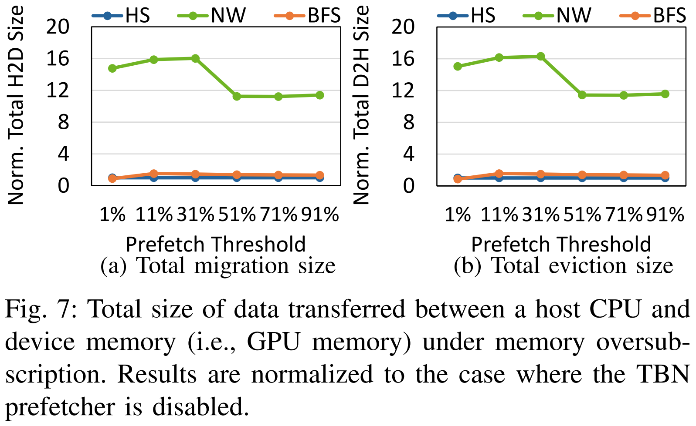
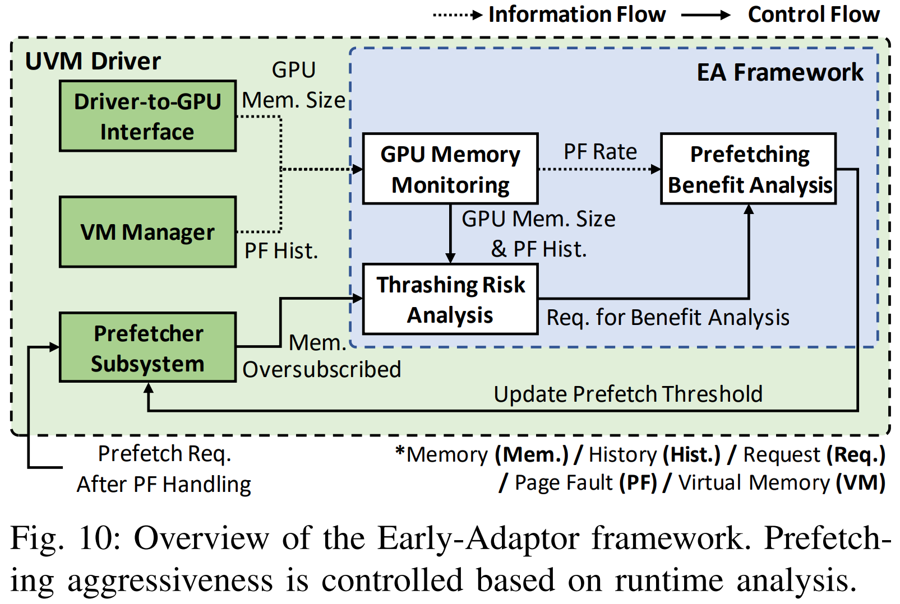
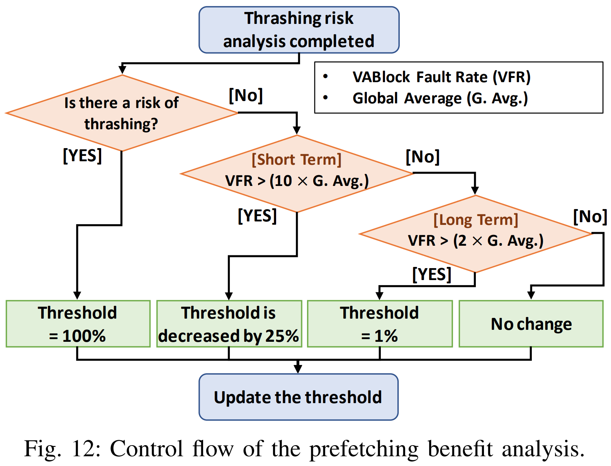
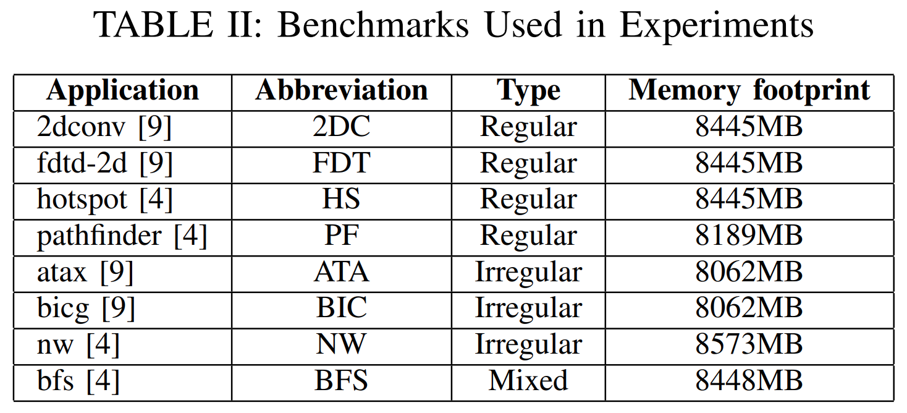
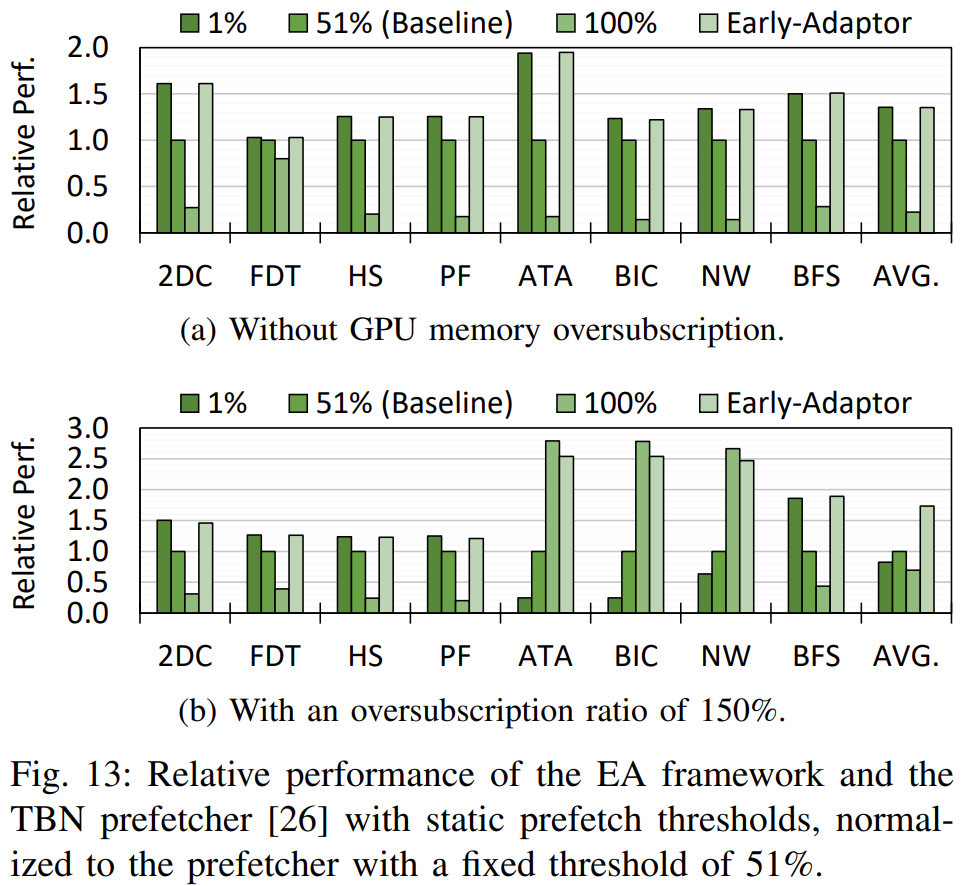
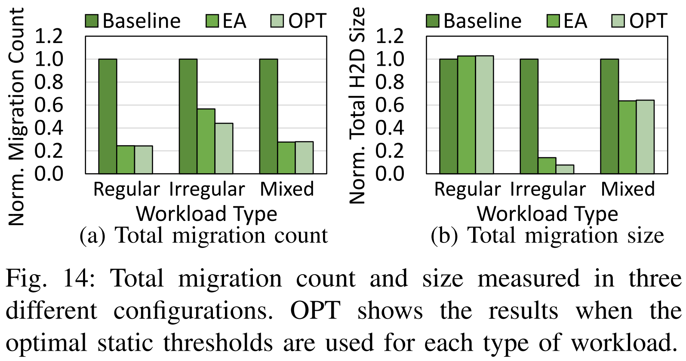

# Early-Adaptor: An Adaptive Framework for Proactive UVM Memory Management
Seokjin Go; Hyunwuk Lee; Junsung Kim; Jiwon Lee; Myung Kuk Yoon; and Won Woo Ro

> **GPGPU, Unified Virtual Memory, prefetching, memory management**
> [https://doi.org/10.1109/ISPASS57527.2023.00032](https://doi.org/10.1109/ISPASS57527.2023.00032)

## Abstract
Unified Virtual Memory (UVM) relieves programmers of the burden of memory management between CPU and GPUs. However, the use of UVM can lead to performance degradation due to its on-demand page migration scheme, especially under memory oversubscription. In this research, we conduct various analyses on real hardware, NVIDIA RTX 3090, to examine such performance degradation with an NVIDIA opensource GPU driver. Our analysis shows that the effectiveness of prefetching highly correlates with the relative number of page faults on a group of contiguous pages, which NVIDIA refers to as a Virtual Address Block (VABlock) spanning across a 2MB virtual address range. Also, the risk of page thrashing is determined by the total number of VABlocks that consistently generate page faults during kernel execution. Hence, the performance impact of the prefetch threshold varies across different workloads. These observations indicate that an adaptive prefetching scheme can resolve the performance bottleneck of memory oversubscription. To this end, we propose the Early-Adaptor (EA) framework, which automatically controls the prefetching aggressiveness based on the page fault history. During runtime, the EA framework monitors patterns of page faults in per-VABlock and in a global scope. After analyzing page fault generation rates and the possibility of page thrashing, the EA framework dynamically controls the prefetching aggressiveness by changing the prefetch threshold. The EA framework requires only minor changes to GPU drivers and needs no changes to the GPU hardware. Experiments on real hardware show that when GPU memory is oversubscribed, the EA framework achieves an average speedup of 1.74x over the conventional GPU prefetcher.

## Problem Statement and Research Objectives
* With UVM, whenever a GPU accesses data residing in the host memory, the GPU driver migrates the data to the GPU memory in the granularity of 4KB pages.
  * **Due to data dependencies, this on-demand page migration stalls all warps accessing the requested pages.** Thus, page migration can lead to the underutilization of compute resources.
  * The process of page fault handling involves interaction with the host operating system for page table manipulations and transferring data through the PCIe interconnect to migrate the required data.
  ➔ Frequent generation of page faults can be harmful to the performance of GPU applications.
* Modern NVIDIA GPUs feature a **<mark>Tree-based Neighborhood (TBN) prefetcher</mark>** that exploits spatio-temporal locality within a 2MB Virtual Address Block (VABlock) region.
  * __When the number of GPU-resident pages in a subregion of a VABlock exceeds a certain threshold(default is 50%)__, the TBN prefetcher migrates all the CPU-resident pages of the subregion to the GPU memory.

> The root node of the tree corresponds to the 2MB region of a VABlock, while a leaf node corresponds to a 64KB virtual address region. In each level, a child node correlates to either a lower or upper half subregion of its parent node.
> ➔ Note that **when prefetching is disabled**, the driver no longer manages pages in 64KB regions; it instead **manages GPU memory at the granularity of a 4KB page**.
> * ❶ The first page fault occurs in the leftmost 4KB page in the first VABlock
> * ❷ After migrating the 4KB page, the remaining pages in the leaf node are prefetched to the GPU memory since the TBN prefetcher manages memory space at the granularity of a 64KB region.
> * After migrating three 64KB regions (❶~❻), the prefetcher finds that more than 50% of the pages under node $N_{2}^{0}$ are resident in the GPU memory. ❼ Then, the prefetcher migrates all pages that are not yet present in the GPU memory under $N_{2}^{0}$.

### Performances of GPUs under different prefetch threshold

* The performance is normalized to the default prefetcher that has a threshold value of 51%.
* (a) When memory footprints do not exceed the GPU memory size: aggressive prefetching policy (i.e., lower threshold) shows higher performance than the default configuration.
* (b) When applications need to use more memory space than GPU physical memory: using a lower prefetch threshold does not necessarily lead to higher speedups

### Memory access characteristics by workload type

* **<mark>Regular types of workloads</mark> (HS)** generate a large number of page faults within a limited number of VABlocks at a time.
  * For such workloads, aggressive prefetching is effective, regardless of memory oversubscription.
* **<mark>Workloads with irregular memory access patterns</mark> (NW)** access a limited number of pages in each VABlock, but they tend to access a large number of VABlocks within a window of time.
  * aggressive prefetching can degrade the performance when GPU memory oversubscribed.
* **<mark>Applications that exhibit mixed memory access patterns</mark> (BFS)** benefit from aggressive prefetching if the size of the irregularly accessed regions does not exceed GPU memory capacity.

## Proposed Method
Using the observations, we propose **<mark>EarlyAdaptor (EA)</mark>** framework that adaptively manages the prefetching aggressiveness on UVM.

### 1. GPU memory monitoring
At runtime, **the GPU memory monitoring** tracks the number of VABlocks that have generated consistent page faults recently.
 * By default, when memory oversubscription is not detected, the prefetch threshold is set to 1% to minimize page fault overheads by employing aggressive prefetching.
 * However, when oversubscription is detected, the EA framework adjusts the prefetch threshold for each VABlock to 100% for accurate measurement of page fault history.
 * To ensure sufficient accuracy in each analysis, the GPU memory monitoring tracks the page fault history for both short-term (i.e., last 20ms) and long-term (i.e., last 1s) time windows. 
    * regular regions generate them in a burst ➔ short-term window
    * irregular regions generate consistent page faults for a long timespan ➔ long-term window
### 2. Thrashing risk analysis
**The thrashing risk analysis** then compares the count of VABlocks with the size of GPU memory.
  * If the total size of risky VABlocks is larger than the GPU memory, the framework sends a throttling signal to the prefetching benefit analysis, as it indicates a potential risk of page thrashing.
    * The last 1 second of page fault history is logically partitioned into fifty 20ms-long time slices. Each time slice, denoted by the ${i}$th slice, captures the page fault history that occurred between the last $20 \times (i - 1)$ ms and $20 \times i$ ms of the timeline.
    * If the VABlock has generated page faults from more than two different time slices, the VABlock is classified as a risky VABlock.
### 3. Prefetching Benefit Analysis
**The prefetching benefit analysis** decides whether to prefetch the VABlock or not, as well as the prefetch threshold, based on the information from the previous two components.
  

## Evaluation and Results
### 1. Benchmarks <a href="#fn1" name="fr1">1</a>, <a href="#fn2" name="fr2">2</a>

* The workloads are classified into three categories according to their memory access patterns:
  1. regular and dense memory accesses to a small number of VABlocks at a time
  2. irregular and sparse memory accesses that are consistently generated to a wide range of VABlocks
  3. mixed memory accesses where either one of the preceding patterns is observed across a different range of VABlocks.
* To enable the functionalities of UVM in GPU workloads, we replace `cudaMalloc()` with `cudaMallocManaged()`
* To explore the behavior of applications under memory oversubscription, we limit the size of available GPU memory.
  * For this, a fixed amount of memory is pinned on the GPU memory via the `cudaMalloc()` API at the start of each application. Pages in such regions are not migrated without manual user intervention.

### 2. Evaluation Indicators
|Performance(Speed-up)|Comparison of Page Fault Statistics|
|:------:|:-------:|
|||

-----
## Notes
* **<mark>CopyThen-Execute (CTE) programming model</mark>** of GPU: In cases where applications require more memory than the GPU can provide, programmers must copy data back and forth manually. In the era of big data, many general-purpose applications executed on GPUs tend to require large amounts of memory that exceed the physical memory size of the GPU.

<h2 style="margin-bottom: 5px; padding-bottom: 10px; border-bottom: 1px solid #dfdfdf;"></h2>
<ol style="color:grey; padding-left:20px;"><li> [4] S. Che, M. Boyer, J. Meng, D. Tarjan, J. W. Sheaffer, S.-H. Lee, and K. Skadron, "Rodinia: A Benchmark Suite for Heterogeneous Computing," in Proceedings of IEEE International Symposium on Workload Characterization, October. 2009, pp. 44–54. <a name="fn1" href="#fr1">↵</a></li>
<li> [9] S. Grauer-Gray, L. Xu, R. Searles, S. Ayalasomayajula, and J. Cavazos, "Auto-Tuning A High-Level Language Targeted to GPU Codes," in Proceedings of Innovative Parallel Computing, May. 2012, pp. 1–10. <a name="fn2" href="#fr2">↵</a></li></ol>