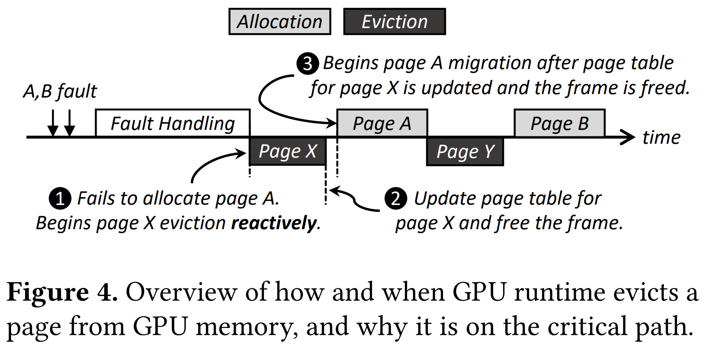
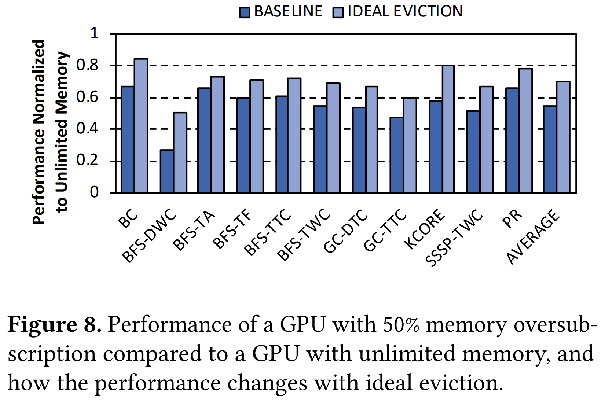

# Batch-Aware Unified Memory Management in GPUs for Irregular Workloads
Hyojong Kim; Jaewoong Sim; Prasun Gera; Ramyad Hadidi; and Hyesoon Kim
> **GPU, Unified memory management, Memory oversubscription, Virtual memory**
> [https://doi.org/10.1145/3373376.3378529](https://doi.org/10.1145/3373376.3378529)

## Abstract
While unified virtual memory and demand paging in modern GPUs provide convenient abstractions to programmers for working with large-scale applications, they come at a significant performance cost. We provide the first comprehensive analysis of major inefficiencies that arise in page fault handling mechanisms employed in modern GPUs. To amortize the high costs in fault handling, the GPU runtime processes a large number of GPU page faults together. We observe that this batched processing of page faults introduces large-scale serialization that greatly hurts the GPU's execution throughput. We show real machine measurements that corroborate our findings.
Our goal is to mitigate these inefficiencies and enable efficient demand paging for GPUs. To this end, we propose a GPU runtime software and hardware solution that (1) increases the batch size (i.e., the number of page faults handled together), thereby amortizing the GPU runtime fault handling time, and reduces the number of batches by supporting CPU-like thread block context switching, and (2) takes page eviction off the critical path with no hardware changes by overlapping evictions with CPU-to-GPU page migrations. Our evaluation demonstrates that the proposed solution provides an average speedup of 2x over the state-of-the-art page prefetching. We show that our solution increases the batch size by 2.27x and reduces the total number of batches by 51% on average. We also show that the average batch processing time is reduced by 27%.

## Problem Statement and Research Objectives
* UVM provides a coherent view of a single virtual address space between CPUs and GPUs with automatic data migration via demand paging.
  * While the feature sounds promising, in reality, the benefit comes with a non-negligible performance cost.
* The goal of this work is to support the efficient execution of large-scale irregular applications, such as graph computing workloads, in the UVM model.

<h3>Previous Study</h3>

Recently, Li et al.<a href="#rd1" name="rs1">1</a> proposed a memory management framework, called **eviction-throttling-compression (ETC)**, to improve GPU performance under memory oversubscription.
➔ However, for many large-scale, irregular applications, we found that the ETC framework is ineffective.
* Since irregular applications **access a large number of pages within a short period of time**, predicting correct timing is not trivial.
* For this to be effective, the working set size has to be reduced when GPU cores are ***throttled***<a href="#td1" name="ts1">T1</a>.
  * This is the case for most regular workloads.
  * However, this is **not the case for many large-scale**, irregular applications because **most of the memory pages are shared across GPU cores**, and thus, memory-aware throttling is not effective in reducing the working set size.

<h3>Background</h3>

#### Thread Concurrency in GPUs
* GPU shader core, such as `NVIDIA Streaming Multiprocessor (SM)`, `AMD Compute Unit (CU)`, or `Intel Execution Unit (EU)`, provides hardware resources that are required to keep the contexts of multiple threads without doing conventional context switching.
  * For example, in NVIDIA GPUs, the maximum concurrency is capped by the maximum number of threads and thread blocks (e.g., 2048 and 32, respectively), the register file size (e.g., 64k 32-bit registers), and the maximum number of registers per thread (e.g., 255), among others.

#### Unified Virtual Memory in GPUs
* Virtual Memory
  * To translate a virtual address into a physical address, the GPU performs a **page table walk**.
    * To accelerate this, translation lookaside buffers (TLBs) are adopted from CPUs and optimized for GPUs.
    1. Requiring a commensurate number of translations ➔ **highly threaded page table walker**
    2. A multilevel page table requires many memory accesses to translate a single address ➔ **page walk cache**
* Demand Paging
  
  * `GPU runtime fault handling time`: To handle a multitude of page faults efficiently, the GPU runtime preprocesses the page faults before performing page table walks.
    * This preprocessing includes sorting the page faults in ascending order of page addresses (to accelerate the page table walks) and the analysis of page addresses to insert page prefetching requests.
  * `Batch processing time`: The time between the beginning of a batch's processing and the migration of the last page.
    * When batch processing ends, the GPU runtime checks whether there are waiting page faults (pages B and C in the figure). Then, the GPU runtime begins to handle them immediately. 

### 1. Batch processing time 
The batch processing time is measured to be in the range of 223µs to 553µs with a median of 313µs, of which, GPU runtime fault handling accounts for an average of 46.69% of the time (measured to be in the range of 50µs to 430µs with a median of 140µs).
* To amortize the GPU runtime fault handling time, it can be attained by increasing the batch size (i.e., the number of page faults handled together in a batch).
  > **ⓘ Note**
  > **Prior work**<a href="#rd2" name="rs2">2</a> reports that page fault handling latency ranges from 20µs to 50µs, but these numbers are conservative and can be worse depending on the applications and systems.

### 2. Unnecessary serialization
Page evictions introduce unnecessary serialization in page migrations.

* page evictions and new page allocations are serialized in modern GPUs to prevent the new pages from overwriting the evicted pages.
  * `alloc_root_chunk()`: The physical memory allocator in the GPU runtime tries to allocate a new page
  * `pick_and_evict_root_chunk()`: If it failed, page eviction is requested
  * `chunk_start_eviction()`: Once victim is selected, its eviction flag is set.
  * `evict_root_chunk()`: The eviction begins.
     

## Proposed Method
### 1. Thread Oversubscription (TO)
* a **CPU-like thread block context switching** technique, to effectively amortize the GPU runtime fault handling time by **increasing the batch size** (i.e., the number of page faults handled together).
  * **(** Only up to 64 ***warps***<a href="#td5" name="ts5">T5</a> (or 2048 threads) can concurrently run in SM **) + (** A warp is stalled once it generates a page fault **) = (** it does not take much time before the GPU becomes crippled due to lack of runnable warps **)**
  * In the presence of page migrations between CPU and GPU memory, increasing thread concurrency is beneficial despite the expensive context switching overhead.
   
    > The GPU runtime fault handling time for the second batch is slightly increased to handle an additional page fault for page D.

* We develop thread oversubscription, a GPU virtualization technique. We utilize the **<mark>Virtual Thread (VT)</mark>**<a href="#rd3" name="rs3">3</a> as our baseline architecture for GPU virtualization. ➔ we extend VT in three ways.
  1. We employ an **additional mapping table** so that different ***Virtual Warp IDs (VWIs)***<a href="#td3" name="ts3">T3</a> can access the same set of register files when they are context switched.
  2. We extend the operation performed by **the *Virtual Thread Controller (VTC)***<a href="#td2" name="ts2">T2</a>.
      * Baseline VT only stores the per-thread block state information in the shared memory through the context handler.
      * We extend this operation to **store register files as well**.
  3. We **dynamically control the degree of thread oversubscription** based on the rate at which ***premature eviction***<a href="#td4" name="ts4">T4</a> occurs.

### 2. Unobtrusive Eviction (UE)
* to take GPU page evictions off the critical path with no hardware changes based on the idea of overlapping page evictions with CPU-to-GPU page migrations.
  

    > At the same time, page Y can be evicted using bidirectional transfers.

* There is an opportunity to reduce the page migration time itself.
  1. `baseline`: the performance of a GPU with 50% memory oversubscription
  2. `unlimited`: the performance of a GPU with unlimited memory, where no page evictions occur.
  3. `ideal eviction`: the performance of a GPU with an instant page eviction capability (= overhead of eviction is 0)
   
    > `baseline` vs. `unlimited`: average performance loss of 46% in `baseline`.
    > `baseline` vs. `ideal eviction`: average performance improvement of 16% in `ideal eviction`.

* Our goal is to devise a mechanism that **exploits bidirectional transfers** without violating the serialization requirement.
  * The key idea is to **preemptively initiate a single page��s eviction** and **enable pipelined bidirectional transfers afterwards**.
  * To perform this preemptive eviction promptly at the beginning of batch processing, we modify the GPU runtime and **add a new GPU memory status tracker**.
  

## Evaluation and Results
### 1. Simulator
We use **<mark>MacSim</mark>**<a href="#rd4" name="rs4">4</a>, a cycle-level microarchitecture simulator. We modify the simulator to support virtual memory, demand paging, and the **<mark>Virtual Thread (VT)</mark>**<a href="#rd3" name="rs3">3</a>.

### 2. Workloads
We select 11 workloads from the **<mark>GraphBIG</mark>**<a href="#rd5" name="rs5">5</a> benchmark suite.
  * `BC(Betweenness Centrality)` is an algorithm that detects the amount of influence a node has over the flow of information in a graph.
  * Graph traversal(`BFS(Breadth First Search`) is the most fundamental operation of graph computing, for which we include five different implementations
    * data-warpcentric (DWC)
    * topological-atomic (TA)
    * topological-frontier (TF)
    * topological-thread-centric (TTC)
    * topological-warpcentric (TWC).
  * `GC(Graph Coloring)` performs the assignment of labels or colors to the graph elements (i.e., vertices or edges) subject to certain constraints, for which we include two different implementations
    * data-thread-centric (DTC)
    * topological-thread-centric (TTC). 
  * `KCORE(K-core decomposition)` partitions a graph into layers from external to more central vertices.
  * `SSSP(Single-Source Shortest Path)` finds the shortest path from the given source to each vertex, for which we include a topological-warp-centric (TWC) implementation.
  * `PR(Page Rank)` is an algorithm that evaluates the importance of web pages.

### 3. Performance Comparision
* **BASELINE**<a href="#rd2" name="rs2_1">2</a>
* **<mark>ETC</mark>**<a href="#rd1" name="rs1_1">1</a>

-----
## Notes
### Terminology
<ol style="padding-left:20px;"><li/><b>Dynamic frequency scaling (also known as CPU throttling)</b> : a power management technique in computer architecture whereby the frequency of a microprocessor can be automatically adjusted "on the fly" depending on the actual needs, to conserve power and reduce the amount of heat generated by the chip.<a name="td1" href="#ts1">↵</a>
<ul><li/><a href="https://en.wikipedia.org/wiki/Dynamic_frequency_scaling">https://en.wikipedia.org/wiki/Dynamic_frequency_scaling</a></ul>
<li/><b>VTC(Virtual Thread Controller)</b> : It keeps track of the state of all thread blocks in order to determine which thread blocks can be brought back from the inactive to an active state, or vice versa, when a thread block is swapped out.<a name="td2" href="#ts2">↵</a>
<li/><b>VWI(Virtual Warp ID)</b> : It is a unique warp identifier across all the assigned warps to an SM, including both active and inactive thread blocks. Only when a thread block finishes execution are its VWIs released and reused for another thread block.<a name="td3" href="#ts3">↵</a>
<li/><b>Premature eviction</b> : It occurs when a page is evicted earlier than it should be, and a page fault is generated for the page again by the GPU.<a name="td4" href="#ts4">↵</a>
<li/><b>Warp</b> : the primary execution unit in GPUs. It is a collection of scalar threads (e.g., 32 in NVIDIA GPUs) that run in a single-instruction multiple-thread (SIMT) fashion.<a name="td5" href="#ts5">↵</a>
<li/><b>TLP(Thread Level Parallelism)</b>
<li/><b>ISR(Interrupt Service Routines)</b>
</ol>

<h2 style="margin-bottom: 5px; padding-bottom: 10px; border-bottom: 1px solid #dfdfdf;"></h2>

<ol style="color:grey; padding-left:20px;"><li> [29] Chen Li, Rachata Ausavarungnirun, Christopher J. Rossbach, Youtao Zhang, Onur Mutlu, Yang Guo, and Jun Yang. 2019. "A Framework for Memory Oversubscription Management in Graphics Processing Units." In Proceedings of the International Conference on Architectural Support for Programming Languages and Operating Systems (ASPLOS).<a name="rd1" href="#rs1">↵</a>
<ul><li/><a href="https://doi.org/10.1145/3297858.3304044">https://doi.org/10.1145/3297858.3304044</a></ul>
<li>[53] Tianhao Zheng, David Nellans, Arslan Zulfiqar, Mark Stephenson, and Stephen W. Keckler. 2016. "Towards High Performance Paged Memory for GPUs." In Proceedings of the International Symposium on High Performance Computer Architecture (HPCA).<a name="rd2" href="#rs2">↵</a>
<ul><li/><a href="https://doi.org/10.1109/HPCA.2016.7446077">https://doi.org/10.1109/HPCA.2016.7446077</a></ul>
<li>[52] M. K. Yoon, K. Kim, S. Lee, W. W. Ro, and M. Annavaram. 2016. "Virtual Thread: Maximizing Thread-Level Parallelism beyond GPU Scheduling Limit." In Proceedings of the International Symposium on Computer Architecture (ISCA).<a name="rd3" href="#rs3">↵</a>
<ul><li/><a href="https://doi.org/10.1109/ISCA.2016.59">https://doi.org/10.1109/ISCA.2016.59</a></ul>
<li>[27] Hyesoon Kim, Jaekyu Lee, Nagesh B. Lakshminarayana, Jaewoong Sim, Jieun Lim, Tri Pho, Hyojong Kim, and Ramyad Hadidi. 2012. "MacSim: A CPU-GPU Heterogeneous Simulation Framework User Guide."<a name="rd4" href="#rs4">↵</a>
<ul><li/><a href="https://scholar.google.co.kr/scholar?oi=bibs&cluster=12961039068837708505&btnI=1&hl=ko">https://scholar.google.co.kr/scholar?oi=bibs&cluster=12961039068837708505&btnI=1&hl=ko</a></ul>
<li>[37] Lifeng Nai, Yinglong Xia, Ilie G. Tanase, Hyesoon Kim, and ChingYung Lin. 2015. "GraphBIG: Understanding Graph Computing in the Context of Industrial Solutions." In International Conference for High Performance Computing, Networking, Storage and Analysis (SC).<a name="rd5" href="#rs5">↵</a>
<ul><li/><a href="https://doi.org/10.1145/2807591.2807626">https://doi.org/10.1145/2807591.2807626</a></ul>
</ol>