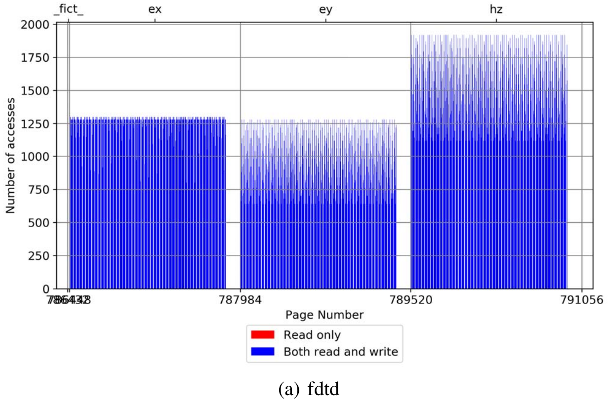
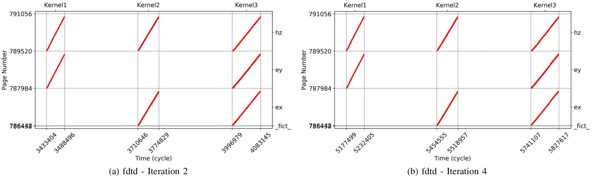
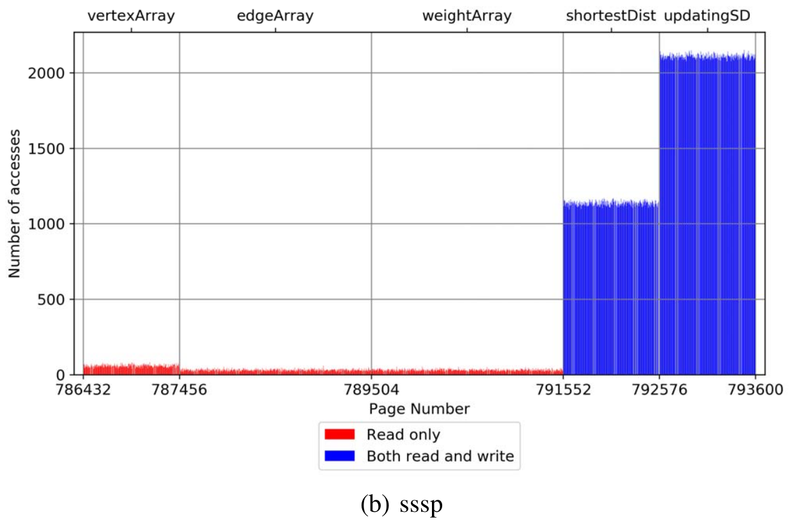
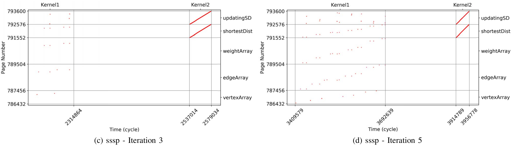
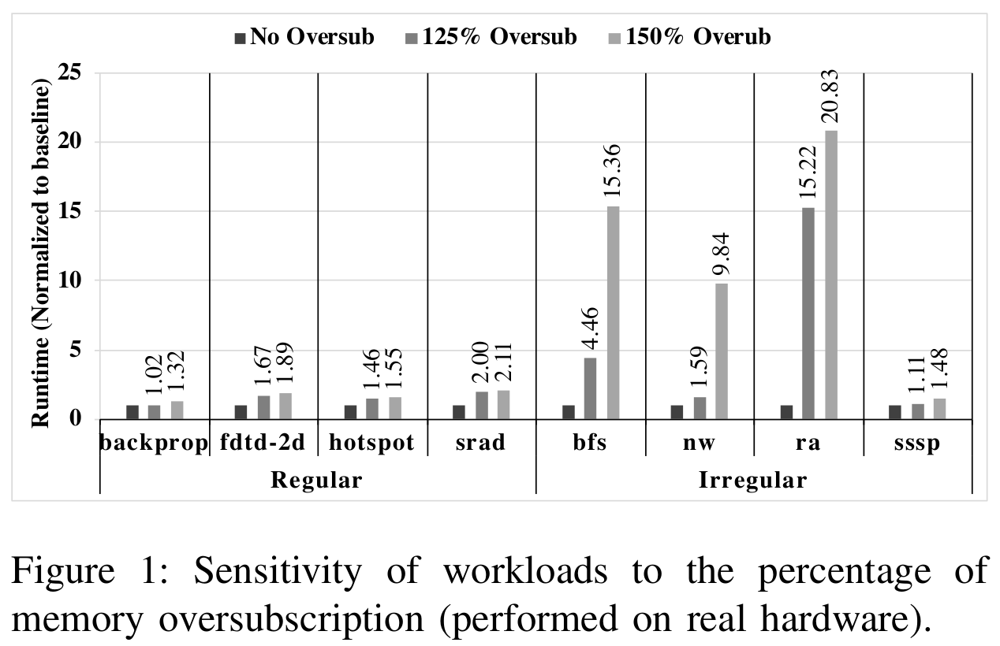
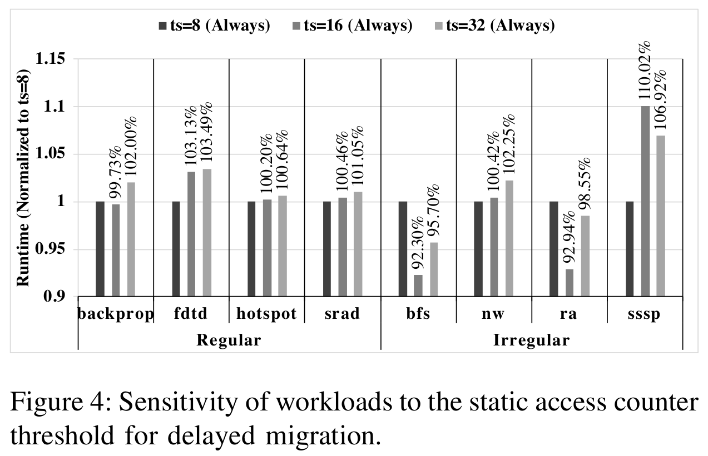
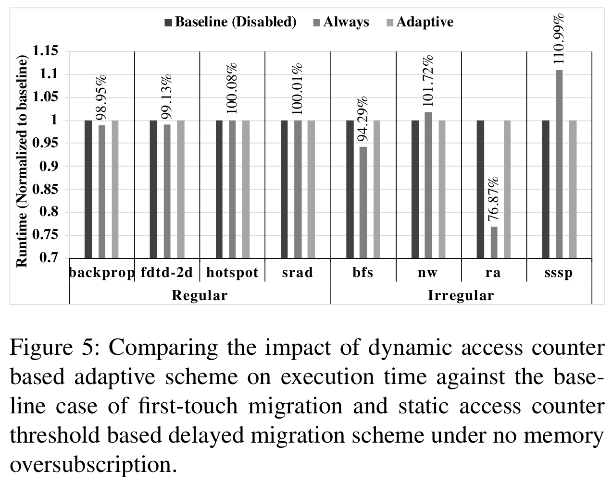
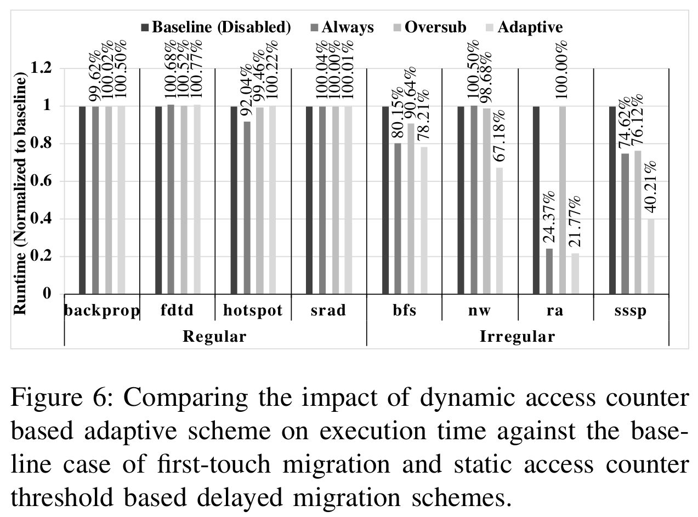
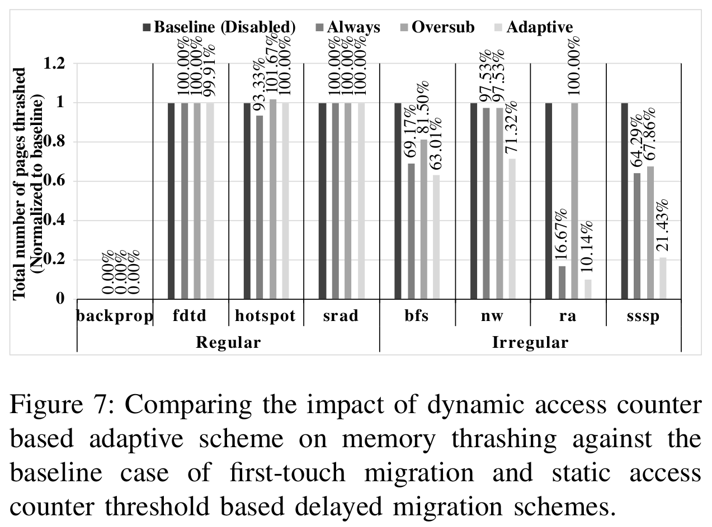
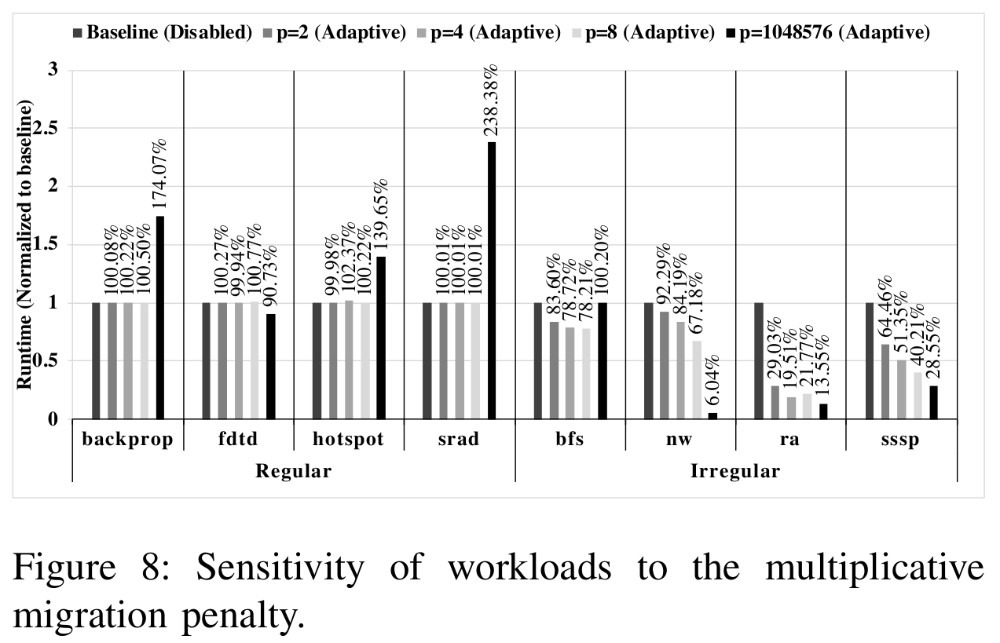

# Adaptive Page Migration for Irregular Data-intensive Applications under GPU Memory Oversubscription
Debashis Ganguly; Ziyu Zhang; Jun Yang; and Rami Melhem
*2020 IEEE International Parallel and Distributed Processing Symposium (IPDPS)*
> **page migration, pinning, memory management, CPU-GPU, Unified Memory**
> [https://doi.org/10.1109/IPDPS47924.2020.00054](https://doi.org/10.1109/IPDPS47924.2020.00054)

## Abstract
Unified Memory in heterogeneous systems serves a wide range of applications. However, limited capacity of the device memory becomes a first order performance bottleneck for data-intensive general-purpose applications with increasing working sets. The performance overhead under memory oversubscription depends on the memory access pattern of the corresponding workload. While a regular application with sequential, dense memory access suffers from long latency write-backs, performance of a irregular application with sparse, seldom access to large data-sets degrades due to page thrashing. Although smart spatio-temporal prefetching and large page eviction yield good performance in general, remote zero-copy access to host-pinned memory proves to be beneficial for irregular, data-intensive applications. Further, new generation GPUs introduced hardware access counters to delay page migration and reduce memory thrashing. However, the responsibility of deciding what strategy is the best fit for a given application relies heavily on the programmer based on thorough understanding of the memory access pattern through intrusive profiling. In this work, we propose a programmer-agnostic runtime that leverages the hardware access counters to automatically categorize memory allocations based on the access pattern and frequency. The proposed heuristic adaptively navigates between remote zero-copy access to host-pinned memory and first-touch page migration based on the trade-off between low latency remote access and high-bandwidth local access. We show that although designed to address memory oversubscription, our scheme has no impact on performance when working sets fit in the device-local memory. Experimental results show that our scheme provides performance improvement of 22% to 78% for irregular applications under 125% memory oversubscription compared to the state of the art. At the same time, regular applications are not impacted by the framework.

## Problem Statement and Research Objectives
### 1. Workload Characterization
<table width="100%">
  <tbody>
    <tr style="background-color:#EEE;">
      <td colspan="2" align="center"><b>Regular applications</b>
        Among the benchmarks<a name="fr" href="#fn">*</a>, <code>fdtd</code>, <code>backprop</code>, <code>hotspot</code>, and <code>srad</code></td>
    </tr>
    <tr>
      <td>
      <td>
    </tr>
    <tr>
    <td><ul style="padding-left:20px; margin:0;"><li>Most of the pages in the allocations are accessed at the same frequency over the entire execution time.</li>
    <li>A very few pages equally spaced over the allocation boundary are accessed a lot more than the rest of the pages.</li></ul>
    <td><ul style="padding-left:20px; margin:0;"><li>We can see that the memory access pattern is fairly constant over two different iterations. Moreover, in every iteration, each allocated data structure is accessed linearly.</li>
    <li>Typically show <b>dense, sequential access</b> repeated over multiple iterations.</li></ul>
    </tr>
  </tbody>
</table>

 

<table width="100%">
  <tbody>
    <tr style="background-color:#EEE;">
      <td colspan="2" align="center"><b>Irregular applications</b>
        Among the benchmarks<a name="fr_" href="#fn">*</a>, <code>sssp</code>, <code>bfs</code>, <code>nw</code>, and <code>ra</code></td>
    </tr>
    <tr>
      <td>
      <td>
    </tr>
    <tr>
    <td><ul style="padding-left:20px; margin:0;"><li>Few data-structures are more heavily accessed than the others leading to a cluster of hot and cold pages over the entire memory set.</li>
    <li>Moreover, the read-only data-structures are cold and the pages in hot data-structures are both read from and written to.</li></ul>
    <td><ul style="padding-left:20px; margin:0;"><li>We can see that <code>kernel1</code> exhibits sparse memory access over different data structures and the memory pages accessed over different iterations varies drastically in virtual address space.</li>
    <li>However, <code>kernel2</code> shows sequential and dense access over two data structures in every iteration.</li>
    <li>Exhibit <b>dense sequential access on hot data structures</b> and <b>sparse, random access on cold data structures</b>.</li></ul>
    </tr>
  </tbody>
</table>

### 2. Problems & Previous Solution
* Typical GPGPU workloads are massively parallel and show spatio-temporal locality.
  ➔ **The tree-based prefetcher**<a name="fr1" href="#fn1">1</a>, upon limiting its prefetch decision within 2MB, provides spatio-temporal locality within large pages.
  * However, **for irregular applications**, aggressive prefetching can be counter-productive under memory oversubscription.
    

    >To emulate memory oversubscription, working sets of the workloads are not scaled, rather the total free space is controlled by allocating dummy `cudaMalloc`ed variables because `cudaMalloc`ed allocations are pinned and not selected for eviction.

* Usage of host-pinned **"Zero-copy"**<a name="fr2" href="#fn2">2</a> memory buffers is suggested in both `CUDA` and `OpenCL` for irregular applications with sparse, rare access to large data.
  * As no data is copied to the device memory, it prevents memory oversubscription
  * Sparse accesses benefit from low latency direct access.
  * However, **for regular applications**, larger migration using prefetcher improves PCI-e bandwidth utilization and reduces the number of far-faults.
    * If GPU reads or writes to host pinned memory directly for multiple times, then kernel (GPU code) execution will slow down.

* `NVIDIA Volta GPUs` and `IBM Power9` introduced a new **hardware based page-level access counter**.
  * If an allocation is advised to be soft-pinned to the host memory, then the memory is not copied directly at the first-touch by the device.
  * Rather, the migration from the preferred location of host memory **to the device memory is delayed** based on a **static access counter threshold**, $t_{s}$.
    * If the page is **accessed to read data** for a certain number of times crossing the value of $t_{s}$ configured in the driver, the data is copied to the device memory.
    * On the other hand, **on write access**, the page is invalidated in the host page table and exclusively copied to the device memory irrespective of the access frequency.
  * However, **for regular applications**, having a static access counter based threshold for **delayed migration** incurs **additional overhead of remote access** because for dense sequential access, the data is eventually migrated to the local memory upon crossing the threshold.

## Proposed Method
To this end, we propose a **dynamic page placement strategy** for irregular general purpose applications.
  * Our proposed framework **leverages hardware-based access counters** to identify sparse and dense memory access and differentiate between hot and cold allocations.
* Over the course of execution, the framework achieves a balance between low latency remote access to host-pinned cold allocations and bandwidth-optimized local access to hot allocations in irregular applications with oversubscribed working sets.
* However, our framework **does not affect regular applications and applications with working sets smaller than the device memory capacity**.

### 1. Dynamic Access Counter Threshold
The goal of the framework, here, is **to tame down the aggression of the prefetcher** by delaying the page migration as the memory starts filling up to its maximum capacity.
* The proposed dynamic threshold, $t_{d}$ , **grows adaptively in response to the size of free space in the device memory** starting from 1 to the driver configured static threshold.

$$
    t_{d}= 
\begin{cases}
    t_{s} \times \frac{\text{Num. of allocated pages}}{\text{Total num. of pages}}+1,& \text{if no oversubscription} \newline 
    t_{s} \times (r+1) \times p,                                                     & \text{otherwise}
\end{cases}
$$

$$
\begin{array}{rcl}
\text{where} & t_{s} = & \text{Static access counter threshold,} \newline
 & r = & \text{Number of round trips or number of times evicted} \newline
 & p = & \text{Multiplicative Migration Penalty}
\end{array}
$$

1. Addresses the situations involving memory oversubscription
    * The framework is driven by the intuition that under memory oversubscription *cold* pages should be soft-pinned to the host memory and **only *hot* pages should be copied to device memory**.
2. $p$ : Multiplicative penalty for migration under oversubscription
    * configurable as a module parameter to the GPU driver
    * With $p = 2$ and $t_{s} = 8$, the pages are migrated after 16th access after oversubscription. 
      ➔ This helps reduce the amount of page thrashing.
3. $r$ : keeps count of the number of round trips or the number of time a certain chunk of memory is evicted
    * The intuition behind this heuristic is that **the more a page is thrashed, the harder it should be pinned to the host memory**.

### 2. Access Counter Based Page Replacement.
The framework also extends page replacement strategy leveraging the same access counters.
* **A naı̈ve LRU page replacement cannot differentiate** a set of cold pages from a set of hot pages.
* We **use the access counters** to sort the list of 2MB large pages in LRU list such that cold pages are prioritized over hot pages for eviction in irregular applications.
  * Thus, we incorporate a **simplified Least Frequently Used (LFU)** scheme in the framework.
* We also **prioritize read-only pages as eviction candidates**.
  * This is because on write access hot pages are migrated exclusively to the device memory irrespective of their access counter.

### 3. Access Counter Granularity
The tree-based prefetcher in `nvidia-uvm` module migrates data in multiple of **64KB basic blocks** based on the page faults relayed from GMMU.
* This leads us to the optimization of **maintaining access counters at 64KB basic block level** instead of 4KB page granularity.

### 4. Access Counter Maintenance
In our implementation, we use 32bits access registers.
* **The lower 27bits** are used for access counters and **most significant 5bits** are kept to keep track of round trip time or $r$.
  * **Hardware counters** are updated by GMMU on every page access during TLB look up.
  * Whereas, **runtime** reads the values of hardware access counters and maintains them as part of driver (/system software) memory.
    * As runtime is responsible to update GPU's page table, they are read, updated, and consulted on every PCIe migration.

## Evaluation and Results
1. **Baseline or Disabled**: the state of the art baseline where remote access is not enabled and data is migrated at first touch.
2. **Always**: the static access counter based threshold proposed in Volta GPUs.
    * It *delays migration* from the start *irrespective of memory oversubscription*.
3. **Oversub**: a static access counter based *delayed migration scheme enabled only after oversubscription*.
    * The following experiments only deal with 125% of device memory oversubscription.

### 1. Sensitivity to Static Migration Threshold

### 2. The Case of No Oversubscription

### 3. The Case of Oversubscription

### 4. Sensitivity to Multiplicative Penalty

-----
## Notes
* Source Codes (with Benchmarks) : [https://github.com/DebashisGanguly/gpgpu-sim_UVMSmart](https://github.com/DebashisGanguly/gpgpu-sim_UVMSmart) <a name="fn" href="#fr">↵</a>

* Warps are stalled on **near-faults** which occurs only upon L2 cache misses.
  * However, in Unified Memory, a new type of faults, which we will refer to as **far-faults**, can occur when data is not physically present in the device local memory.
  * The overhead of a far-fault consists of two major components: **a far-fault handling latency** (typically 45μs in Pascal GPUs) **to walk and manage page table and the data migration latency** over PCI-e interconnect.
  * The data migration and kernel execution is serialized.

* **Tree-based prefetcher** trades in the spectrum of two extremities: 4KB small page and 2MB large page. <a name="fn1" href="#fr1">↵</a>
  * It adapts to the current state of the tree and opportunistically decides on the prefetch size ranging from 64KB to 1MB instead of a fixed granularity.
  * CUDA 8.0 introduced `cudaMemPrefetchAsync` which allows programmers to overlap the kernel execution with asynchronous parallel data migration. However, the onus of deciding what and when to prefetch still lies on the programmers.

* With **zero-copy** allocations, the physical allocation is hard-pinned to the host memory. <a name="fn2" href="#fr2">↵</a>
  * `cudaHostRegister` API allows `malloc`ed allocation to be pinned to the host memory and the kernels are launched with device pointer derived using `cudaHostGetDevicePointer` API.
  * **Remote zero-copy access has lower latency than the classic Direct Memory Access (DMA), but also suffers from lower bandwidth of PCIe interconnect**.
    * CUDA 9.0 offers the ability to provide user hints to the Unified Memory subsystem about the usage pattern.
      * `cudaMemAdviseSetAccessedBy` flag allows the device to establish direct mapping to the host memory.
      * `cudaMemAdviseSetPreferredLocation` allows to specify the preferred location of a memory allocation to be set to the host memory.