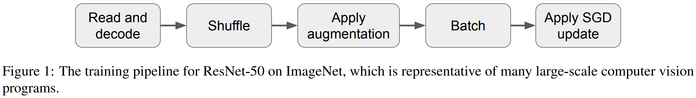
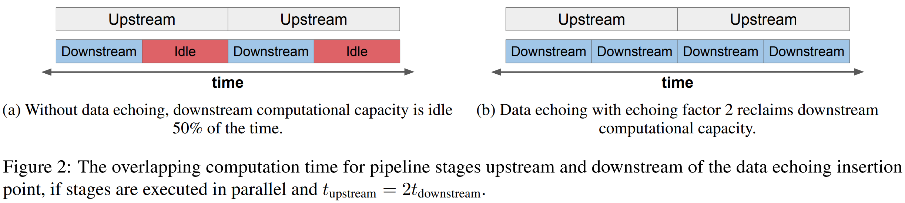
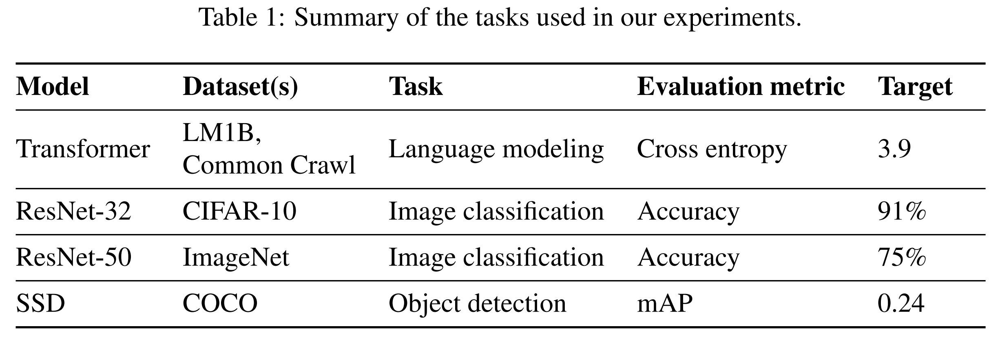
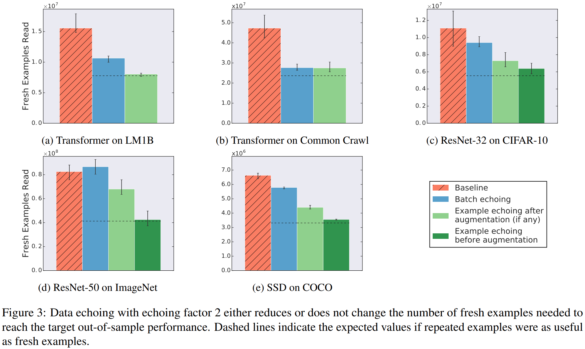
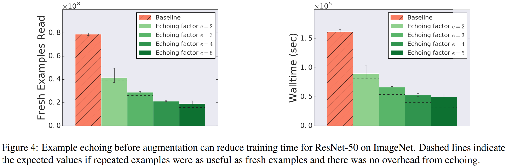
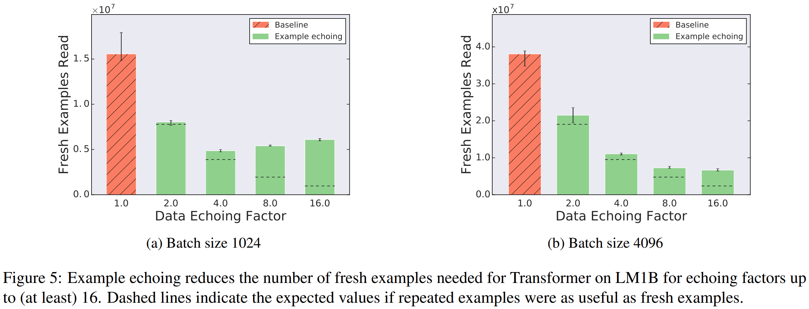
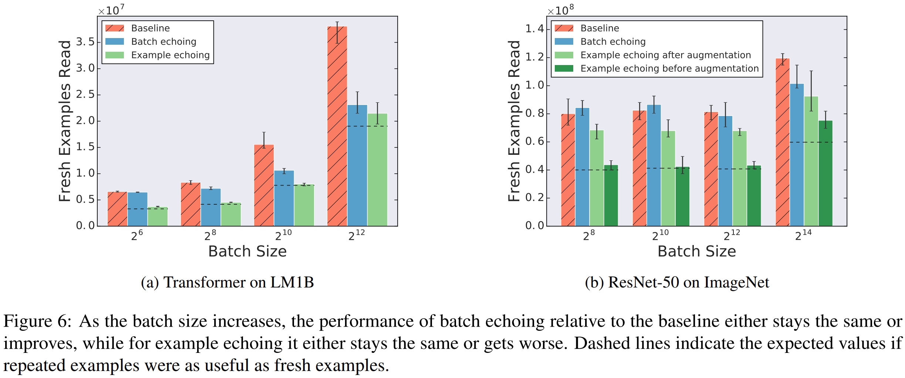
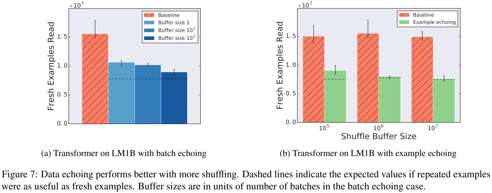
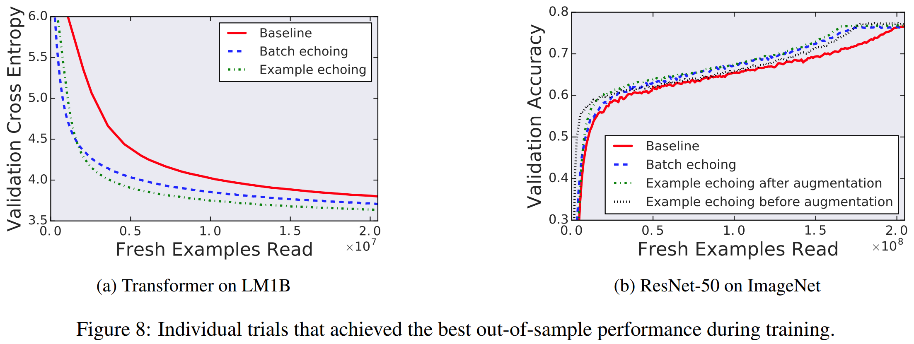

<script type="text/x-mathjax-config">
MathJax.Hub.Config({
  tex2jax: {inlineMath: [['$','$'], ['\\(','\\)']]}
});
</script>
<script src='https://cdnjs.cloudflare.com/ajax/libs/mathjax/2.7.5/latest.js?config=TeX-MML-AM_CHTML' async></script>

# Faster Neural Network Training with Data Echoing
Dami Choi; Alexandre Passos; Christopher J. Shallue; and George E. Dahl
> **Deep Learning, File I/O**
> [https://doi.org/10.48550/arXiv.1907.05550](https://doi.org/10.48550/arXiv.1907.05550)

## Abstract
In the twilight of Moore's law, GPUs and other specialized hardware accelerators have dramatically speed up neural network training. However, earlier stages of the training pipeline, such as disk I/O and data preprocessing, do not run on accelerators. As accelerators continue to improve, these earlier stages will increasingly become the bottleneck. In this paper, we introduce "data echoing," which reduces the total computation used by earlier pipeline stages and speeds up training whenever computation upstream from accelerators dominates the training time. Data echoing reuses (or "echoes") intermediate outputs from earlier pipeline stages in order to reclaim idle capacity. We investigate the behavior of different data echoing algorithms on various workloads, for various amounts of echoing, and for various batch sizes. We find that in all settings, at least one data echoing algorithm can match the baseline's predictive performance using less upstream computation. We measured a factor of 3.25 decrease in wall-clock time for ResNet-50 on ImageNet when reading training data over a network.


## Problem Statement and Research Objectives
<p align="center" style="padding-bottom:0; margin-bottom:0;"/>

* A training program may need to read and decompress training data, shuffle it, batch it, and even transform or augment it.
  * **These steps exercise multiple system components**, including CPUs, disks, network bandwidth, and memory bandwidth. 
  * Since **many of today's datasets are too large to fit into an accelerator's memory or even the host machine's main memory**, most large-scale neural network training systems stream over the training data, incrementally reading it from disk, pre-processing it in main memory, and copying successive batches of training examples to the accelerator, which runs the training algorithm.
  * Moreover, these operations are not simply executed once at the start of the training program.
  ➔ Therefore, **each training step involves a mixture of operations that do and do not run on accelerators**.

* There are **workloads where the code running on accelerators consumes only a small portion of the overall wall time**, and this scenario will only become more common **if accelerator improvements continue to outpace improvements in CPUs**.
  1. make the non-accelerator work faster
  2. reduce the amount of non-accelerator work required to achieve the desired performance.
    ➔ we focus on this option

## Proposed Method
<p align="center" style="padding-bottom:0; margin-bottom:0;"/>

* [Figure 2a] If any of the stages upstream from the SGD step cannot process images at the same rate as the SGD step, **the accelerator will be partly idle**.
* Instead, we propose **data echoing** as a simple, cheap, and effective method for reclaiming idle accelerator capacity.
  * [Figure 2b]: **Once a practitioner identifies the largest bottleneck in the training pipeline**, they can **insert an echoing stage after it** to reclaim idle accelerator capacity.

* We implement data echoing by inserting a stage in the training pipeline that repeats (echoes) the outputs of the previous stage. In TensorFlow's `tf.data` library, an echoing stage is as simple as follows, where $e$ is **the data echoing factor (the number of times each data item is repeated)**.
  ```
  dataset.flat_map(
    lambda t:
    tf.data.Dataset.from_tensors(t).repeat(e))
  ```
  * If the overhead of repeating data is negligible and the stages on either side of echoing are executed in parallel, then **the average time for data echoing to complete one upstream step and $e$ downstream steps** is $$max \\{ t_{upstream}, e \times t_{downstream} \\} $$ where $t_{upstream}$ is the time taken by all stages upstream of echoing, $t_{downstream}$ is the time taken by all stages downstream of echoing, and $e$ is the echoing factor.
    * If we denote the ratio of upstream-to-downstream processing time by $R = t_{upstream}/t_{downstream}$, when $e \leq R$, the additional downstream steps per upstream step are "free" because they utilize idle downstream capacity.

## Evaluation and Results
<p align="center" style="padding-bottom:0; margin-bottom:0;"></p>

* **Echoing before batching** (example echoing)  vs  **Echoing after batching** (batch echoing)
* **Echoing before augmentation** vs **Echoing after augmentation**

### 1. Data echoing can reduce the number of fresh examples required for training


* In all but one case, data echoing requires strictly fewer fresh examples than the baseline to reach the target out-of-sample performance.
  * The sole exception (batch echoing on ResNet-50) requires about the same number of fresh examples as the baseline
    ➔ data echoing provides no benefit, but does not harm training either.

### 2. Data echoing can reduce training time
When using data echoing, each upstream step is used for $e$ (instead of 1) downstream SGD updates.
  * Since repeated data **might be less valuable than completely fresh data**, data echoing might require more downstream SGD updates to reach the desired predictive performance, and **so the speedup factor might be less than $e$**.


➔ Data echoing provides a **significant speedup for all echoing factors**, up to a speedup factor of 3.25 for echoing factor 5.

### 3. Data echoing can be useful up to a reasonable upper bound on the echoing factor


### 4. Data echoing as batch size increases


### 5. Data echoing performs better with more shuffling
* In some cases, we also shuffle the outputs of the echoing stage, but this can require additional memory.


### 6. Data echoing does not harm predictive performance
<p align="center" style="padding:0; margin:0;"></p>

