

# Computational Storage for an Energy-Efficient Deep Neural Network Training System
Shiju Li; Kevin Tang; Jin Lim; Chul-Ho Lee; and Jongryool Kim
*Euro-Par 2023: Parallel Processing*
> **Deep Neural Networks, Computational Storage, Near-Storage Data Preprocessing, Model Training, Energy Efficiency**
> [https://doi.org/10.1007/978-3-031-39698-4_21](https://doi.org/10.1007/978-3-031-39698-4_21)

## Abstract
Near-storage data processing and computational storage have recently received considerable attention from the industry as energy- and cost-efficient ways to improve system performance. This paper introduces a computational-storage solution to enhance the performance and energy efficiency of an AI training system, especially for training a deep learning model with large datasets or high-dimensional data. Our system leverages dimensionality reduction effectively by offloading its operations to computational storage in a systematic manner. Our experiment results show that it can reduce the training time of a deep learning model by over 40.3%, while lowering energy consumption by 38.2%.

## Problem Statement and Research Objectives
### GPU memory capacity wall
* When training a DNN model on a large dataset or high-dimensional data, **storing all the training data in GPUs can quickly become impractical** due to the limited memory capacity of GPUs, leading to out-of-memory errors and thus preventing further training.
* The problem is further compounded **when multiple epochs of training are required or when hyperparameter tuning is necessary**.

### To cope with the memory problem associated with training a DNN model
1. To **distribute the training of each model across multiple GPUs**.
    * This approach involves **splitting the dataset or model variables across the GPUs**, resulting in faster training time and improved performance.
    * However, it **can lead to a linear increase in GPU and energy costs**.
2. To **take advantage of the host CPU memory as a buffer**
    * This approach involves **offload some of the impending tensors** to CPU memory during training.
    * However, this approach can result in **low training throughput and significant CPU memory interference** in practice, which motivates the need to relieve the burden of utilizing the CPU during training.

### Previous Study

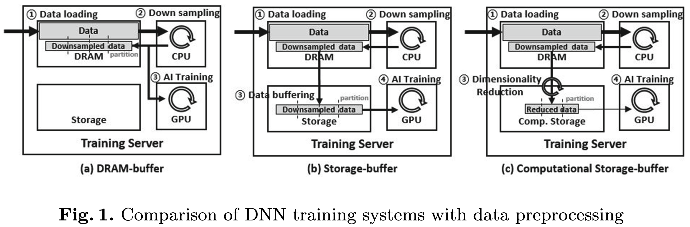

* **DRAM Buffered System**
  * If the input data for training exceeds the GPU memory capacity, the GPU needs to read the data from DRAM during training to **load the entire data batch from DRAM** to GPU memory during each epoch.
* **Storage Buffered System**
  * After original data are preprocessed in the CPU, **the data is buffered back into the local storage** once again.
  * Since the process of reading the training batches is repeated for every epoch, the IO time cost is non-negligible.
* **Computational Storage Buffered System** ★
  * This system **can minimize data movement** in machine learning workloads by **performing preprocessing steps near the SSD**.

## Proposed Method
### 1. Random Projection (RP)
* Random Projection (RP) : A set of points in a high-dimensional space can be embedded into a space of much lower dimension in a way that nearly preserves distances between the points.
* From an algorithmic perspective, the level of distortion create by an RP $p$ is implemented by multiplying the dataset matrix $\mathbb{A}$ with $(n \times d)$ dimensions and a random matrix $\mathbb{B}$ with $(d \times k)$ dimensions.
* Of significance is the fact that the development of $\mathbb{B}$ is independent of $\mathbb{A}$, indicating that **RP is data-insensitive** and **compatible with partitioned or parallel computation** for large datasets.
* A desirable property is that $k$ is dependent only on the logarithmic size of the data, i.e., $k = O(\ln{n})$. 
  * The storage requirement for $n$ column vectors is cut down from $dn$ to $kn = O(n \log{n})$.

### 2. Computational Storage (CS) Buffered System
  * This work proposes a system that offloads RP as data processing to the CS.
  * This work can apply Dimensionality reduction (DR) as an inline operation beside downsampling, and the reduced data can be stored in the CS.
    1. To apply DR, the system first **loads the downsampled data from the host memory to the working memory on the CS**.
    2. The compute unit on the CS **performs a DR** and stores the reduced data in its storage.
    3. Then, **the reduced data is transferred** to the GPU for training **through peer-to-peer direct memory access (P2P-DMA)**.
  * On one hand, **the CS is utilized by the training batch generator** to produce training batches locally, avoiding consumption of host CPU cycles or DRAM bandwidth.
  * On the other hand, **P2P-DMA enables direct memory access between a GPU and CS** without using the host DRAM buffer, minimizing host intervention during SSD read/write.

### 3. System Implementation Details

* **SGEMM kernel using Xilinx OpenCL HLS**
  The SGEMM kernel is used to perform RP and obtain the result matrix $\mathbb{C} = \mathbb{A}\mathbb{B}$.
  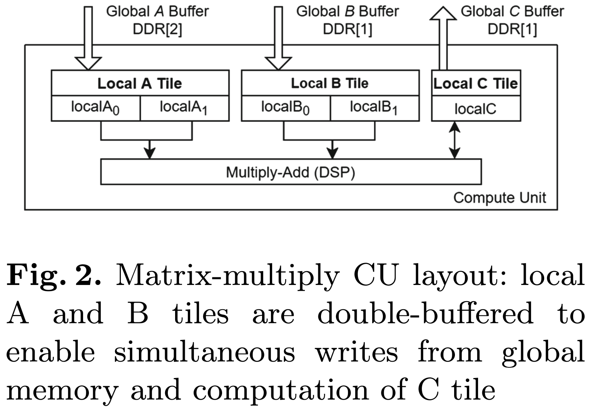 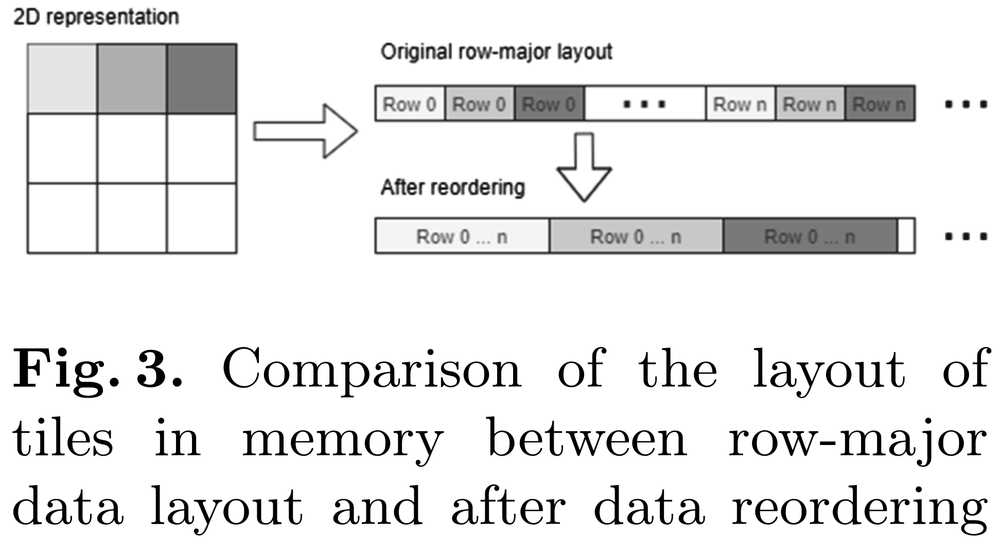

  <blockquote>
  The design of the CU is shown in Fig. 2, and consists of <b>DSP units to perform multiply-add</b> and <b>BRAM (Block RAM) blocks for storing the input/output tiles</b>.
  <ul style="margin-top:0.3">
    <li>As FPGA on-chip memory resources are limited compared to external memory, full matrices are first transferred to FPGA’s external DRAM, and tiles are loaded to BRAMs on the CU as needed to perform the matrix multiplication.
    </li>
  </ul>
  </blockquote> 

  * Double buffering for input tiles
    * **The input matrices are double-buffered** to overlap the write from external DRAM (global memory) and the read for computation of the output tile ($\mathbb{C}$).
    * As FPGA on-chip memory is limited, the tile size must be reduced to compensate.
       ➔ For this reason, this work buffers the input $\mathbb{A}$, $\mathbb{B}$ tiles but **do not double-buffer the output $\mathbb{C}$ tile**.
  * DRAM memory bandwidth
    * Xilinx HLS provides **two main optimizations for memory accesses**, burst transfers and read/write widening, **which require a sequential, regular access pattern** for taking full advantage of the FPGA’s DRAM memory bandwidth.
    * Under a **standard row- or column-major matrix layout**, tiles are located **in a non-contiguous region of memory**
       ➔ **The host performs a reordering of input matrices** to a tiled data format before transferring to the SGEMM kernel as shown in Fig. 3.

* **OpenCL host application**
  * Internally, it uses **OpenCL queues to schedule the I/O and kernel execution**.
  * Because the matrix data originally resides outside the FPGA DRAM (either in host DRAM or in SSD), in practice there is **an additional cost of loading data to the FPGA**.
  * **To hide this latency**, this work implements **an asynchronous API and pipeline the host-FPGA I/O and kernel computation**.

* **P2P-DMA**
  * On a BIOS with support for large memory-mapped IO, **the U200 FPGA can map its 64 GB of DDR to the host memory space**, allowing for peer-to-peer (P2P) DMA transfer.
    * If data is intended to be read or written to SSD, PCIe bandwidth can be saved by **enabling P2P DMA and transferring data directly between FPGA and SSD**, bypassing the buffer in host memory.

* **DNN training system with computational storage**
  
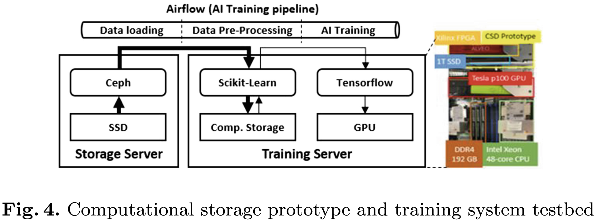

  1. The original data (training, validation and test dataset) are **initially stored in different containers of Ceph in the storage server**.
  2. They are **transferred to DRAM of the local server for buffering**.
      * For large scale training tasks, the training data is too large to fit entirely into DRAM, so it must be first partitioned according to the DRAM size and training batch size.
  3. The partitioned data are then **downsampled in the CPU**, processed, and **sent to CS for RP**, and finally **stored in the CS**.
      * The downsampling typically includes data cleaning, data integration, data transformation and data augmentation. ➔ may increase the data size.

## Evaluation and Results

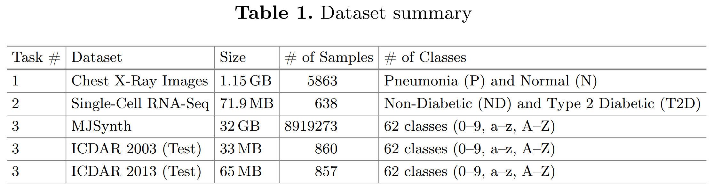

### Task1. Pediatric pneumonia chest X-ray classification
* The MLP model has four neural layers, including three fully connected layers with Relu activation and dropout rate of 0.2, and a final layer with 1 neuron and sigmoid activation. Binary cross-entropy is set as the loss function.

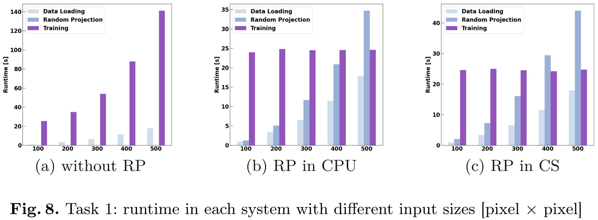

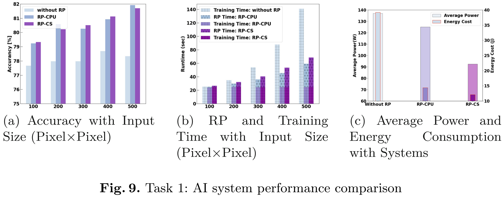

### Task2. RNA-seq cell types classfication
* The MLP model has same structure as Task1.
* The dimension of the input data was 638 × 26616. After RP, feature size in all samples was reduced to 1000.

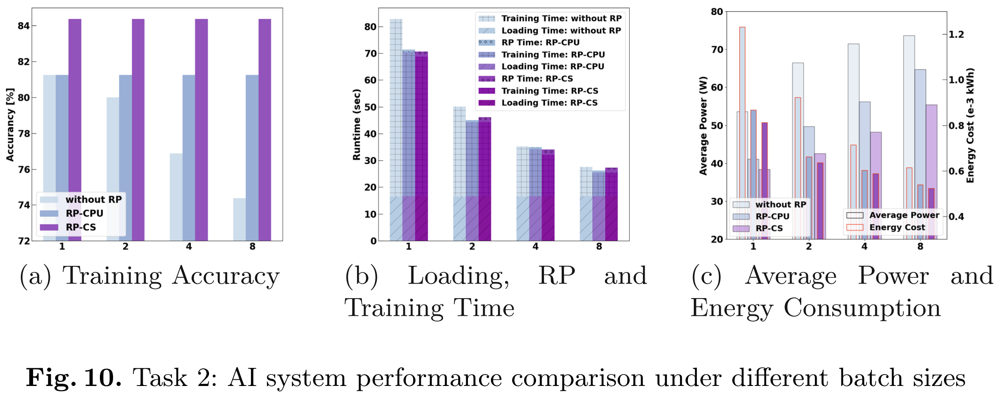

### Task3. Unconstrained scene text recognition task.
#### Process

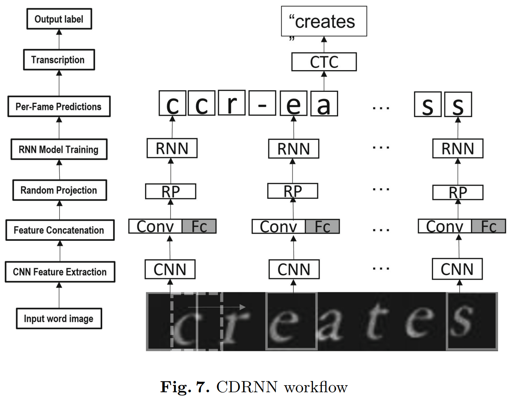

1. To extract robust features for text recognition, this work **first trains a case-sensitive character classifier** using 0.1 million images samples.
    * These word images are **evenly chopped into multiple character images based on the length of the label of each word**, in which each character image is given the corresponding label.
  
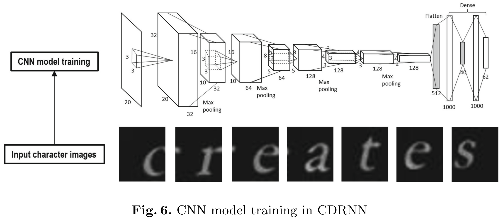

2. For each **resized word image sample with a height of 32**, this work **uses a sliding window of size equal to 32
to shift it**, and convert the captured image patch to a multi-layer CNN feature sequence by passing them through pre-trained CNN model in CPU.
    * Specifically, this work **extracts the output of the flatten layer and the smallest fully connected layer, and concatenate them** into a feature sequence with 552 dimensions. (see Fig. 6)
3. This work uses RP to embed **the original 552-dimension features into 80-dimension** random subspace in the CS.
4. This work **trains a RNN model**, which recognizes reduced feature sequence sample, in the GPU.
5. This work uses connectionist temporal classification (CTC) to remove the repeated labels.

#### Result

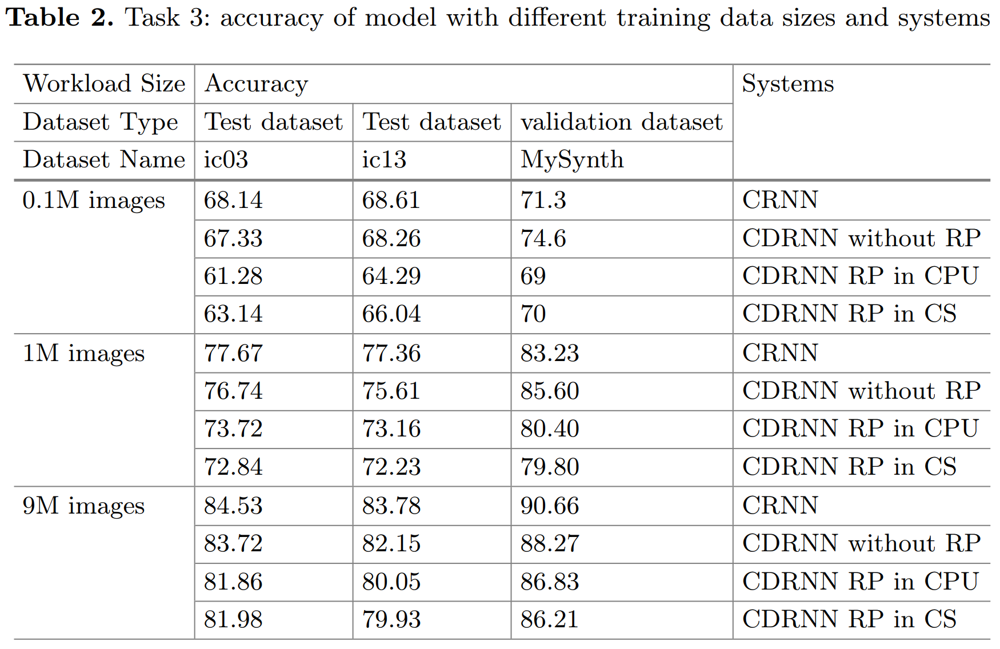

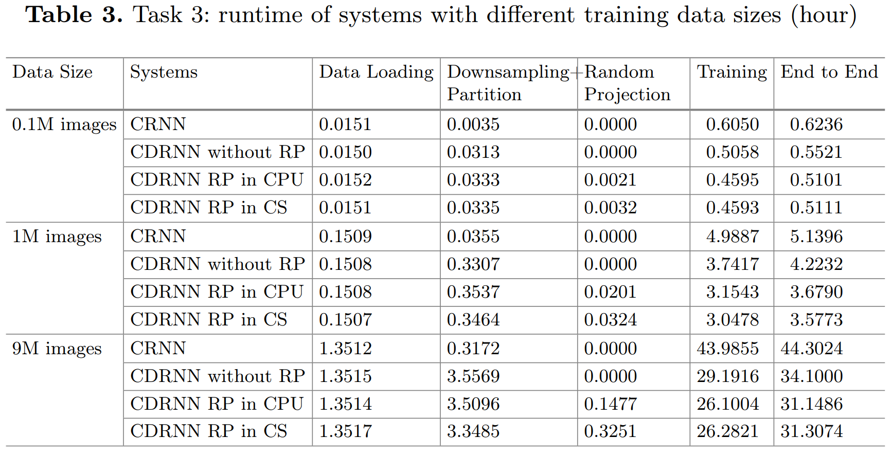
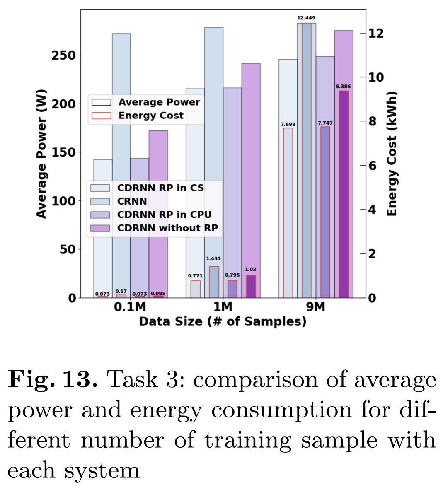

-----
## Notes
* **Dimensionality reduction (DR)** is one such approach that can be leveraged, especially for high-dimensional data that often contain a lot of redundant features and thus increase space and computational time complexity while being prone to overfitting.
  * In particular, **random projection (RP)** can **effectively reduce the computation and storage burden of deep learning** without significant information loss. ➔ its inherent simplicity and parallelism enable its efficient implementation in field programmable gate arrays (FPGAs)