

# λ-IO: A Unified IO Stack for Computational Storage
Zhe Yang; Youyou Lu; Xiaojian Liao; Youmin Chen; Junru Li; Siyu He; and Jiwu Shu
*2023 USENIX Conference on File and Storage Technologies*
> **IO Stacks**
> [https://www.usenix.org/conference/fast23/presentation/yang-zhe](https://www.usenix.org/conference/fast23/presentation/yang-zhe)

## Abstract
The emerging computational storage device offers an opportunity for in-storage computing. It alleviates the overhead of data movement between the host and the device, and thus accelerates data-intensive applications. In this paper, we present λ-IO, a unified IO stack managing both computation and storage resources across the host and the device. We propose a set of designs – interface, runtime, and scheduling – to tackle three critical issues. We implement λ-IO in full-stack software and hardware environment, and evaluate it with synthetic and real applications against Linux IO, showing up to 5.12× performance improvement.

## Problem Statement and Research Objectives
### 1. In-Storage Computing and IO Stack
Although low latency of kernel-bypass has led to the emergence of user-space IO libraries such as SPDK(Storage Performance Development Kit), **the IO stack is still indispensable** in most scenarios for three reasons.
* **Compatibility**: A sea of applications rely on POSIX file interfaces to access storage data.
* **Functionality**: The IO stack offers abundant modules and functionalities, including the file system and the page cache. **In contrast, a userspace IO library only supports data transfer with the raw storage device**. The application has to build its own file system and data cache.
* **Sharing**: The IO stack has **well-tested resource allocation and security mechanisms**, so that users and applications can share the whole device. Sharing is also hard to be implemented in the userspace and **absent from userspace IO libraries**.

### 2. Host-Device Coordination
**“Either the host or the device may be faster to run an application.”**

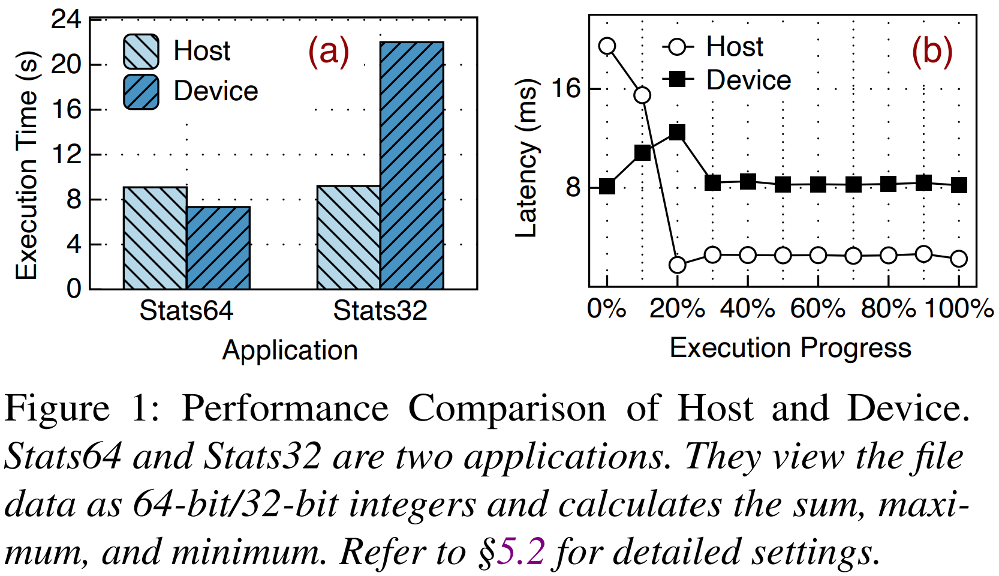

* **Different applications have different features and thus prefer different sides**.
  * As reported in Figure 1(a), Stats64 runs faster in the device while Stats32 runs faster in the host.
* **Even one application also favors different sides during the execution progress**.
  * As reported in Figure 1(b), earlier requests are faster in the device as the host does not cache data. The host outperforms significantly when it has the data in cache after 20%.

### 3. eBPF and its Limitations
**eBPF (extended Berkeley Packet Filter)** is an in-kernel virtual machine. It enables the user to run a piece of logic inside the kernel without modifying the kernel source code or loading a kernel module.

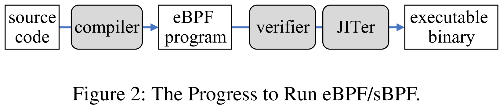

> 1. **The user compiles the source code** to an eBPF program in eBPF bytecode and **loads the program via a specific syscall**.
> 2. The in-kernel static verifier checks the program to ensure safety.
> 3. **The just-in-time compiler (JITer) translates the eBPF program to executable binary** in native hardware for later execution.

However, this study finds that **eBPF is inapplicable to general ISC** because of its overstrict static verifier.

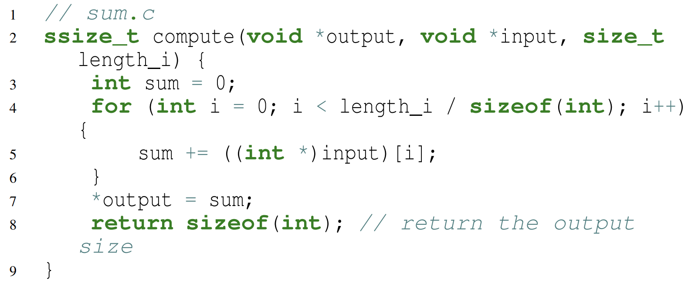

`compute` function is the typical computation code to sum values, but fails to pass the eBPF static verifier for two reasons.
1. **Pointer access**: The eBPF verifier **checks that the program does not access arbitrary kernel addresses**. As `input` and `output` are memory pointers, the verifier does not know their boundaries and prohibits pointer arithmetic and dereference.
2. **Dynamic-length loop**. eBPF checks each loop by simulating the iteration of the loop during the static verification. **It supports a bounded loop** when the loop boundary is bounded so that the loop finishes in bounded time in the simulation. However, `length_i` is unknown during the static verification and **is dynamically determined before execution**. In the verifier’s view, the loop is unbounded and the program does not complete in limited time.

## Proposed Method

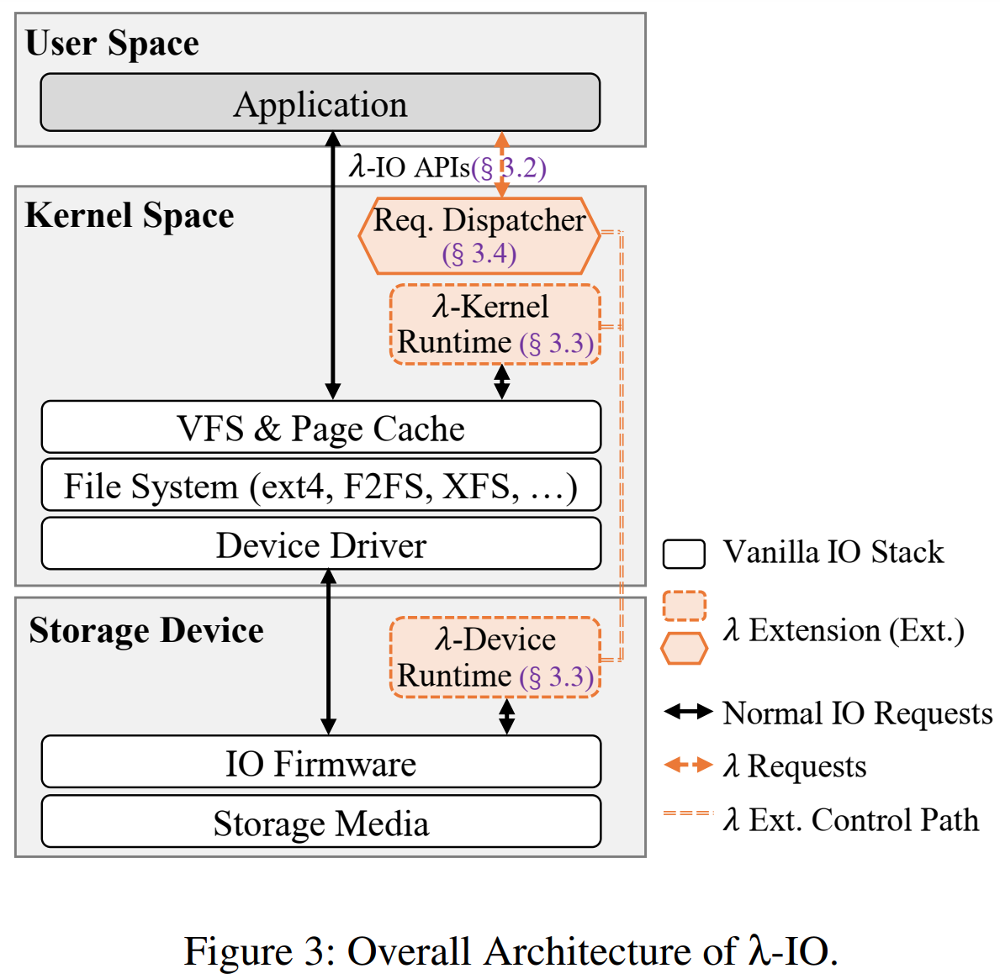

### 1. λ-IO APIs and Workflow

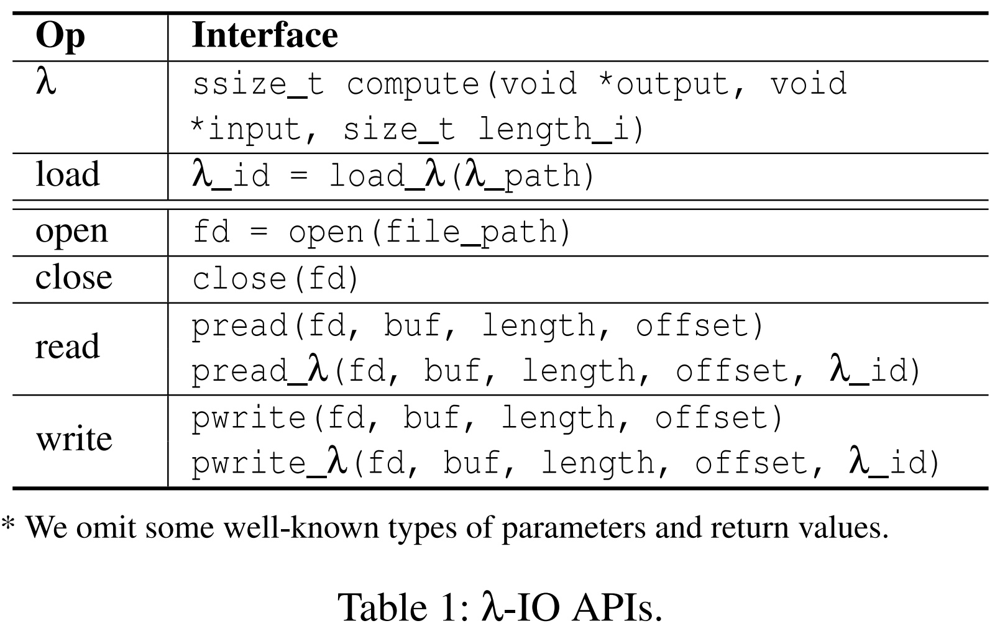

* **λ**: the interface to program the computational logic.
  * Parameters of `input` and `output` point to **input and output buffers**, along with `length_i` to indicate the size of the input buffer.
  * Thus, **the computational logic in the function body can access data through pointers** as it does in normal memory computing.
    ➔ It consumes data from the input buffer and produces data to the output buffer.
  * It is notable that the λ function body need not worry about the specific value of the two pointers, **no matter the computational logic runs in the λ-kernel or the λ-device runtime**.
    ➔ The λ runtime prepares memory buffers and sets proper values before executing the λ function.

* **Load**: the interface to load a λ function.
  * The user compiles the λ function source code to an sBPF program, and loads it via `load_λ`. `load_λ` returns `λ_id` as the handle to be used in later λ read and write calls.
  * The user needs to **compile and load a λ function only once**, although λ-IO has two runtimes in the host kernel and the device.
    * Receiving a loading call, λ-IO parses the sBPF program file, and **transfers the bytecode to both the λ-kernel runtime and the λ-device runtime**.
    * Afterward, **each runtime invokes the sBPF verifier and JITer** to translate the bytecode to an executable binary in the native ISA for later execution.

* **Read**: Compared to normal read, λ read (`pread_λ`) adds a parameter `λ_id` to indicate the invoked λ function.
  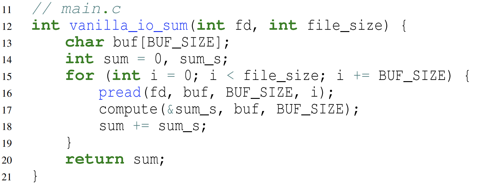 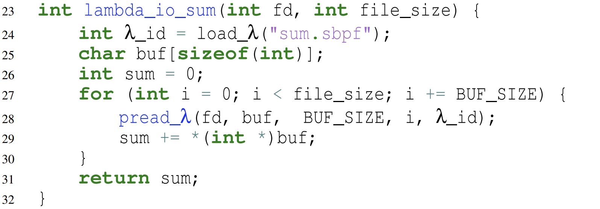

  * `vanilla_io_sum`: The application repeatedly reads file data into a buffer (`buf`). Then it runs the computational logic (`compute`) to sum values.
  * `lambda_io_sum`: The application loads the compiled sBPF program in Line 24, and gets a handle `λ_id`. When the application calls `pread_λ`, it additionally passes `λ_id`.
    1. It loads the file data of the specified range into an input memory buffer, and sets the `input` and `length_i` parameters of the λ function.
    2. It allocates an output memory buffer and sets it as `output` of the λ function. The output memory buffer is as large as the input by default.
    3. It triggers the λ function, which sums data in the `input` and stores the result in the `output`.
    4. It copies data in `output` to the user-allocated `buf`, along with the output size represented by the return value of `compute`.

* **Write**: λ write (`pwrite_λ`) works similarly to λ read in the reversed direction. λ-IO uses data in `buf` as the `input`, runs the function of `λ_id`, **writes the `output` to the file at the `offset`** and **returns the output size**.

### 2. Cross-Platform λ Runtime
#### (1) Computation: Extending eBPF to sBPF
At the core of the λ runtime is sBPF(s stands for storage). sBPF inherits the bytecode format of eBPF, but extends the verifier and JITer.
* **For the pointer access**: sBPF focuses on two memory buffer pointers, `input` and `output`. The sBPF verifier tracks all the pointer variables derived from `input` and `output`, by adding or subtracting an offset. 
* **For the dynamic-length loop**:  sBPF applies a dynamic count. This study observes that, the program has at least a **jump-back instruction with a negative offset** to implement a loop.
  * The sBPF JITer **allocates a counter** and inserts extra native code beside each jump-back instruction. Once a jump-back instruction is executed, the counter increases.
  * **If the counter reaches the preset loop threshold**, the program terminates and returns an error.
    * For an ISC program, **the number of loops is typically proportional to the input buffer size**.
      ➔ the threshold can be set to the same order of magnitude as the maximum input buffer size of programs.
  * sBPF does not allow infinite loops during execution ➔ As the sBPF **limits the number of jump-backs**, the program **completes in bounded time**.

#### (2) Data: Consistent File Access
Given that there are a sea of file systems, such as ext4, F2FS and XFS, this study introduces how λ-IO access file data consistently **without relying on any specified file systems for compatibility**. e.g. existing syscalls, VFS, and page cache in the kernel.
* **λ-kernel runtime**: Considering compatibility to a host of underlying file systems, **the λ-kernel runtime is placed atop VFS and page cache**. For a λ request, the λ-kernel runtime accesses file via `kernel_read` and `kernel_write`.
* **λ-device runtime**: The device first has to know the exact storage locations of a range in the file. **So the host is responsible for extracting necessary metadata** and pushing it down to the device. Fortunately, Linux offers `FIEMAP` and `FIBMAP` ioctl interfaces, to retrieve the file extent metadata of storage locations by given offset and length.
* **Consistency**: As data may be modified in the host userspace, the host kernel, and the device, λ-IO has to guarantee data consistency among three places.
  * The host-side consistency between the userspace and the kernel
    * Both the userspace and the kernel **rely on the identical VFS and page cache** to access file data.
      ➔ consistency is guaranteed!!
  * The consistency between the host and the device
    * During executing a λ read/write request in the device, λ-IO acquires a **read/write lock on the file**, to guarantee consistency against other normal IO and l requests.
    * Before dispatching a λ read request to the device, λ-IO **flushes dirty cache** within the overlapped range
    * Before dispatching a λ write request to the device, λ-IO **invalidates the host-side page cache** within the overlapped range

### 3. Dynamic Request Dispatching
* $t_h$: the execution time in the host

$$
\begin{cases}
    t_{h} = \frac{(1-c)D}{B_{s}}+\frac{(1-c)D}{B_{d}}+\frac{D}{B_{h}}    & \text{if in the host} \newline 
    t_{d} = \frac{D}{B_{s}}+\frac{\alpha D}{B_{d}}+\frac{D}{\beta B_{h}}     & \text{if in the device}
\end{cases}
$$

<table>
  <tbody>
    <tr style="background-color:#EEE;">
      <th>exact values obtained directly</th>
      <th>estimated by profiling</th>
    </tr>
    <tr>
    <td width="40%"><ul style="padding-left:20px; margin:0;">
    <li>$D$ : the loaded data size from the storage media.</li>
    <li>$c$ : the cache ratio.</li>
    <ul><li>The higher the ratio of the cached file data, the more the dispatcher tend to dispatch the λ read request to the host.</li></ul></ul>
    <td><ul style="padding-left:20px; margin:0;">
    <li>$B_s$: the bandwidth between the storage media and the device controller buffer (per request)</li>
    <li>$B_d$: the bandwidth between the device and the host (per request)</li>
    <li>$B_h$: the host-side computing bandwidth (per request).</li>
    <li>$\alpha$: the ratio between the output and input</li>
    <li>$\beta$: the ratio between the device and the host computing bandwidth</li></ul>
    </tr>
  </tbody>
</table>

* To determine these variables efficiently, λ-IO profiles partial requests periodically rather than profiles each request. For a given `(file_path, λ_id)` pair, λ-IO sets a profiling period, like `n` requests.
  * For the beginning `k` requests in a period (`k` refers to **profiling length**), λ-IO **submits them to both the λ-kernel and λ-device runtimes**.
  * After `k` requests complete, λ-IO **calculates the average of each variable** and uses it as the estimated value.

## Evaluation and Results

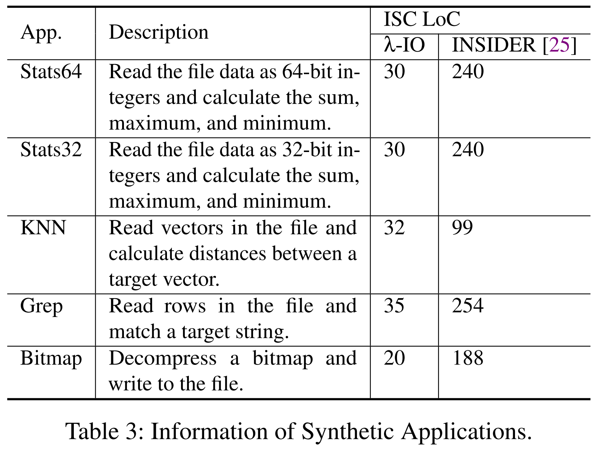

### 1. Single Application <a href="#fn" name="fr">*</a>

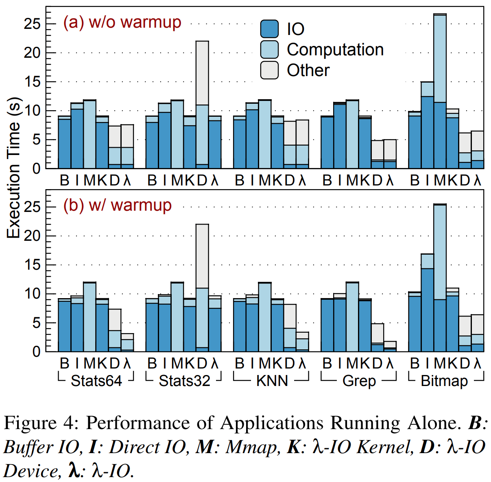

* Cache settings
  * **without warmup**: drop the page cache before each execution
  * **with warmup**: read the input/output file sequentially via Buffer IO, to warm up the page cache before each execution.

### 2. Sensitivity Analysis
<table>
  <tbody>
    <tr style="background-color:#EEE;">
      <th>Dataset Size</th>
      <th>Warmup</th>
    </tr>
    <tr>
      <td>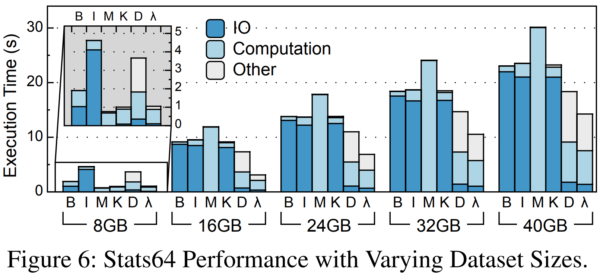
        <ul style="padding-left:20px; margin:0;"><li>$\textbf{Dataset size} < \textbf{page cache capacity}$ : 8GB</li>
        <li>$\textbf{Dataset size} \approx \textbf{page cache capacity}$ : 16GB</li>
        <li>$\textbf{Dataset size} > \textbf{page cache capacity}$ : 24GB, 32GB and 40GB</li></ul>
      <td>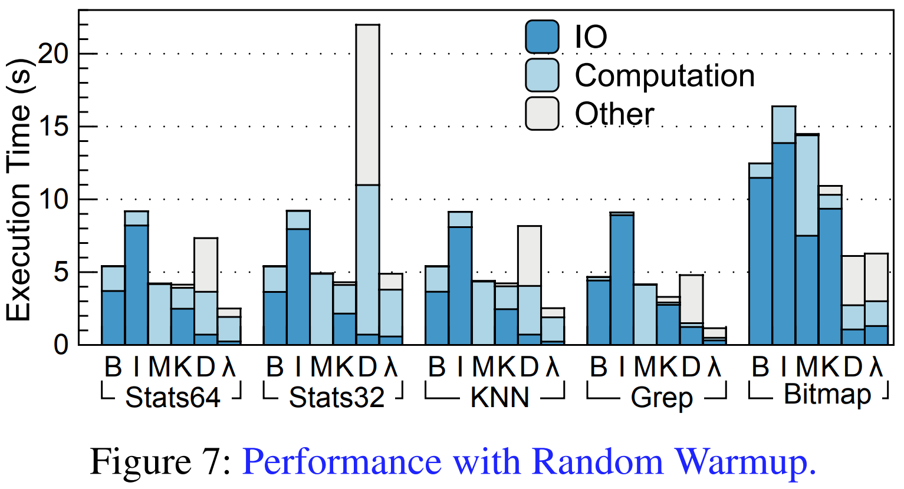</td>
    </tr>
    <tr style="background-color:#EEE;">
      <th>Profiling Periods and Profiling Length</th>
      <th>Buffer Size and Thread Count</th>
    </tr>
    <tr>
    <td width="50%">
    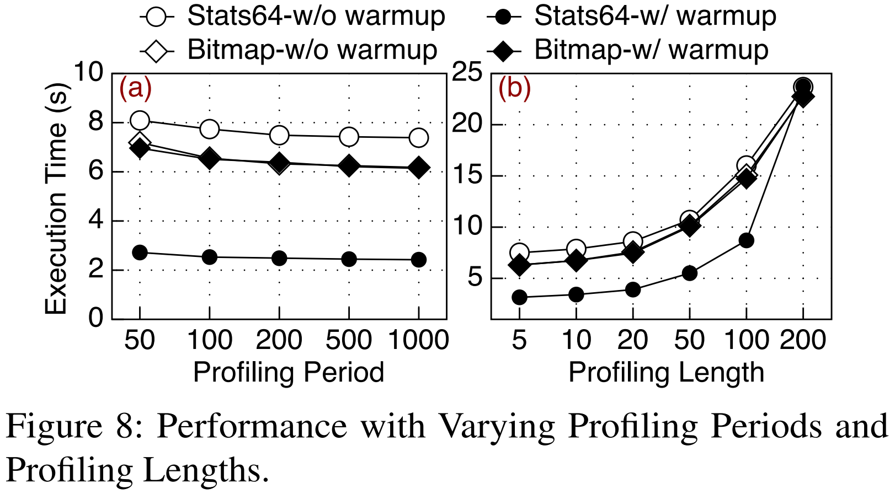
    <td>
    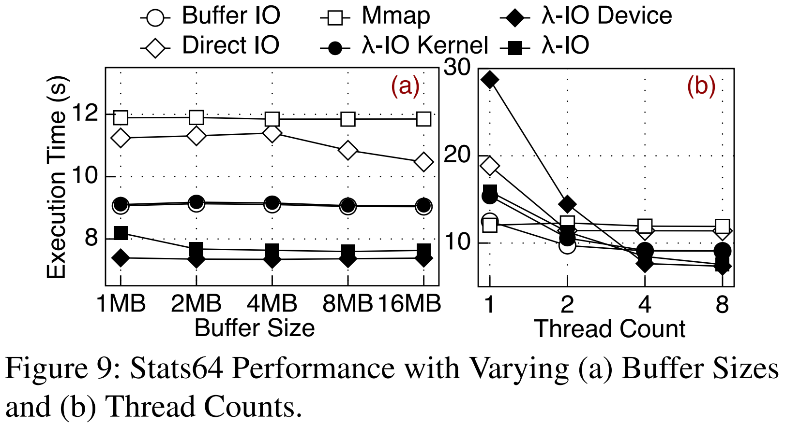
    </tr>
  </tbody>
</table>

### 3. Case Study: Spark SQL
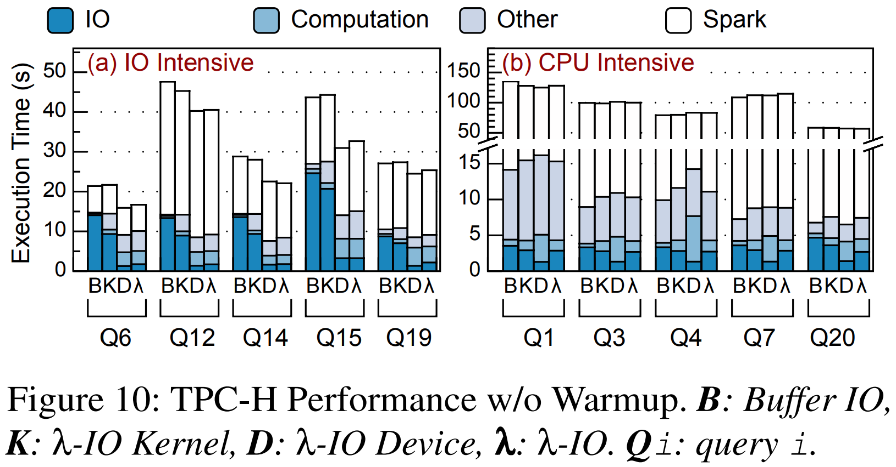
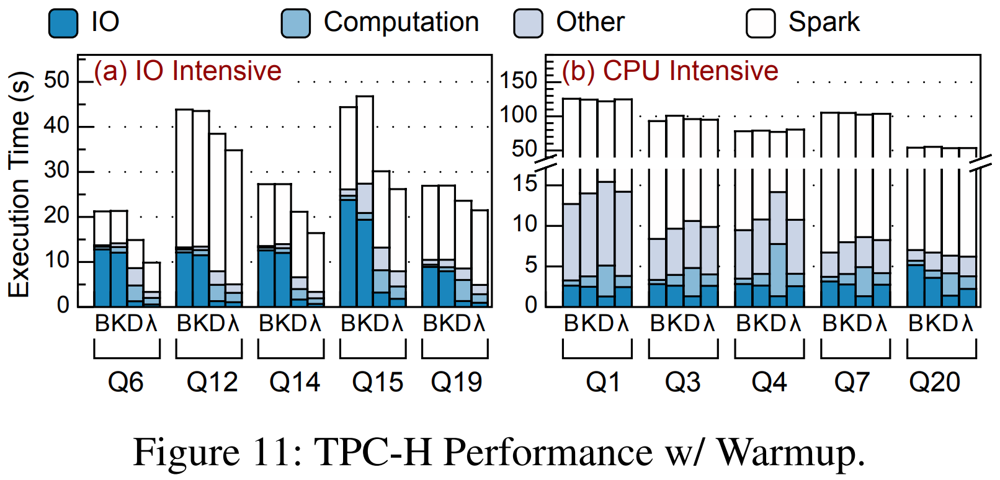

-----
## Notes
* Source code: [https://github.com/thustorage/lambda-io](https://github.com/thustorage/lambda-io)
* Stats32: **eBPF does not support 32-bit integers well**.
  ➔ eBPF programs use 64-bit registers even for 32-bit integers in Stats32. <a name="fn" href="#fr">↵</a>
