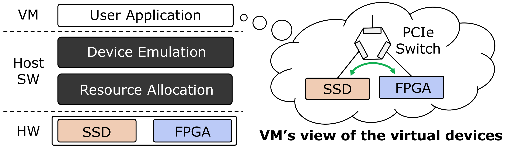

# A Fast and Flexible Hardware-based Virtualization Mechanism for Computational Storage Devices
Dongup Kwon; Dongryeong Kim; Junehyuk Boo; Wonsik Lee; and Jangwoo Kim
*2021 USENIX Annual Technical Conference*
> **Computational Storage Devices**
> [https://www.usenix.org/conference/atc21/presentation/kwon](https://www.usenix.org/conference/atc21/presentation/kwon)

## Abstract
A computational storage device incorporating a computation unit inside or near its storage unit is a highly promising technology to maximize a storage server's performance. However, to apply such computational storage devices and take their full potential in virtualized environments, server architects must resolve a fundamental challenge: cost-effective virtualization. This critical challenge can be directly addressed by the following questions: (1) how to virtualize two different hardware units (i.e., computation and storage) and (2) how to integrate them to construct virtual computational storage devices, and (3) how to provide them to users. However, the existing methods for computational storage virtualization severely suffer from their low performance and high costs due to the lack of hardware-assisted virtualization support.
In this work, we propose FCSV-Engine, an FPGA card designed to maximize the performance and cost-effectiveness of computational storage virtualization. FCSV-Engine introduces three key ideas to achieve the design goals. First, it achieves high virtualization performance by applying hardware-assisted virtualization to both computation and storage units. Second, it further improves the performance by applying hardware-assisted resource orchestration for the virtualized units. Third, it achieves high cost-effectiveness by dynamically constructing and scheduling virtual computational storage devices. To the best of our knowledge, this is the first work to implement a hardware-assisted virtualization mechanism for modern computational storage devices.

## Problem Statement and Research Objectives
### ■ Computational Storage
* Computational storage = SSD + FPGA + near-storage procesing

* SW-based virtualization Approach
  

  * However, the existing virtualization mechanisms for computational storage severely suffer from their low performance and high costs.

### 1. Indirect Device-Control and Data Paths

 &ensp;

  * In the full software implementation, SSD and FPGA **operations involve VM exits and traps to a hypervisor**.
  *  In the full software implementation, since a guest OS cannot obtain host physical addresses of the FPGA’s BARs <a href="#fn1" name="fr1">1</a>, its input and output data **must be transferred via the guest and host OS stacks**.

### 2. SSD-FPGA Coupled Architecture
An SSD-FPGA coupled computational storage architecture severely **suffers from its limited scalability** due to its board-level SSD-FPGA integration. Moreover, their architectural limitations become increasingly apparent **as the gaps between SSD and FPGA resource capacity and performance increase**.

* When two or more I/O-intensive VMs share the SSD, the near-storage processing latency becomes 2.1x slower than the single-VM execution case.
* When the VMs demand higher I/O performance by increasing the queue depth, the target VM and its near-storage processing suffer from the more severe resource contention.

### 3. Static SSD/FPGA Resource Allocation
Static resource allocation and scheduling for both computation and storage units **will incur high hardware costs** because they **cannot handle the dynamic behavior** of VM workloads efficiently.

> When the total request rate exceeds the maximum throughput, the operator latency and the number of QoS violations increase quickly.

## Proposed Method
### 1. Hardware-assisted virtualization layer based on PCIe SR-IOV <a href="#fn2" name="fr2">2</a>

* To mitigate the software overhead in computational storage virtualization, FCSV-Engine offers **hardware-assisted virtualization under a standard PCIe SR-IOV layer**.
  * By incorporating SR-IOV, FCSV-Engine can **virtualize itself at the hardware level** and **each VF can be assigned exclusively to a VM for the direct access**.
  * In this work, a single SR-IOV implementation at FCSV-Engine is utilized to virtualize both computation and storage units.
* FCSV-Engine **allocates a disjoint set of memory regions** and **assigns different AXI <a href="#fn3" name="fr3">3</a> address ranges for each VF** so that near-storage processing requests from two different VMs do not interfere with each other.
* **A different set of available interrupt vectors of FCSV-Engine for each VM** are allocated.
  * In this work, 8 interrupt vectors per VM are allocated.
  * Each vector is dedicated to a single completion queue of FlexCSV device driver running on a guest OS.
* FCSV-Engine implements a multi-queue device interface and a doorbell mechanism to interact with guest OSes.
  * For this multi-queue device interface, this study **arranges FCSV-Engine’s PCIe BAR regions** for **doorbell registers of virtual FCSV-Engine instances (i.e., each VF)**.
  * From the software side, **FCSV-Engine’s device driver installed on a guest OS allocates multiple SQ/CQ pairs** <a href="#fn4" name="fr4">4</a> and initializes the doorbell registers mapped at FCSV-Engine’s BARs.

### 2. Hardware-level direct device-orchestration mechanism
* **Near-storage Processing Command**: To offload resource orchestration routines to FCSV-Engine, FlexCSV **extends a standard NVMe protocol** and defines a new command format for near-storage processing.
  * `op_chain` specifies which operators should be activated and the target stream order of the activated operators.
  * `src_addr/size` and `dst_addr/size` represent the addresses and sizes of the source and destination in the FPGA’s DRAM space.

* **Resource Orchestration**: To orchestrate two different hardware units without frequent software-hardware crossings, FCSV-Engine schedules user-requested computation and storage operations at the hardware level.
  

* **Software FCSV-Engine**: FCSV-Engine’s resource orchestration mechanism **can be implemented at the hypervisor level, but it still suffers** from frequent software-hardware layer crossings to orchestrate two different hardware units.
   

  * Because of the indirect resource orchestration routines through the host software (e.g., MMIO, interrupt), **the software FCSV-Engine implementation fails** to achieve the full potential of near-storage processing.

### 3. SSD-FPGA decoupled architecture

  > for scalable near-storage processing with multiple PCIe-attached SSDs.
* **To allow multiple NVMe SSDs to combine with FCSV-Engine** through PCIe P2P, the host software **remaps their queue pairs** onto FCSV-Engine’s BAR regions.
  * By doing so, the decoupled storage units can seamlessly exchange NVMe commands and their completions with FCSV-Engine.
  * As a result, FlexCSV can **mitigate the performance bottleneck at a single FPGA or SSD** by flexibly combining PCIe-attached computation and storage devices in the same server.
* FCSV-Engine implements PCIe message arbitration and transaction modules to **encapsulate local NVMe requests (e.g., NVMe doorbell write) with PCIe transactions** and allow **multiple storage interfaces to share a single PCIe/DMA IP core**.

### 4. Dynamic resource allocation
* **Operator Renaming**:  FCSV-Engine **implements a shared operator pool** and **dynamically maps user-requested operations** onto available physical operators.
  * In this way, FCSV-Engine can quickly capture the dynamic behavior of VM workloads and thus reduce QoS violations significantly.
  * The area overhead is 2%–4% and the total critical path overhead is around 100 ns, which is negligible compared to the original scheduler area and operator delay.
* **Operator Partial Reconfiguration**: 
  * If the demand from near-storage processing workloads **exceeds the maximum number of operator slots**, they **can be partially reconfigured** to serve the current user requests.
  

   * Reconfiguration from the host software incurs long latency because the software has to send the bitstream from the host DRAM to the FPGA.
    * Alternatively, to achieve agile operator reconfiguration, it can **store the partial bitstreams in the FPGA DRAM** and implement a PR controller to **allow the FPGA to reconfigure its operator slots**.

## Evaluation and Results
### 1. Device Virtualization Performance

> To measure the storage performance, this study ran flexible I/O tester (FIO) in both native and FlexCSV virtualization environments with an increasing data block size.
* Due to the hardware-assisted virtualization mechanism (including SR-IOV), FCSV-Engine can achieve the near-native performance when utilizing both SSD and FPGA devices in virtualized environments.
* The increasing data block size further mitigates the software overhead by merging multiple near-storage processing requests using NVMe’s scatter-gather list (SGL) support.

### 2. Near-Storage Processing Performance

> For this evaluation, a 4-GB dataset is generated as an input file of near-storage processing, and each benchmark running on a guest OS divides the dataset into multiple 4-KB blocks and iterates them to cover the total dataset size.
* Full SW, Opt SW: paravirtualization schemes with and without SR-IOV support (fig4)
* FlexCSV(SW), FlexCSV(HW): described in **_Figure 12_**

### 3. Multi-SSD Performance

### 4. Dynamic Resource Scheduling

* This study ran four VMs and grouped the VMs into two groups (A, B) that have different request rates ($T_{wait}/T_{exec}$).
  * After that, they compared the QoS violation ratios with four different resource scheduling strategies.
  * The static-worst, static-best, and dynamic scheduling methods utilize two physical operators, and dynamic+pr can support up to four physical operators through partial reconfiguration.

-----
## Notes
1. **Base Address Register (BAR)**: a pointer to a byte in memory, and the offset specifies a number of bytes. <a name="fn1" href="#fr1">↵</a>
(Sloss, A., Symes, D., & Wright, C. (2004). Chapter 3. Introduction to the ARM Instruction. In **ARM System Developer’s Guide**. essay, Elsevier/ Morgan Kaufman. [https://www.sciencedirect.com/topics/computer-science/base-address-register](https://www.sciencedirect.com/topics/computer-science/base-address-register))
2. **Single Root I/O Virtualization (SR-IOV)** is an I/O virtualization technology that is used for the virtualization of I/O resources for individual servers. It logically divides a physical adapter port into multiple logical ports. <a name="fn2" href="#fr2">↵</a>
([https://www.ibm.com/docs/en/power8?topic=adapters-managing-sr-iov](https://www.ibm.com/docs/en/power8?topic=adapters-managing-sr-iov))
3. **Advanced eXtensible Interface (AXI)**: an on-chip communication bus protocol and is part of the Advanced Microcontroller Bus Architecture specification (AMBA). <a name="fn3" href="#fr3">↵</a>
([https://en.wikipedia.org/wiki/Advanced_eXtensible_Interface](https://en.wikipedia.org/wiki/Advanced_eXtensible_Interface))
4. **Submission Queue/Completion Queue** <a name="fn4" href="#fr4">↵</a>
([https://nvmexpress.org/wp-content/uploads/2013/04/FMS-2012-How-the-Streamlined-Architecture-of-NVM-Express-Enables-High-Performance-PCIe-SSDs.pdf](https://nvmexpress.org/wp-content/uploads/2013/04/FMS-2012-How-the-Streamlined-Architecture-of-NVM-Express-Enables-High-Performance-PCIe-SSDs.pdf))
    * **NVMe I/O Command**
      
    * **NVMe Queues per Core**
      
* Kwon, D., Lee, W., Kim, D., Boo, J., & Kim, J. (2022). **SmartFVM: A fast, flexible, and scalable hardware-based virtualization for commodity storage devices**. ACM Transactions on Storage, 18(2), 1–27. [https://doi.org/10.1145/3511213](https://doi.org/10.1145/3511213) 