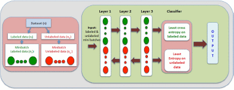
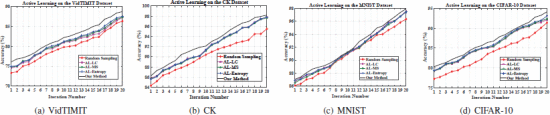
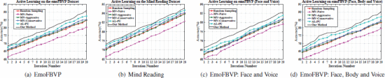

<!--`Macros`: Use \bbone instead of \mathbb{1}-->

# Deep Active Learning for Image Classification
Hiranmayi Ranganathan; Hemanth Venkateswara; Shayok Chakraborty; and Sethuraman Panchanathan
*2017 IEEE International Conference on Image Processing (ICIP)*
> **Computer Vision, Deep Learning, Deep Belief Networks, Active Learning, Entropy, Dataset, Labeling, Sampling**
> [https://doi.org/10.1109/ICIP.2017.8297020](https://doi.org/10.1109/ICIP.2017.8297020)

## Abstract
In the recent years, deep learning algorithms have achieved state-of-the-art performance in a variety of computer vision applications. In this paper, we propose a novel active learning framework to select the most informative unlabeled samples to train a deep belief network model. We introduce a loss function specific to the active learning task and train the model to minimize the loss function. To the best of our knowledge, this is the first research effort to integrate an active learning based criterion in the loss function used to train a deep belief network. Our extensive empirical studies on a wide variety of uni-modal and multi-modal vision datasets corroborate the potential of the method for real-world image recognition applications.

## Problem Statement and Research Objectives
* A fundamental challenge in training a deep neural network is **the requirement of large amounts of labeled training data**.
  * While gathering large quantities of unlabeled data is cheap and easy, **annotating the data (with class labels) is an expensive process** in terms of time, labor and human expertise.
  * Thus, developing algorithms to minimize human effort in training deep models is of paramount practical importance.
* **Active learning** algorithms automatically identify the salient and exemplar samples from large amounts of unlabeled data and reduce human annotation efforts in inducing a classification model.
  * Even though both **deep learning** and **active learning** have been extensively studied, **research on combining the two is still in a nascent stage**. 
    * A deep model is first learned using a conventional loss function.
    * The active sampling condition is then defined based on the posterior probabilities obtained from the last layer or the distance of a sample from the decision boundary.
  * However, **the merit of a deep model** lies in its ability to learn a **discriminating set of features** for a given task.

## Proposed Method
In standard active learning settings,
> 1. A classifier is first trained on the labeled data and used to obtain the predictions for the unlabeled data.
> 2. Entropy is then applied to obtain the uncertainty of such a classifier prediction.

In this two-step approach, the unlabeled data does not play a role in training the classifier.
➔ We propose an active learning model where we **combine the entropy measure along with the cross-entropy loss during training**.

### 1. Labeling Procedure
1. From the unlabeled set $X_{u}$, an oracle is given a batch of points $B$ to be labeled.
2. After labeled, the batch $B$ is then combined with the labeled set $X_l$ along with the corresponding labels (added to $Y_{l}$) that are provided by the oracle.
3. These data points are removed from the unlabeled set $X_{u}$ in order to ensure $X_{l}$ and $X_{u}$ are disjoint.
4. A new and improved classifier is estimated using the augmented labeled sets $\\{ X_{l}, Y_{l} \\}$. This procedure is repeated until we run out of budget to get labeled data from the oracle.

Given the probability of label assignment for a data point, **entropy (from Information Theory)** can be used to obtain **a measure of uncertainty regarding its label assignment**. The set $B$ can therefore be chosen by selecting the data points with the largest uncertainty.

### 2. Joint Loss for Active Learning
We combine the cross-entropy loss<a name="fr1" href="#fn1">1</a> and the entropy<a name="fr2" href="#fn2">2</a> to formulate a classifier with a joint loss that is given by,

$$
\begin{align*}
\arg \min_{f \in \mathcal{F}} \ E( \mathcal{D};f)=\frac{1}{n_{l}}\sum_{i=1}^{n_{l}}L(f(x_{i}), y_{i})\\\\
\qquad\qquad \qquad\qquad +\frac{\lambda}{n_{u}}\sum_{i=n_{l}+1}^{n} H(f(x_{i}))
\end{align*}
$$

where $\lambda$ controls the relative importance of the entropy loss.

The output of the $N$-th layer of the network (before the loss) for a data point $x_i$, is given by the vector ${h_{i}^{N}}$. The loss in terms of probabilities is given by,

$$
\begin{align*}
E(X_{l}, X_{u}, Y_{l})= & -\frac{1}{n_{l}}\sum_{i=1}^{n_{l}}\sum_{j=1}^{C}1 \\{ y_{i}=j \\} \log p_{ij}\\\\
\qquad\qquad\qquad & -\frac{\lambda}{n_{u}}\sum_{i=n_{l}+1}^{n}\sum_{j=1}^{C}p_{ij}\log p_{ij}
\end{align*}
$$

During the training procedure, the derivative $\partial E / \partial h^{N}$ is back-propagated through the network in order to update the weights of the network.

$$
\frac{\partial E}{\partial h_{pq}^{N}}=
\begin{cases} \frac{1}{n_{l}}\left(p_{pq}-1\\{y_{p}=q\\}\right),& \qquad p\in[1, \ldots, n_{l}] \newline
\frac{\lambda}{n_{u}}p_{pq}\left(\sum\nolimits_{j}^{C}p_{pj}h_{pj}^{N}-h_{pq}^{N}\right),& \qquad p\in[n_{l}+1, \ldots, n].
\end{cases}
$$

### 3. Active Learning Network Architecture and Training

Our model is a three layer Deep Belief Networks (DBNs).
* **One epoch**: When the network has seen all the data points in the training set (labeled and unlabeled).
* **One training iteration $t$ of the active learning algorithm**: Repeating the training procedure over multiple epochs until convergence.
  * At the end of every iteration $t$, we sample the most informative batch of unlabeled data points (using Equation<a name="fr2" href="#fn2">2</a>) to form $B$.
  * We iterate until we run out of unlabeled data to be labeled or we run out of budget to get them labeled.

## Evaluation and Results
➔ The goal was to study the improvement in performance on the test set with increasing sizes of the training set.
> * For a given batch size $k$, each algorithm selected $k$ instances from the unlabeled pool to be labeled in each iteration.
>   * After each iteration, the selected points were removed from the unlabeled set, appended to the training set and the performance was evaluated on the test set.
>   * The experiments were run for 20 iterations.

* **Uni-modal datasets**
  1. **Random Sampling**: selects a batch of unlabeled samples at random from the unlabeled pool
  2. **Active Labeling with Least Confidence (AL-LC)**: selects the samples with the smallest of the maximum activations
  3. **Active Labeling with Margin Sampling (AL-MS)**: selects the samples with the smallest separation between the top two class predictions
  4. **Active Labeling with Entropy (AL-Entropy)**: selects the unlabeled samples with the largest class prediction information entropy

* **Multi-modal datasets**
  * Muslea et al.<a name="fr3" href="#fn3">3</a> proposed the **Multi-view (MV)** algorithm in which a separate classification model was trained for each modality (view).
    * A set of _Contention Points_ was identified from the unlabeled set, where at least two models produced different predictions; samples were queried from this set using three selection strategies: (i) **MV-Naive**, (ii) **MV-Aggressive** and (iii) **MV-Conservative**.
  * The **PU algorithm** combining uncertainty and diversity depicts better performance than the Multi-view active learning algorithms.

-----
## Notes
* Cross-Entropy Loss: $L(f(x_{i}), y_{i})=-\sum_{j=1}^{C}1\{y_{i}=j\}\log f_{j}(x_{i}), \forall i\in[1, \ldots, n_{l}]$ <a name="fn1" href="#fr1">↵</a>
* Entropy: $H(f(x_{i}))=-\sum_{j=1}^{C}f_{j}(x_{i})\log f_{j}(x_{i}), \forall i\in[n_{l}+1, \ldots, n]$ <a name="fn2" href="#fr2">↵</a>
  * $f_{j} (x_{i})$ is the probability of assigning $x_i$ to category $j$.
  * $p_{i} := \[f_{1}(x_{i}), f_{2}(x_{i}),...,f_{C}(x_{i})\]^{\intercal}$ is the probability vector for $x_i$
  * $p_{ij} := f_{j} (x_{i}) = {e^{h_{ij}^{N}}} / \sum_{j'}{e^{h_{ij'}^{N}}}$ is the probability that data point $x_i$ belongs to class $j$.

<h2 style="margin-bottom: 5px; padding-bottom: 10px; border-bottom: 1px solid #dfdfdf;"></h2>
<ol style="color:grey; padding-left:20px;"><li> [16] I. Muslea, S. Minton, and C. Knoblock. Active learning with multiple views. In Journal of Artificial Intelligence Research, 2006. <a name="fn3" href="#fr3">↵</a></li>