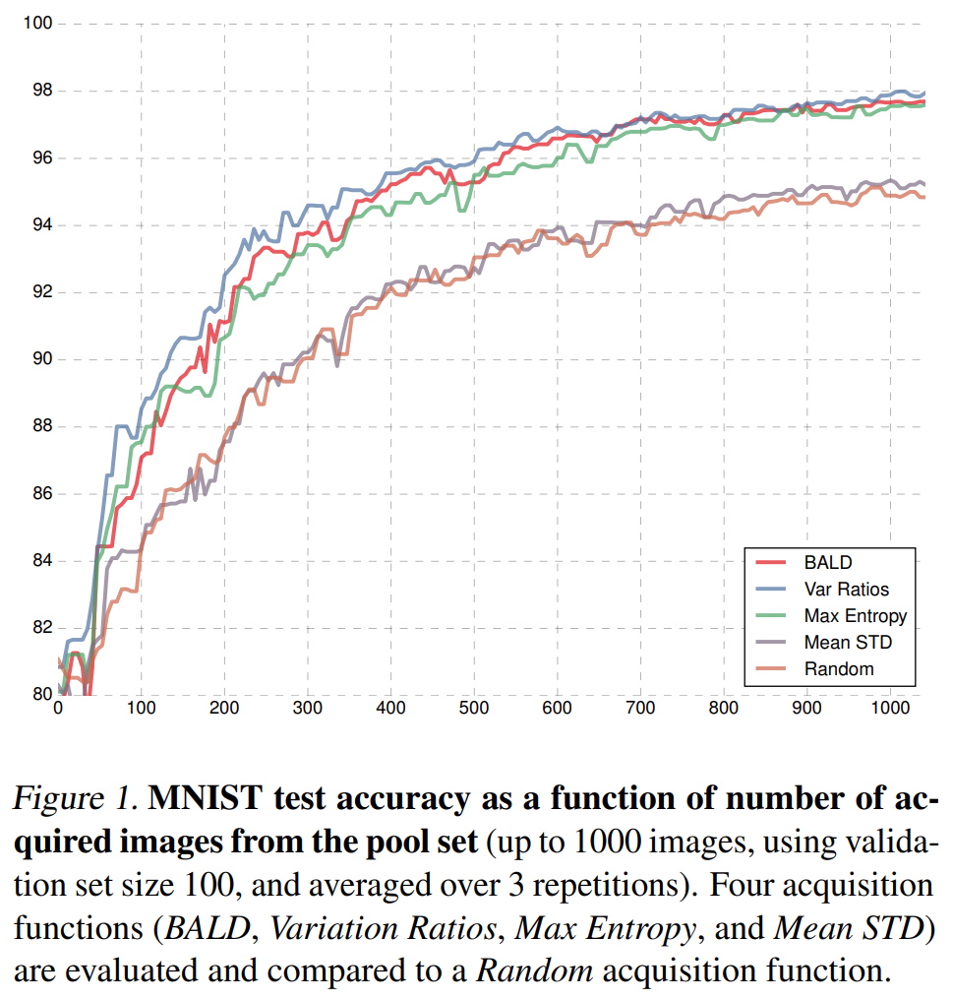
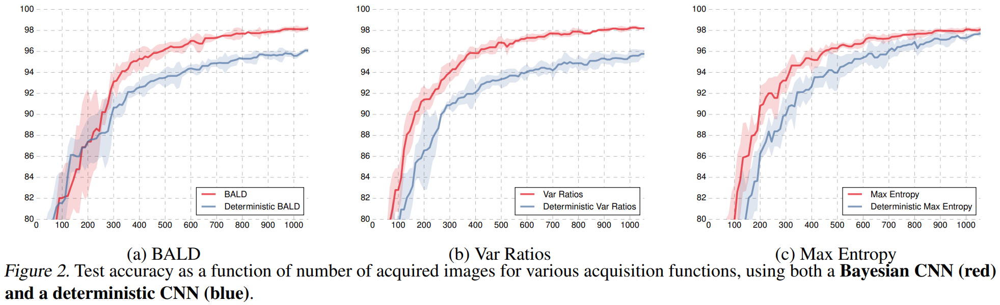
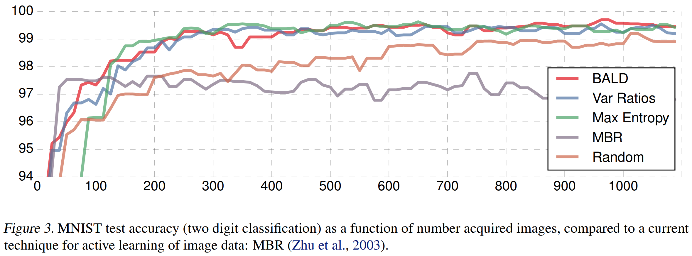
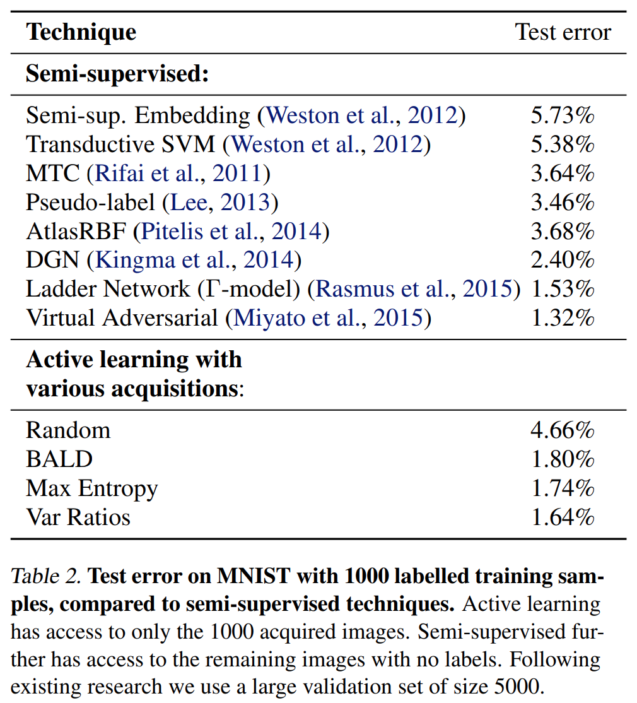
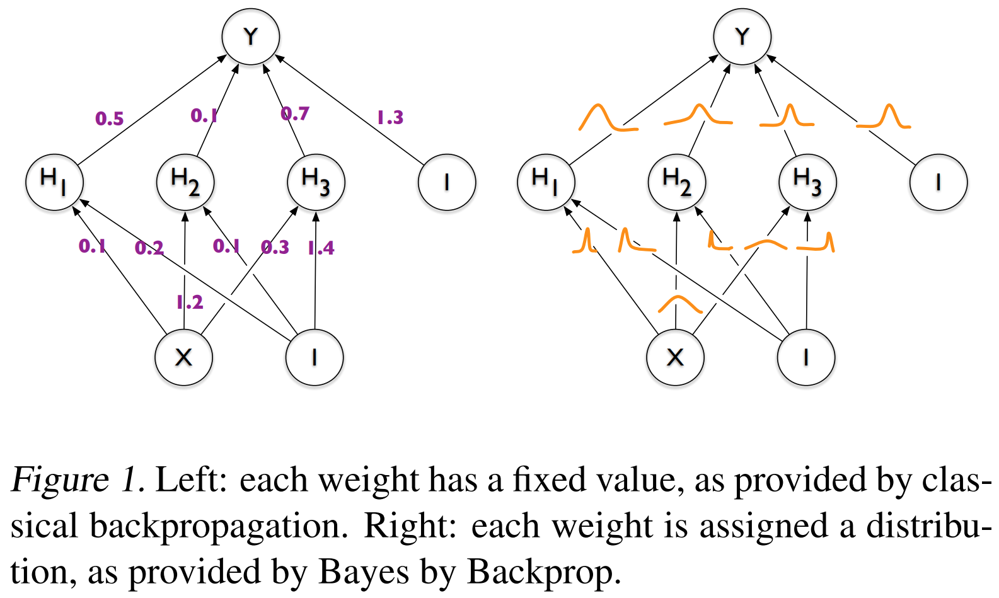
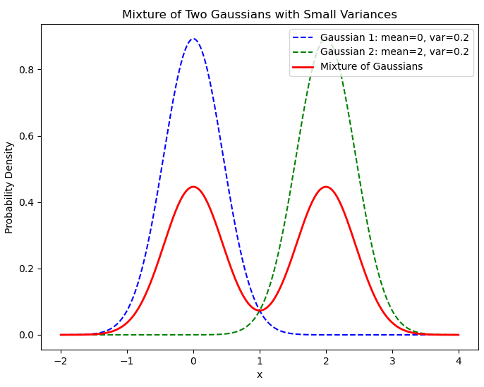

<!--`Macros`: Use \bbone instead of \mathbb{1}-->

# Deep Bayesian active learning with image data
Yarin Gal; Riashat Islam; and Zoubin Ghahramani
*34th International Conference on Machine Learning (ICML'17)*
**Deep Learning, Bayesian Approximation, Active Learning**
> [https://dl.acm.org/doi/10.5555/3305381.3305504](https://dl.acm.org/doi/10.5555/3305381.3305504)
> [https://github.com/Riashat/Deep-Bayesian-Active-Learning](https://github.com/Riashat/Deep-Bayesian-Active-Learning)
> (Un-official) [https://github.com/lunayht/DBALwithImgData](https://github.com/lunayht/DBALwithImgData)

## Abstract
Even though active learning forms an important pillar of machine learning, deep learning tools are not prevalent within it. Deep learning poses several difficulties when used in an active learning setting. First, active learning (AL) methods generally rely on being able to learn and update models from small amounts of data. Recent advances in deep learning, on the other hand, are notorious for their dependence on large amounts of data. Second, many AL acquisition functions rely on model uncertainty, yet deep learning methods rarely represent such model uncertainty. In this paper we combine recent advances in Bayesian deep learning into the active learning framework in a practical way. We develop an active learning framework for high dimensional data, a task which has been extremely challenging so far, with very sparse existing literature. Taking advantage of specialised models such as Bayesian convolutional neural networks, we demonstrate our active learning techniques with image data, obtaining a significant improvement on existing active learning approaches. We demonstrate this on both the MNIST dataset, as well as for skin cancer diagnosis from lesion images (ISIC2016 task).

## Problem Statement and Research Objectives
Active Learning (also known as “experiment design” in the statistics literature): A framework where a system could learn from small amounts of data, and choose by itself what data it would like the user to label, would make machine learning much more widely applicable.
  * In active learning, a model is trained on a small amount of data (the initial training set), and an **_acquisition function_** (often based on the model’s _uncertainty_) decides which data points to ask an external _oracle_ for a label.
  * An oracle (often a _human expert_) labels the selected data points, these are added to the training set, and a new model is trained on the updated training set. This process is then repeated, with the training set increasing in size over time.

Even though existing techniques for active learning have proven themselves useful in a variety of tasks, a major remaining challenge in active learning is its **lack of scalability to high-dimensional data** (Tong, 2001).
To perform active learning, a model has to be able to learn from small amounts of data and represent its uncertainty over unseen data. This severely restricts the class of models that can be used within the active learning framework.

But even though **active learning** forms an important pillar of machine learning, **deep learning tools are not prevalent within it**. Deep learning poses several difficulties when used in an active learning setting.
* First, we have to be able to **handle small amounts of data**. Recent advances in deep learning, on the other hand, are notorious for their dependence on large amounts of data (Krizhevsky et al., 2012).
* Second, many **AL acquisition functions rely on model uncertainty**. But in deep learning we rarely represent such model uncertainty.

Relying on Bayesian approaches to deep learning, in this paper we combine **recent advances in Bayesian deep learning into the active learning framework** in a practical way. Taking advantage of specialised models such as Bayesian convolutional neural networks (BCNNs) (Gal & Ghahramani, 2016a;b), we demonstrate our active learning techniques with image data.

## Proposed Method

### 1. Bayesian Convolutional Neural Networks<a href="#fn1" name="fr1">1</a>
In this paper we concentrate on high dimensional _image_ data, and need a model able to represent prediction uncertainty on such data.

* To perform active learning with image data we make use of the **Bayesian equivalent of CNNs**.
  * Existing approaches rely on kernel methods, and feed image pairs through linear, polynomial, and RBF kernels to capture image similarity as an input to an SVM for example.
  * Unlike the kernels above, which cannot capture spatial information in the input image, CNNs are designed to use this spatial information. 
* To perform approximate inference in the Bayesian CNN model we make use of stochastic regularisation techniques such as **dropout**, which can be used to perform practical approximate inference in complex deep models.
  * This approach is equivalent to performing **approximate variational inference** where we find a distribution $q_{\theta}^{*}(\omega)$ in a tractable family which minimises **the Kullback-Leibler (KL) divergence**<a href="#fn2" name="fr2">2</a> to the true model posterior $p(\omega \mid \mathcal{D}\_{\text{train}})$ given a training set $\mathcal{D}\_{\text{train}}$.
  ➔ Minimize the difference between the approximate distribution and the actual distribution.
  * Dropout can be interpreted as a **variational Bayesian approximation**, where the approximating distribution is a mixture of two Gaussians with small variances and the mean of one of the Gaussians is fixed at zero.<a href="#fn3" name="fr3">3</a>
  * The uncertainty in the weights induces prediction uncertainty by marginalising over the approximate posterior using Monte Carlo integration, with $\hat{\omega}\_{t} \sim q\_{\theta}^{\*}(\omega)$ where $q\_{\theta}(\omega)$ is the Dropout distribution.

$$
\begin{array}{ll}
p(y = c \mid \mathbf{x}, \mathcal{D}\_{\text{train}}) \\\\
\qquad = \int p(y = c \mid \mathbf{x}, \omega) p(\omega \mid \mathcal{D}\_{\text{train}}) d\omega & \because \ \text{Bayesian inference} & (1^{\prime})\\\\
\qquad \approx \int p(y = c \mid \mathbf{x}, \omega) q_{\theta}^{\*}(\omega) d\omega & \ \leftarrow \ \text{approximate variational inference} & (1^{\prime\prime})\\\\
\qquad \approx \frac{1}{T} \sum_{t=1}^{T} p(y = c \mid \mathbf{x}, \hat{\omega}_t) & \because \ \text{Monte Carlo approximation} & (1^{\prime\prime\prime})
\end{array}
$$

### 2. Acquisition Functions<a href="#fn4" name="fr4">4</a> and their Approximations
We next explore various **acquisition functions** appropriate for our image data setting, and develop tractable approximations for us to use with our Bayesian CNNs.

1. **Max Entropy**: Choose pool points that maximise the predictive entropy

$$
\mathbb{H} \left[ y \mid \mathbf{x}, \mathcal{D}\_{\text{train}} \right] := -\sum\_{c} p(y = c \mid \mathbf{x}, \mathcal{D}\_{\text{train}}) \log p(y = c \mid \mathbf{x}, \mathcal{D}\_{\text{train}}) \qquad (2)
$$

2. **Bayesian Active Learning by Disagreement (BALD)**: Choose pool points that are expected to maximise the information gained about the model parameters, i.e. **maximise the mutual information** between predictions and model posterior
    * High mutual information implies that the model parameters have a significant effect on the predictions, while low mutual information suggests that the model’s predictions are fairly robust to variations in the parameters.

$$
\mathbb{I} \left[ y, \omega \mid \mathbf{x}, \mathcal{D}\_{\text{train}} \right] := \mathbb{H} \left[ y \mid \mathbf{x}, \mathcal{D}\_{\text{train}} \right] - \mathbb{E}\_{p(\omega \mid \mathcal{D}\_{\text{train}})} \left[ \mathbb{H} \left[ y \mid \mathbf{x}, \omega \right] \right] \qquad (3)
$$

For BALD, for example, we can write the acquisition function as follows

$$
\begin{align*}
\enspace \mathbb{I} \left[ y, \omega \mid \mathbf{x}, \mathcal{D}\_{\text{train}} \right] & = \mathbb{H} \left[ y \mid \mathbf{x}, \mathcal{D}\_{\text{train}} \right] - \mathbb{E}\_{p(\omega \mid \mathcal{D}\_{\text{train}})} \left[ \mathbb{H} \left[ y \mid \mathbf{x}, \omega \right] \right] \qquad\qquad\qquad\qquad\qquad\qquad\quad & \leftarrow (3)
\end{align*}
$$

$$
\begin{array}{ll}
\enspace\qquad\qquad\qquad & = -\sum\_{c} p(y = c \mid \mathbf{x}, \mathcal{D}\_{\text{train}}) \ \log p(y = c \mid \mathbf{x}, \mathcal{D}\_{\text{train}}) & \\\\
& \quad +\mathbb{E}\_{p(\omega \mid \mathcal{D}\_{\text{train}})} \left[ \sum\_{c} p(y = c \mid \mathbf{x}, \mathcal{D}\_{\text{train}}) \ \log p(y = c \mid \mathbf{x}, \mathcal{D}\_{\text{train}}) \right] \qquad\qquad\qquad & \leftarrow (2)
\\\\ \newline
\enspace\qquad\qquad\qquad & = -\sum\_{c} \int p(y = c \mid \mathbf{x}, \omega) p(\omega \mid \mathcal{D}\_{\text{train}}) d\omega \cdot \log \int p(y = c \mid \mathbf{x}, \omega) p(\omega \mid \mathcal{D}\_{\text{train}}) d\omega & \\\\
& \quad +\mathbb{E}\_{p(\omega \mid \mathcal{D}\_{\text{train}})} \left[ \sum\_{c} p(y = c \mid \mathbf{x}, \mathcal{D}\_{\text{train}}) \ \log p(y = c \mid \mathbf{x}, \mathcal{D}\_{\text{train}}) \right] & \leftarrow (1^{\prime})
\\\\ \newline
\enspace\qquad\qquad\qquad & \approx -\sum\_{c} \int p(y = c \mid \mathbf{x}, \omega) q_{\theta}^{\*}(\omega) d\omega \cdot \log \int p(y = c \mid \mathbf{x}, \omega) q_{\theta}^{\*}(\omega) d\omega & \\\\
& \quad +\mathbb{E}\_{q_{\theta}^{\*}(\omega)} \left[ \sum\_{c} p(y = c \mid \mathbf{x}, \mathcal{D}\_{\text{train}}) \ \log p(y = c \mid \mathbf{x}, \mathcal{D}\_{\text{train}}) \right] \qquad\qquad\qquad\quad\enspace & \leftarrow (1^{\prime\prime})
\\\\ \newline
\enspace\qquad\qquad\qquad & \approx -\sum\_{c} \left( \frac{1}{T} \sum_{t} \hat{p\_{c}^{t}} \right) \log \left( \frac{1}{T} \sum_{t} \hat{p\_{c}^{t}} \right) + \frac{1}{T} \sum\_{c,t} \hat{p\_{c}^{t}} \log \hat{p\_{c}^{t}} \qquad\qquad\qquad\qquad\quad\enspace & \leftarrow (1^{\prime\prime\prime}) \\\\
& =: \hat{\mathbb{I}}[y, \omega \mid \mathbf{x}, \mathcal{D}\_{\text{train}}]
\end{array}
$$

We then have

$$
\begin{array}{ccc}
\hat{\mathbb{I}}[y, \omega \mid \mathbf{x}, \mathcal{D}\_{\text{train}}] 
\overset{T \to \infty}{\longrightarrow} \mathbb{H}[y \mid \mathbf{x}, q\_{\theta}^{\*}] - \mathbb{E}\_{q\_{\theta}^{\*}(\omega)} \left[\mathbb{H}[y \mid \mathbf{x}, \omega]\right]\\\\
\approx \mathbb{I}[y, \omega \mid \mathbf{x}, \mathcal{D}_{\text{train}}]
\end{array}
$$

## Evaluation and Results

### 1. Comparison of various acquisition functions
* **Initial Dataset**: MNIST dataset with a (random but balanced) initial training set of 20 data points(samples), and a validation set of 100 points
* **Test & Pool set**: the standard test set of 10K points, and the rest of the points are used as a pool set. The pool set is a set with candidate data to be further trained by the model.
* **Data Acquisition**: To decide what data points to acquire though we used MC dropout following the derivations above.
* **Repeat**: The acquisition process is repeated 100 times, each time acquiring the 10 points that maximised the acquisition function over the pool set.

### 2. Importance of model uncertainty
We assess the importance of model uncertainty in our Bayesian CNN by evaluating three of the acquisition functions (BALD, Variation Ratios, and Max Entropy) with a deterministic CNN.
* Much like the Bayesian CNN, **the deterministic CNN** produces a **probability vector** which can be used with the acquisition functions.
  * Such deterministic models can capture **_aleatoric uncertainty_ – the noise in the data –** but cannot capture _epistemic uncertainty_ – the uncertainty over the parameters of the CNN, which we try to minimise during active learning.

### 3. Comparison to current active learning techniques with image data
We next compare to a method in the sparse existing literature of active learning with image data which relies on a kernel method and further leverages the unlabelled images.
* MBR <a href="#fn" name="fr">Zhu et al. (2003)</a> evaluate an RBF kernel over the raw images to get a similarity graph which can be used to share information about the unlabelled data. Active learning is then performed by greedily selecting unlabelled images to be labelled, such that an estimate to the expected classification error is minimised.

### 4. Comparison to semi-supervised learning <a href="#fn5" name="fr5">5</a>
In _semi-supervised learning_ a model is given a fixed set of labelled data, and a fixed set of unlabelled data. The model can use the unlabelled dataset to learn about the distribution of the inputs, in the hopes that this information will aid in learning the mapping to the outputs as well.
* Benchmarks on MNIST
  * A small number of labelled images (1000 random images).
  * A (very) large unlabelled set of 49K images
  * A large validation set of 5K-10K labelled images to tune model hyper-parameters and model structure
* Test error for our active learning models with various acquisition functions (after the acquisition of 1000 training points), as well as the semi-supervised models

-----
## Notes

<ol style="padding-left:20px;">
<li/><b>Bayesian deep learning</b>: In a standard neural network, the weights are fixed after training, whereas in a Bayesian neural network, the weights are represented as probability distributions with associated uncertainty. Since each weight is a distribution, the model's predictions, the final output $Y$, are probabilistic. Each time the model is queried, it samples from the weight distributions, resulting in slightly different predictions on each pass.<a name="fn1" href="#fr1">↵</a>
  
 <a href="#fn_" name="fr_">*</a>  

<li/><b>Kullback-Leibler (KL) divergence</b>: a measure of how one probability distribution $P$(true distribution) differs from a second, reference probability distribution $Q$(approximate distribution). KL divergence tells us how much information is lost when we use the approximate distribution $Q$ to represent the true distribution $P$.  <a name="fn2" href="#fr2">↵</a>
<li/>Randomly setting weights to zero in Dropout is similar to the process of sampling from a Gaussian distribution with a mean of zero. In other words, there is a probability that a certain weight will become zero, which can be interpreted as sampling from a distribution with a mean of zero. <a name="fn3" href="#fr3">↵</a>
  

<li/><b>Acquisition function</b>: Given a model $\mathcal{M}$, pool data $\mathcal{D}_{\text{pool}}$, and inputs $x\in \mathcal{D}_{\text{pool}}$, an acquisition function $a(x, \mathcal{M})$ is a function of $x$ that the AL system uses to decide where to query next. <a name="fn4" href="#fr4">↵</a>

$$x^{*}=\text{argmax}_{x\in \mathcal{D}_{\text{pool}}} a(x, \mathcal{M})$$

<li/><b>Semi-supervised Learning</b> vs <b>Active Learning</b> <a name="fn5" href="#fr5">↵</a>
  <ul><li/><b>Semi-supervised Learning</b>: Focuses on training a model by utilizing unlabeled data and improving performance without additional labeling.   ➔ It enhances the model's generalization ability by <b>leveraging the potential information in unlabeled data</b>.
  <li/><b>Active Learning</b>: Focuses on the efficient use of labeling resources by selectively requesting labels for data points that the model needs for training.   ➔ The model selects the data points that would be <b>most beneficial for its current training</b>, and <b>requests labels for those data points from experts or an oracle</b>.</ul>
</ol>

<h2 style="margin-bottom: 5px; padding-bottom: 10px; border-bottom: 1px solid #dfdfdf;"></h2>
<ol style="color:grey; padding-left:20px;"><li> X. Zhu, J. Lafferty, and Z. Ghahramani, "Combining active learning and semi-supervised learning using Gaussian fields and harmonic functions," In Proc. of the ICML-2003 Workshop on The Continuum from Labeled to Unlabeled Data, pp. 58–65. <a name="fn" href="#fr">↵</a></li>
<li> Charles Blundell, Julien Cornebise, Koray Kavukcuoglu, and Daan Wierstra, "Weight uncertainty in neural networks", Proc. of the 32nd International Conference on International Conference on Machine Learning (ICML'15), Vol. 37, pp. 1613-1622. <a name="fn_" href="#fr_">↵</a></li>