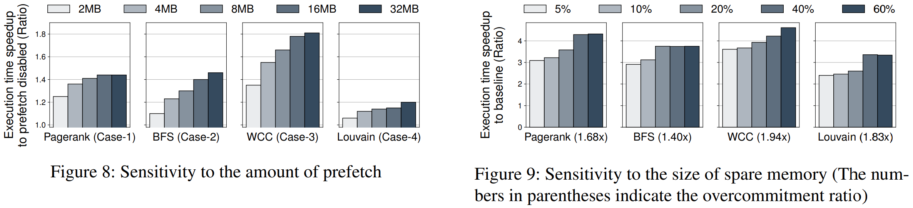

# Memory Harvesting in Multi-GPU Systems with Hierarchical Unified Virtual Memory
Sangjin Choi; Taeksoo Kim; Jinwoo Jeong; Rachata Ausavarungnirun; Myeongjae Jeon; Youngjin Kwon; and Jeongseob Ahn
> Operating Systems
> [https://www.usenix.org/conference/atc22/presentation/choi-sangjin](https://www.usenix.org/conference/atc22/presentation/choi-sangjin)
> [https://github.com/casys-kaist/HUVM](https://github.com/casys-kaist/HUVM)

## Abstract
With the ever-growing demands for GPUs, most organizations allow users to share the multi-GPU servers. However, we observe that the memory space across GPUs is not effectively utilized enough when consolidating various workloads that exhibit highly varying resource demands. This is because the current memory management techniques were designed solely for individual GPUs rather than shared multi-GPU environments.
This study introduces a novel approach to provide an illusion of virtual memory space for GPUs, called hierarchical unified virtual memory (HUVM), by incorporating the temporarily idle memory of neighbor GPUs. Since modern GPUs are connected to each other through a fast interconnect, it provides lower access latency to neighbor GPU’s memory compared to the host memory via PCIe. On top of HUVM, we design a new memory manager, called memHarvester, to effectively and efficiently harvest the temporarily available neighbor GPUs’ memory. For diverse consolidation scenarios with DNN training and graph analytics workloads, our experimental result shows up to 2.71× performance improvement compared to the prior approach in multi-GPU environments.

## Problem Statement and Research Objectives
* As the demand for GPUs explodes, it is now a common practice in both academia and industry to equip multiple GPUs in a single server and make them shareable. ➔ Memory space across GPUs is not fully utilized

* To overcome the limited capacity of GPUs, previous study provides an illusion of infinite memory space with the host memory, **leveraging host-side memory as a swap device to the GPUs** through the unified virtual memory (UVM) technique.
  

  > ➊ UVM identifies that the page accessed by the GPU kernel is mapped to the host by referring to the page table
  > ➋ page fault exception is raised
  > ➌ the driver evicts an old page from GPU memory before transferring the faulted page to GPU
  > ➍ the UVM driver brings the page into the GPU memory

  * Although this enables us to run analytics on large graphs or DNN training with large batches without out-of-memory errors, it **significantly degrades performance**.

* However, **none of the work does utilize the idle memory of neighbor GPUs** in commodity multi-GPU systems.
  * When evicting pages to host memory, the pre-eviction rate is **limited to the PCIe bandwidth** and pre-eviction requests **contend with fetch requests occasionally**.
  * As modern GPU servers are commonly equipped with 8~16 GPUs connected **via high-speed interconnect such as NVLink**, accessing the idle memory of neighbor GPUs is much faster than that of the host.

## Proposed Method
* In this study, we introduce a new approach providing an illusion of virtual memory space for GPUs called **hierarchical unified virtual memory (HUVM)** comprised of local GPU, spare memory of neighbor GPUs, and the host memory.
  * Using the fast interconnect, i.e., NVLink, we build a new data path exploiting the spare memory of neighbor GPUs.
  * As the spare memory can act as a victim cache<a name="fr1" href="#fn1">1</a>, we populate as many evicted chunks as possible on the spare memory.
  * Our approach of **using spare memory as a victim buffer** allows that with a small fraction of memory, memHarvester turns the latency of host memory access into that of a neighbor GPU memory almost entirely.

### memHarvester
By harvesting spare memory in multi-GPU systems, **memHarvester** creates an illusion of GPU applications having a small cache between a GPU and host memory.
> Implementation details are described in Section 5 of the paper.

 

> * memHarvester allows GPU-0 to utilize the spare memory of GPU-1
> * Suppose the application running on the GPU-0 is accessing `page A` and `B` on the host memory. ( ∴ `page A` and `B` in the same fault batch)
> * Since the `page A` and `B` are faulted in order, memHarvester prefetches the next `page C`, `D`, and `E`. Assume that the number of pages to be prefetched is three in this example.

### 1. Hiding Eviction Latency to Host
* **Page eviction** (Figure 4b)
  * Since migrating data to GPU memory is faster than to the host memory, our harvesting can reduce the latency of handling GPU page faults.
  * While the harvesting GPU fetches the required pages, memHarvester invokes a **background _writeback_ thread** to **make a copy of the evicted page** present in the harvested memory **to the host memory**.
    * After copying pages, memHarvester marks the pages backed in host memory as `removable`.
  * Once the application in the yielding GPU **requires more memory** than it currently has, it causes a GPU page fault. Then, memHarvester **reclaims the harvested (removable) pages** for the yielding GPU to use without the eviction.

* **Pre-eviction** (Figure 3 ➊ & Figure 4b)
  * Once the memory consumption of harvesting GPU **reaches a threshold of total physical memory** (by default, if less than 50 free chunks are available), memHarvester **invokes a pre-eviction thread**.
    * The pre-eviction has a good match with the background writeback technique because pre-eviction and writeback are pipelined.

* **Large page eviction** (Figure 3 ➋)
  * While evicting a 2MB chunk from the GPU to the host, the UVM driver splits the 2MB chunk into 512 4KB pages and performs the page population for the 512 pages.
    * **The granularity for page faults** is supposed to be **the same size as the host architecture** because the UVM driver relies on the demand paging scheme.
    * On the other hand, the UVM driver uses **a 2MB chunk as an eviction unit** to simplify memory management.
  * To avoid such undesired inefficiency, memHarvester **allocates 2MB of large pages in host memory** by using the kernel’s contiguous memory allocator<a name="fr2" href="#fn2">2</a>.

* **Eviction policy**
  * As multiple GPUs can leave a small amount of idle memory, as shown in Figure 1, memHarvester **selects a target in a round-robin fashion** to avoid hotspot contention and maximize the available GPU-to-GPU bandwidth in the system.
  * Additionally, the round-robin policy enables each yielding GPU to **make the removable pages in parallel** through individual PCIe lanes.
  * When multiple harvesting requests are concentrated on a single spare memory, memHarvester handles the requests following their arrival orders.
  * Note that the spare memory is used as a shared cache across harvesters.

### 2. Hiding Fetch Latency from Host
* **Fetching pages in parallel** (Figure 3 ➌ and Figure 4c)
  * To reduce the cost of handling page faults, modern GPUs batch multiple page faults<a name="fr3" href="#fn3">3</a>. The UVM driver **handles requested pages** corresponding to the page faults **one by one**.
  * With the availability of harvested memory, memHarvester **invokes page fault handling threads for each GPU** (i.e., harvesting GPU and yielding GPUs), dividing tasks to each handling thread.

* **Multi-path parallel prefetcher** (Figure 3 ➍,➎,➏)
  * When **prefetching multiple memory chunks** across the host and spare memory, there is **no dependency between chunks**.
  * Our multi-path prefetcher can exploit the parallelism fetching the chunks with PCIe and NVLink.
    * prefetches the pages in the spare memory to the local GPU memory via NVLink
    * prefetches the pages in the host memory through PCIe
      * on the spare memory
      * on the local GPU memory
  * The amount of prefetch are selected as **32MB**.

* **Prefetch policy** (Figure 5)
  * Unless the PCIe lane attached to the spare memory is crowded, we observe that **prefetching to the spare memory can further reduce the fetch latency** compared to the prefetch directly from the host to the local GPU.
    * reduce the number of page faults by prefetching
    * reduce the page fault latency by prefetching the page on the spare memory
  * On the other hand, as the number of active harvesters increases, the PCIe lane attached to the spare memory can be congested.
    * To deal with diverse harvesting scenarios in multi-GPU servers, we have a policy in prefetching to **dynamically select** where the data in the host memory to be prefetched to either the spare memory or the local GPU memory **based on the number of active harvesters**.

## Evaluation and Results
### Inter-job Harvesting
* Performance improvement
  
 

* Analysis of performance improvement
  

* Sensitivity study
  

### Intra-job Harvesting
* Performance improvement
  
 

-----
## Notes
* **victim cache** : A victim cache is a hardware cache designed to reduce conflict misses and enhance hit latency for direct-mapped caches. It is utilized in the refill path of a Level 1 cache, where any cache-line evicted from the cache is cached in the victim cache. ([https://en.wikipedia.org/wiki/Victim_cache](https://en.wikipedia.org/wiki/Victim_cache)) <a name="fn1" href="#fr1">↵</a>

* Michal Nazarewicz. A deep dive into cma, Mar. 2012. [https://lwn.net/Articles/486301/](https://lwn.net/Articles/486301/) <a name="fn2" href="#fr2">↵</a>

* The stock UVM driver handles up to 128 faults in a batch. <a name="fn3" href="#fr3">↵</a>

* Multi-GPU interconnection: [https://developer.nvidia.com/blog/dgx-1-fastest-deep-learning-system/](https://developer.nvidia.com/blog/dgx-1-fastest-deep-learning-system/)
  

