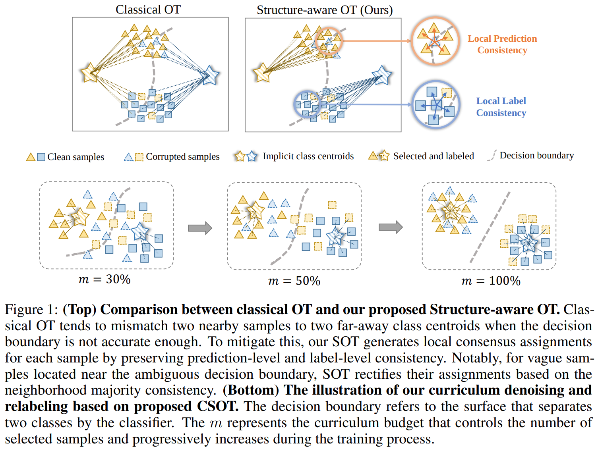
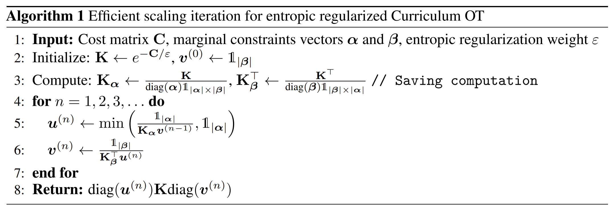
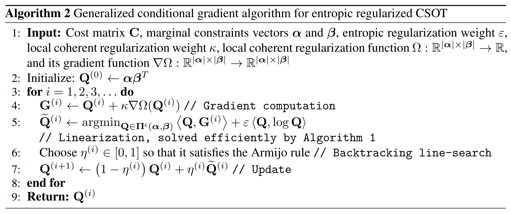
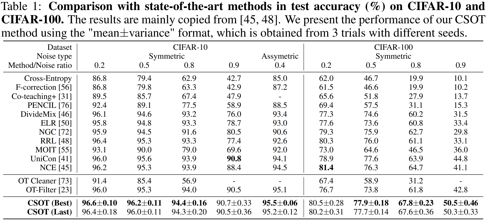
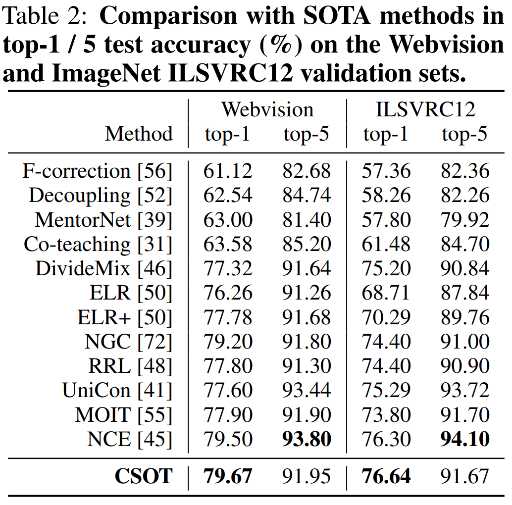
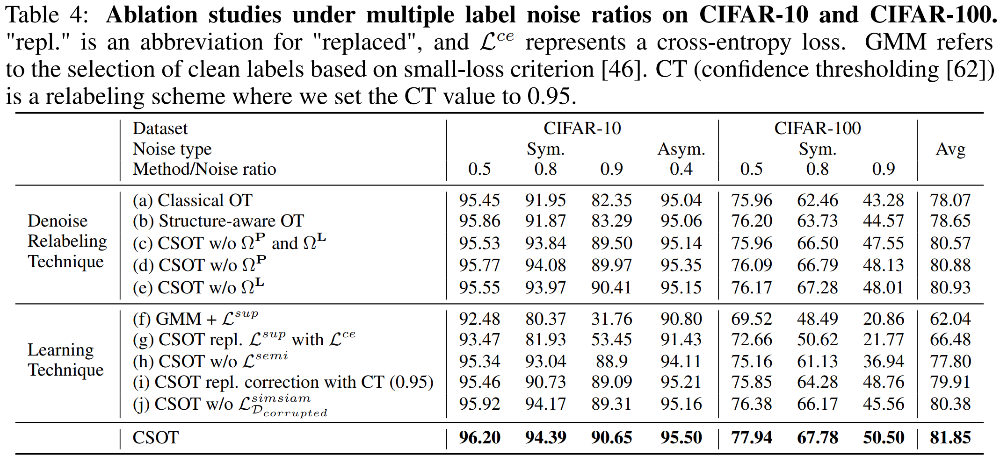
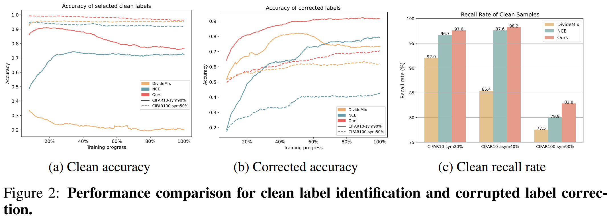

<!--`Macros`: Use \bbone instead of \mathbb{1}-->

# CSOT: Curriculum and Structure-Aware Optimal Transport for Learning with Noisy Labels
Wanxing Chang; Ye Shi; and Jingya Wang
*37th International Conference on Neural Information Processing Systems (NeurIPS 2023)*
> **Learning with Noisy Labels, Optimal Transport, Curriculum Learning**
> [https://dl.acm.org/doi/10.5555/3666122.3666495](https://dl.acm.org/doi/10.5555/3666122.3666495)
> [https://github.com/changwxx/CSOT-for-LNL](https://github.com/changwxx/CSOT-for-LNL)

## Abstract
Learning with noisy labels (LNL) poses a significant challenge in training a well-generalized model while avoiding overfitting to corrupted labels.Recent advances have achieved impressive performance by identifying clean labels and correcting corrupted labels for training.However, the current approaches rely heavily on the model’s predictions and evaluate each sample independently without considering either the global or local structure of the sample distribution.These limitations typically result in a suboptimal solution for the identification and correction processes, which eventually leads to models overfitting to incorrect labels.In this paper, we propose a novel optimal transport (OT) formulation, called Curriculum and Structure-aware Optimal Transport (CSOT). CSOT concurrently considers the inter- and intra-distribution structure of the samples to construct a robust denoising and relabeling allocator.During the training process, the allocator incrementally assigns reliable labels to a fraction of the samples with the highest confidence. These labels have both global discriminability and local coherence.Notably, CSOT is a new OT formulation with a nonconvex objective function and curriculum constraints, so it is not directly compatible with classical OT solvers. Here, we develop a lightspeed computational method that involves a scaling iteration within a generalized conditional gradient framework to solve CSOT efficiently. Extensive experiments demonstrate the superiority of our method over the current state-of-the-arts in LNL.

## Problem Statement and Research Objectives
Mining large-scale labeled data based on a web search and user tags can provide a cost-effective way to collect labels, but this approach inevitably introduces noisy labels. Since DNNs can so easily overfit to noisy labels, such label noise can significantly degrade performance, giving rise to a challenging task: learning with noisy labels (LNL).

### ■ Learning with noisy labels
* **Identifying clean labels**: These methods often _model per-sample loss distributions_ using a Beta Mixture Model or a Gaussian Mixture Model, **treating samples with smaller loss as clean ones**.
* **Label correction methods** : Typically adopt a pseudo-labeling strategy that **leverages the DNNs predictions to correct the labels**

  ➔ However, these approaches evaluate each sample independently **without considering the correlations among samples**, which leads to a suboptimal identification and correction solution.

### ■ Optimal transport-based pseudo-labeling
* OT-based PL optimizes the **mapping samples to class centroids**, while considering the global structure of the sample distribution in terms of marginal constraints instead of per-sample predictions.

  ➔ However, these approaches only consider the inter-distribution matching of samples and classes but **do not consider the intra-distribution coherence structure of samples**.
  * More specifically, the cost matrix in OT relies on pairwise metrics, so two nearby samples could be mapped to two far-away class centroids (Fig. 1).
      

## Proposed Method
In this paper, to enhance intra-distribution coherence, we propose a new OT formulation for denoising and relabeling, called **Structure-aware Optimal Transport (SOT)**. This formulation fully considers the intra-distribution structure of the samples and produces robust assignments with both _global discriminability_ and _local coherence_.
  * Technically speaking, we introduce **local coherent regularized terms** to encourage both prediction- and label-level local consistency in the assignments.
  * Furthermore, to avoid generating incorrect labels in the early stages of training or cases with high noise ratios, we devise **Curriculum and Structure-aware Optimal Transport (CSOT)** based on SOT.
    * CSOT constructs a robust denoising and relabeling allocator by relaxing one of the equality constraints to allow only a fraction of the samples with the highest confidence to be selected.
    * These samples are then assigned with reliable pseudo labels.
    * The allocator progressively selects and relabels batches of high-confidence samples based on an increasing budget factor that controls the number of selected samples.
    * Notably, CSOT is a new OT formulation with a nonconvex objective function and curriculum constraints, so it is significantly different from the classical OT formulations.

### 1. Structure-Aware Optimal Transport for Denoising and Relabeling
Our proposed SOT for denoising and relabeling is formulated by **adding two local coherent regularized terms** based on Problem (2). Given a cosine similarity $\mathbf{S} \in \mathbb{R}^{B \times B}$ among samples in feature space, a one-hot label matrix $\mathbf{L} \in \mathbb{R}^{B \times C}$ transformed from given noisy labels, SOT is formulated as follows

$$
\min\_{\mathbf{Q} \in \Pi(\frac{1}{B} \bbone\_{B}, \frac{1}{C} \bbone\_{C})} \langle -\log \mathbf{P}, \mathbf{Q} \rangle + \kappa \left( \Omega^{\mathbf{P}} \left( \mathbf{Q}\right) + \Omega^{\mathbf{L}} \left( \mathbf{Q}\right) \right) \qquad (3)
$$

where the local coherent regularized terms $\Omega^{\mathbf{P}}$ and $\Omega^{\mathbf{L}}$ encourages prediction-level and label-level local consistency respectively, and are defined as follows (where $\odot$ indicates element-wise multiplication)

$$
\begin{align*}
\Omega^{\mathbf{P}}(\mathbf{Q})=-\sum\_{i,j}{\mathbf{S}\_{ij}} \sum\_{k}{\mathbf{P}\_{ik} \mathbf{P}\_{jk} \mathbf{Q}\_{ik} \mathbf{Q}\_{jk}} = -\langle \mathbf{S}, (\mathbf{P} \odot \mathbf{Q}) (\mathbf{P} \odot \mathbf{Q})^{\top} \rangle \qquad (4) \\\\
\Omega^{\mathbf{L}}(\mathbf{Q})=-\sum\_{i,j}{\mathbf{S}\_{ij}} \sum\_{k}{\mathbf{L}\_{ik} \mathbf{L}\_{jk} \mathbf{Q}\_{ik} \mathbf{Q}\_{jk}} = -\langle \mathbf{S}, (\mathbf{L} \odot \mathbf{Q}) (\mathbf{L} \odot \mathbf{Q})^{\top} \rangle \qquad (5)
\end{align*}
$$

To be more specific, $\Omega^{\mathbf{P}}$ encourages assigning larger weight to $\mathbf{Q}\_{ik}$ and $\mathbf{Q}\_{jk}$ if the $i$-th sample is very close to the $j$-th sample, and their predictions $\mathbf{P}\_{ik}$ and $\mathbf{P}\_{jk}$ from the $k$-th class centroid are simultaneously high. 

### 2. Curriculum and Structure-Aware Optimal Transport for Denoising and Relabeling
For the purpose of robust clean label identification and corrupted label correction, we further propose a Curriculum and Structure-aware Optimal Transport (CSOT), which constructs a robust curriculum allocator.
* This curriculum allocator gradually selects a fraction of the samples with high confidence from the noisy training set, controlled by a budget factor, then assigns reliable pseudo labels for them.
* Our proposed CSOT for denoising and relabeling is formulated by **introducing new curriculum constraints based on SOT** in Problem (3).
  * Given curriculum budget factor $m \in [0, 1]$, **our CSOT seeks optimal coupling matrix** $\mathbf{Q}$ **by minimizing following objective**

$$
\begin{align*}
\min\_{\mathbf{Q}} \langle -\log \mathbf{P}, \mathbf{Q} \rangle + \kappa \left( \Omega^{\mathbf{P}} \left( \mathbf{Q} \right) + \Omega^{\mathbf{L}} \left( \mathbf{Q} \right) \right) \qquad\qquad \\\\
\text{s.t.} \quad \mathbf{Q} \in \\\{ \mathbf{Q} \in \mathbb{R}_+^{B \times C} \vert \mathbf{Q} \bbone\_{C} \leq \frac{1}{B} \bbone\_{B}, \mathbf{Q}^{\top} \bbone\_{B} \leq \frac{m}{C} \bbone\_{C} \\\} \qquad (6)
\end{align*}
$$

* Unlike SOT, which enforces an equality constraint on the samples, **CSOT relaxes this constraint and defines the total coupling budget** as $m \in [0, 1]$, where $m$ represents the expected total sum of $Q$.
  * Intuitively speaking, $m = 0.5$ indicates that top 50% confident samples are selected from all the classes, **avoiding only selecting the same class for all the samples within a mini-batch**.

* In addition, we define the general confident scores of samples as $\mathcal{W} = \\\{w\_{0}, w\_{1}, · · · , w\_{B−1}\\\}$, where $w_{i} = \mathbf{Q}\_{i \hat{y}\_{i}}/(m/C)$.
  * Since our curriculum allocator assigns weight to only a fraction of samples controlled by $m$, we use $\mathsf{topK}(\mathcal{S},k)$ operation (return top-$k$ indices of input set $\mathcal{S}$) to identify selected samples denoted as $\delta\_{i}$

$$
\delta_{i} =
\begin{cases}
    1,    & \mathsf{topK}(\mathcal{W}, \left\lfloor mB \right\rfloor) \\\\ 
    0,    & \text{otherwise}
\end{cases} \qquad (7)
$$

### 3. Training Objectives
* To avoid error accumulation in the early stage of training, we adopt a two-stage training scheme.
  * In the first stage, the model is **supervised by progressively selected clean labels** and **self-supervised by unselected samples**.
  * In the second stage, the model is **semi-supervised by all denoised labels**.
* Notably, we construct our training objective mainly based on Mixup loss $\mathcal{L}^{mix}$ and Label consistency loss $\mathcal{L}^{lab}$ same as NCE [45], and a self-supervised loss $\mathcal{L}^{simsiam}$ proposed in SimSiam [15].

Our two-stage training objective can be constructed as follows

$$
\begin{align*}
\mathcal{L}^{sup} = \mathcal{L}\_{\mathcal{D}\_{clean}}^{mix} + \mathcal{L}\_{\mathcal{D}\_{clean}}^{lab} + \lambda\_{1}\mathcal{L}\_{\mathcal{D}\_{corrupted}}^{simsiam} \qquad (9) \\\\
\mathcal{L}^{semi} = \mathcal{L}\_{\mathcal{D}\_{clean}}^{mix} + \mathcal{L}\_{\mathcal{D}\_{clean}}^{lab} + \lambda\_{2}\mathcal{L}\_{\mathcal{D}\_{corrupted}}^{lab} \qquad (10)
\end{align*}
$$

### 4. Lightspeed Computation for CSOT
* Solving Curriculum Optimal Transport
  * Problem (6) can be solved by performing iterative KL projection between $\mathcal{C}\_{1}$ and $\mathcal{C\_{2}}$, namely Dykstra’s algorithm

$$
\begin{align*}
\mathcal{C}\_{1} \overset{\text{def}}{=} \\\{\mathbf{Q} \in \mathbb{R}\_{+}^{|\alpha| \times |\beta|} \vert \mathbf{Q}\bbone\_{\beta} \ge \alpha \\\\
\mathcal{C}\_{2} \overset{\text{def}}{=} \\\{\mathbf{Q} \in \mathbb{R}\_{+}^{|\alpha| \times |\beta|} \vert \mathbf{Q}^{\top}\bbone\_{\alpha} \ge \beta
\end{align*}
$$

* Solving Curriculum and Structure-Aware Optimal Transport
  

  

## Evaluation and Results
### 1. Comparison with the State-of-the-Arts

 

### 2. Ablation Studies and Analysis

-----
## Notes
* [https://github.com/lijichang/LNL-NCE](https://github.com/lijichang/LNL-NCE)

* **Curriculum learning (CL)**: attempts to **gradually increase the difficulty of the training samples**, allowing the model to learn progressively from easier concepts to more complex ones.
  * CL has been applied to various machine learning tasks, including image classification, and reinforcement learning.
  * Recently, the combination of curriculum learning and pseudo-labeling has become popular in semi-supervised learning.
    * These methods mainly focus on dynamic confident thresholding instead of adopting a fixed threshold.

* **Optimal Transport (OT)** vs **Pseudo-labeling based on optimal transport**
  <table>
  <tbody>
    <tr style="background-color:#EEE;">
      <th align="center">Optimal Transport (OT)</th>
      <th align="center">Pseudo-labeling based on optimal transport</th>
    </tr>
    <tr>
      <td align="center"> $\large{\min_{\mathbf{Q} \in \Pi(\alpha, \beta)} \langle \mathbf{C}, \mathbf{Q} \rangle} \quad \small{(1)}$   $\scriptsize{* \ <\cdot , \cdot> \text{ : Frobenius dot-product}}$
      <td align="center"> $\large{\min_{\mathbf{Q} \in \Pi(\frac{1}{B} \bbone_B, \frac{1}{C} \bbone_C)} \langle -\log \mathbf{P}, \mathbf{Q} \rangle} \quad \small{(2)}$   $\scriptsize{* \ \bbone_d : d \text{-dimensional vector of ones}}$
    </tr>
    <tr>
    <td><ul style="padding-left:20px; margin:0;">
    <li>$\alpha, \beta$ : probability vectors (indicating two distributions)</li>
    <ul><li>$\left| \alpha \right|$ :  the dimension of $\alpha$</li></ul>
    <li>Cost matrix : $\mathbf{C} \in \mathbb{R}^{\left| \alpha \right| \times \left| \beta \right|}$</li>
    <li>Coupling matrix $\mathbf{Q}$
    <ul><li>$Q_{ik}$ <b>indicates how the mass is moved</b> from the $i$ of the $\alpha$ to the $k$ of the $\beta$.</li>
      <li>Constrains: $\mathbf{Q} \bbone_{\left| \beta \right|} = \alpha, \quad \mathbf{Q}^\top \bbone_{\left| \alpha \right|} = \beta$</li></ul></ul>
    <td><ul style="padding-left:20px; margin:0;">
    <li>$B, C$ : the batch size of samples, and the number of classes</li>
    <li>Cost matrix : $\mathbf{C} = -\log\mathbf{P}$</li>
    <ul><li>$\mathbf{P} \in \mathbb{R}_{+}^{B \times C}$ : <b>classifier softmax predictions</b></li></ul>
    <li>Coupling matrix $\mathbf{Q}$</li>
    <ul><li>$Q_{ik}$ <b>indicates the probability</b> that the sample $i$ will be mapped to a class $k$</li>
      <li>Constrains: $\mathbf{Q} \bbone_C = \frac{1}{B} \bbone_B, \quad \mathbf{Q}^\top \bbone_B = \frac{1}{C} \bbone_C$</li></ul>
    </tr>
  </tbody>
  </table> 

  * Directly optimizing the exact OT problem would be time-consuming, and an entropic regularization term is introduced: 

$$
\min\_{\mathbf{Q} \in \Pi(\alpha, \beta)}\left< \mathbf{C}, \mathbf{Q} \right> + \epsilon \left< \mathbf{Q}, \log\mathbf{Q} \right>, \quad \text{where} \ \ \epsilon > 0
$$